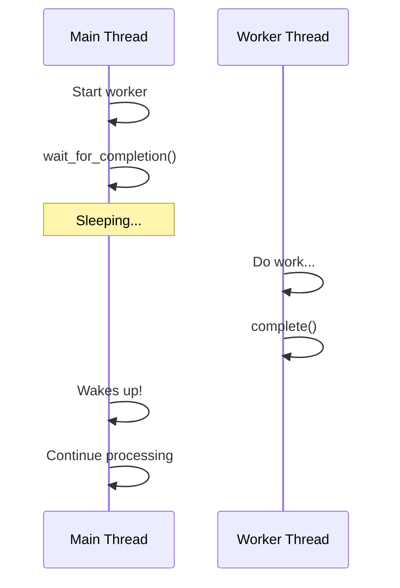

# Completions

Completions provide a simple mechanism for one task to signal another that some event has occurred. They're commonly used to synchronize between a thread and its completion handler, or between setup and actual operation.

## Basic Completion Usage

```c
#include <linux/completion.h>

/* Static initialization */
static DECLARE_COMPLETION(my_completion);

/* Or dynamic initialization */
struct completion my_completion;
init_completion(&my_completion);

/* Waiting thread */
wait_for_completion(&my_completion);
/* Continues after completion signaled */

/* Signaling thread */
complete(&my_completion);  /* Wake one waiter */
/* or */
complete_all(&my_completion);  /* Wake all waiters */
```

## Completion Flow



## Completion Operations

### Basic Wait

```c
/* Wait forever */
wait_for_completion(&comp);

/* Wait interruptible (can be interrupted by signals) */
if (wait_for_completion_interruptible(&comp)) {
    /* Was interrupted */
    return -ERESTARTSYS;
}

/* Wait killable (can be killed by fatal signals) */
if (wait_for_completion_killable(&comp)) {
    return -ERESTARTSYS;
}
```

### Wait with Timeout

```c
unsigned long timeout = msecs_to_jiffies(5000);  /* 5 seconds */

/* Returns 0 on timeout, remaining jiffies otherwise */
if (!wait_for_completion_timeout(&comp, timeout)) {
    pr_err("Operation timed out\n");
    return -ETIMEDOUT;
}

/* Interruptible with timeout */
long ret = wait_for_completion_interruptible_timeout(&comp, timeout);
if (ret == 0) {
    return -ETIMEDOUT;
} else if (ret < 0) {
    return -ERESTARTSYS;
}
/* ret > 0: completed successfully */
```

### Try Wait (Non-blocking)

```c
if (try_wait_for_completion(&comp)) {
    /* Completion was already signaled */
} else {
    /* Not yet complete */
}
```

### Signal Completion

```c
/* Wake one waiter */
complete(&comp);

/* Wake all waiters */
complete_all(&comp);
```

### Reinitialize

```c
/* Reset completion for reuse */
reinit_completion(&comp);
```

## Example: Synchronizing with Interrupt

```c
#include <linux/module.h>
#include <linux/completion.h>
#include <linux/interrupt.h>

struct my_device {
    struct completion data_ready;
    int data;
    int irq;
};

static struct my_device dev;

/* Called from process context */
static ssize_t my_read(struct file *file, char __user *buf,
                       size_t count, loff_t *ppos)
{
    int ret;

    /* Start hardware operation */
    start_hardware_read(&dev);

    /* Wait for interrupt to signal completion */
    ret = wait_for_completion_interruptible_timeout(
        &dev.data_ready, msecs_to_jiffies(1000));

    if (ret == 0)
        return -ETIMEDOUT;
    if (ret < 0)
        return -ERESTARTSYS;

    /* Data is ready */
    if (copy_to_user(buf, &dev.data, sizeof(dev.data)))
        return -EFAULT;

    return sizeof(dev.data);
}

/* Interrupt handler */
static irqreturn_t my_irq_handler(int irq, void *data)
{
    struct my_device *d = data;

    /* Read data from hardware */
    d->data = read_hardware_data();

    /* Signal that data is ready */
    complete(&d->data_ready);

    return IRQ_HANDLED;
}

static int __init my_init(void)
{
    init_completion(&dev.data_ready);
    /* ... register IRQ ... */
    return 0;
}
```

## Example: Thread Startup Synchronization

```c
#include <linux/kthread.h>
#include <linux/completion.h>

struct worker {
    struct completion started;
    struct completion stopped;
    struct task_struct *thread;
    bool should_stop;
};

static struct worker worker;

static int worker_thread(void *data)
{
    struct worker *w = data;

    /* Signal that we've started */
    complete(&w->started);

    while (!w->should_stop) {
        /* Do work */
        schedule_timeout_interruptible(HZ);
    }

    /* Signal that we're stopping */
    complete(&w->stopped);
    return 0;
}

static int start_worker(void)
{
    init_completion(&worker.started);
    init_completion(&worker.stopped);
    worker.should_stop = false;

    worker.thread = kthread_create(worker_thread, &worker, "my_worker");
    if (IS_ERR(worker.thread))
        return PTR_ERR(worker.thread);

    wake_up_process(worker.thread);

    /* Wait for thread to actually start */
    wait_for_completion(&worker.started);

    pr_info("Worker thread is running\n");
    return 0;
}

static void stop_worker(void)
{
    worker.should_stop = true;
    wake_up_process(worker.thread);

    /* Wait for thread to actually stop */
    wait_for_completion(&worker.stopped);

    pr_info("Worker thread has stopped\n");
}
```

## Example: Firmware Loading

```c
struct fw_load_context {
    struct completion done;
    const struct firmware *fw;
    int error;
};

static void fw_callback(const struct firmware *fw, void *context)
{
    struct fw_load_context *ctx = context;

    ctx->fw = fw;
    ctx->error = fw ? 0 : -ENOENT;

    complete(&ctx->done);
}

int load_firmware_sync(struct device *dev, const char *name,
                       const struct firmware **fw)
{
    struct fw_load_context ctx;
    int ret;

    init_completion(&ctx.done);
    ctx.fw = NULL;
    ctx.error = 0;

    /* Request firmware asynchronously */
    ret = request_firmware_nowait(THIS_MODULE, true, name, dev,
                                  GFP_KERNEL, &ctx, fw_callback);
    if (ret)
        return ret;

    /* Wait for callback */
    wait_for_completion(&ctx.done);

    *fw = ctx.fw;
    return ctx.error;
}
```

## Multiple Waiters

```c
DECLARE_COMPLETION(event);

/* Multiple threads can wait */
void waiter_thread1(void) {
    wait_for_completion(&event);
    pr_info("Waiter 1 woken\n");
}

void waiter_thread2(void) {
    wait_for_completion(&event);
    pr_info("Waiter 2 woken\n");
}

/* Wake all */
void trigger_event(void) {
    complete_all(&event);  /* Both waiters wake */
}

/* Or wake one at a time */
void trigger_one(void) {
    complete(&event);  /* Only one waiter wakes */
}
```

## Completion vs Other Primitives

| Primitive | Use Case |
|-----------|----------|
| Completion | One-shot signaling, thread sync |
| Mutex | Protect shared data |
| Semaphore | Resource counting |
| Wait queue | Complex wait conditions |

## Checking Completion State

```c
/* Check if completion was signaled (without waiting) */
if (completion_done(&comp)) {
    pr_info("Already completed\n");
}
```

## Common Patterns

### Request-Response

```c
struct request {
    struct completion done;
    int result;
    void *data;
};

void submit_request(struct request *req)
{
    init_completion(&req->done);
    queue_request(req);  /* Submit to hardware/thread */
}

int wait_request(struct request *req, unsigned long timeout)
{
    if (!wait_for_completion_timeout(&req->done, timeout))
        return -ETIMEDOUT;
    return req->result;
}

/* In handler */
void complete_request(struct request *req, int result)
{
    req->result = result;
    complete(&req->done);
}
```

### Initialization Barrier

```c
static DECLARE_COMPLETION(subsystem_ready);

void __init subsystem_init(void)
{
    /* ... initialize ... */
    complete_all(&subsystem_ready);
}

void user_function(void)
{
    /* Wait for subsystem to be ready */
    wait_for_completion(&subsystem_ready);
    /* Now safe to use subsystem */
}
```

## Summary

- Completions provide simple thread signaling
- Use for one-shot events and synchronization
- `complete()` wakes one waiter, `complete_all()` wakes all
- Always use timeout variants in production code
- Use `reinit_completion()` to reset for reuse
- Great for IRQ-to-process and thread synchronization

## Next

Learn about [work queues]() for deferred processing.
