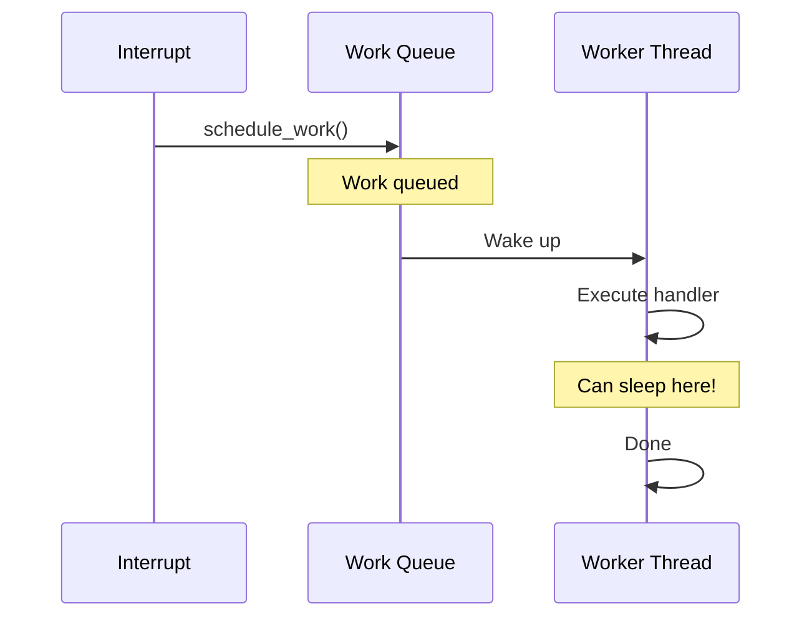

# Work Queues

Work queues allow you to defer work to be executed later in process context. Unlike tasklets and softirqs, work queue handlers can sleep, making them ideal for I/O operations and complex processing.

## Deferred Work Options

| Mechanism | Context | Can Sleep? | Use Case |
|-----------|---------|------------|----------|
| Workqueue | Process | Yes | Heavy processing, I/O |
| Tasklet | Softirq | No | Quick, lock-free work |
| Timer | Softirq | No | Time-delayed execution |
| Threaded IRQ | Process | Yes | Bottom half of interrupt |

## Basic Work Queue Usage

### Using System Work Queue

```c
#include <linux/workqueue.h>

/* Define work structure */
struct my_work_data {
    struct work_struct work;
    int value;
    char buffer[256];
};

/* Work handler */
static void my_work_handler(struct work_struct *work)
{
    struct my_work_data *data = container_of(work,
                                             struct my_work_data, work);

    pr_info("Work executing: value=%d\n", data->value);

    /* Can sleep here! */
    msleep(100);

    /* Can do I/O */
    /* ... */
}

/* Initialize and schedule */
static struct my_work_data my_work;

void start_work(int val)
{
    my_work.value = val;
    INIT_WORK(&my_work.work, my_work_handler);
    schedule_work(&my_work.work);  /* Queue on system workqueue */
}
```

### Static Initialization

```c
static void my_handler(struct work_struct *work);

/* Static work item */
static DECLARE_WORK(my_work, my_handler);

/* Schedule it */
schedule_work(&my_work);
```

## Delayed Work

Execute work after a delay:

```c
#include <linux/workqueue.h>

struct delayed_work my_delayed_work;

static void delayed_handler(struct work_struct *work)
{
    struct delayed_work *dw = container_of(work,
                                           struct delayed_work, work);
    pr_info("Delayed work executing\n");
}

void start_delayed_work(void)
{
    INIT_DELAYED_WORK(&my_delayed_work, delayed_handler);

    /* Execute after 2 seconds */
    schedule_delayed_work(&my_delayed_work, 2 * HZ);
}

void cancel_work(void)
{
    cancel_delayed_work_sync(&my_delayed_work);
}
```

## Creating Custom Work Queue

For high-priority or isolated work:

```c
#include <linux/workqueue.h>

static struct workqueue_struct *my_wq;

static int __init my_init(void)
{
    /* Create dedicated workqueue */
    my_wq = create_singlethread_workqueue("my_worker");
    if (!my_wq)
        return -ENOMEM;

    return 0;
}

static void __exit my_exit(void)
{
    destroy_workqueue(my_wq);
}

void queue_my_work(struct work_struct *work)
{
    queue_work(my_wq, work);
}
```

### Work Queue Creation Options

```c
/* Single-threaded */
wq = create_singlethread_workqueue("my_wq");

/* Multi-threaded (one per CPU) */
wq = create_workqueue("my_wq");

/* With flags */
wq = alloc_workqueue("my_wq",
                     WQ_HIGHPRI | WQ_MEM_RECLAIM,
                     max_active);
```

#### Work Queue Flags

| Flag | Description |
|------|-------------|
| `WQ_HIGHPRI` | High priority workers |
| `WQ_MEM_RECLAIM` | Can be used during memory reclaim |
| `WQ_CPU_INTENSIVE` | May run long, don't block other work |
| `WQ_FREEZABLE` | Participates in system freeze |
| `WQ_UNBOUND` | Not bound to specific CPU |

## Complete Example: Deferred I/O

```c
#include <linux/module.h>
#include <linux/workqueue.h>
#include <linux/slab.h>

struct io_request {
    struct work_struct work;
    void *buffer;
    size_t size;
    loff_t offset;
    void (*callback)(struct io_request *, int result);
};

static struct workqueue_struct *io_wq;

static void io_work_handler(struct work_struct *work)
{
    struct io_request *req = container_of(work, struct io_request, work);
    int result;

    pr_info("Processing I/O request: offset=%lld, size=%zu\n",
            req->offset, req->size);

    /* Simulate I/O (can sleep!) */
    msleep(50);
    result = 0;  /* Success */

    /* Call completion callback */
    if (req->callback)
        req->callback(req, result);

    kfree(req);
}

int submit_io_request(void *buffer, size_t size, loff_t offset,
                      void (*callback)(struct io_request *, int))
{
    struct io_request *req;

    req = kmalloc(sizeof(*req), GFP_KERNEL);
    if (!req)
        return -ENOMEM;

    req->buffer = buffer;
    req->size = size;
    req->offset = offset;
    req->callback = callback;

    INIT_WORK(&req->work, io_work_handler);
    queue_work(io_wq, &req->work);

    return 0;  /* Request queued */
}

static int __init io_init(void)
{
    io_wq = alloc_workqueue("io_worker", WQ_MEM_RECLAIM, 4);
    if (!io_wq)
        return -ENOMEM;

    return 0;
}

static void __exit io_exit(void)
{
    destroy_workqueue(io_wq);
}

module_init(io_init);
module_exit(io_exit);
MODULE_LICENSE("GPL");
```

## Work Queue from Interrupt

```c
struct my_device {
    struct work_struct work;
    spinlock_t lock;
    int pending_data;
};

/* Interrupt handler - queue work */
static irqreturn_t my_irq_handler(int irq, void *data)
{
    struct my_device *dev = data;

    spin_lock(&dev->lock);
    dev->pending_data = read_hardware();
    spin_unlock(&dev->lock);

    /* Queue work for processing */
    schedule_work(&dev->work);

    return IRQ_HANDLED;
}

/* Work handler - process data */
static void process_work(struct work_struct *work)
{
    struct my_device *dev = container_of(work, struct my_device, work);
    int data;

    spin_lock(&dev->lock);
    data = dev->pending_data;
    spin_unlock(&dev->lock);

    /* Heavy processing in process context */
    pr_info("Processing: %d\n", data);
    /* ... can sleep here ... */
}

static int __init my_init(void)
{
    INIT_WORK(&my_dev.work, process_work);
    spin_lock_init(&my_dev.lock);
    /* ... request IRQ ... */
    return 0;
}
```

## Canceling Work

```c
/* Cancel and wait for completion */
cancel_work_sync(&work);

/* Cancel delayed work and wait */
cancel_delayed_work_sync(&delayed_work);

/* Cancel without waiting */
cancel_work(&work);
cancel_delayed_work(&delayed_work);

/* Flush all pending work on queue */
flush_workqueue(wq);

/* Flush system workqueue */
flush_scheduled_work();
```

## Recurring Work

```c
static struct delayed_work periodic_work;

static void periodic_handler(struct work_struct *work)
{
    pr_info("Periodic work executing\n");

    /* Do periodic task */
    /* ... */

    /* Reschedule ourselves */
    schedule_delayed_work(&periodic_work, HZ);  /* Every second */
}

void start_periodic(void)
{
    INIT_DELAYED_WORK(&periodic_work, periodic_handler);
    schedule_delayed_work(&periodic_work, HZ);
}

void stop_periodic(void)
{
    cancel_delayed_work_sync(&periodic_work);
}
```

## Work Queue Flow



## Per-CPU Work

```c
/* Schedule on specific CPU */
schedule_work_on(cpu, &work);

/* Queue on specific CPU */
queue_work_on(cpu, wq, &work);
```

## Best Practices

### Do

```c
/* DO: Free resources in work handler */
static void cleanup_work(struct work_struct *work)
{
    struct my_data *data = container_of(work, struct my_data, work);
    /* ... process ... */
    kfree(data);
}

/* DO: Check if work is pending before freeing */
cancel_work_sync(&data->work);
kfree(data);
```

### Don't

```c
/* DON'T: Use uninitialized work */
schedule_work(&work);  /* Crash! Not initialized */

/* DON'T: Free while work is running */
kfree(data);  /* Work might still be using it! */
schedule_work(&data->work);
```

## Summary

- Work queues run in process context - can sleep
- Use system workqueue for simple cases: `schedule_work()`
- Create custom workqueues for high-priority or isolated work
- Use `delayed_work` for time-deferred execution
- Always cancel work before freeing resources
- Use `cancel_work_sync()` to wait for running work

## Next

Learn about [lockdep]() for deadlock detection.
