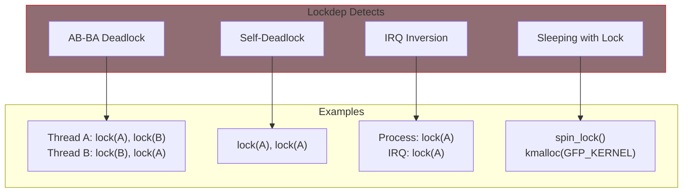

# Lockdep

Lockdep (lock dependency validator) is a kernel debugging tool that detects potential deadlocks before they actually occur. It tracks lock acquisition order and warns when code could deadlock.

## What Lockdep Detects



## Enabling Lockdep

```bash
# Check if enabled in kernel
grep LOCKDEP /boot/config-$(uname -r)

# Kernel config options
CONFIG_PROVE_LOCKING=y
CONFIG_DEBUG_LOCK_ALLOC=y
CONFIG_DEBUG_LOCKDEP=y
```

## How It Works

Lockdep builds a dependency graph:

1. First time lock A then B is acquired: Records A → B dependency
2. If later lock B then A is attempted: Detects potential deadlock!

```
First occurrence:
  lock(A)
  lock(B)   <- Records: "A before B"
  unlock(B)
  unlock(A)

Later occurrence:
  lock(B)
  lock(A)   <- ERROR! "B before A" conflicts!
```

## Understanding Lockdep Output

### Simple Deadlock Warning

```
=============================================
WARNING: possible circular locking dependency detected
5.15.0 #1 Not tainted
---------------------------------------------
test/1234 is trying to acquire lock:
ffff88810a4e48a0 (&dev->lock_b){+.+.}-{3:3}, at: function_b+0x20/0x50

but task is already holding lock:
ffff88810a4e4860 (&dev->lock_a){+.+.}-{3:3}, at: function_a+0x15/0x40

which lock already depends on the new lock.

the existing dependency chain (in reverse order) is:

-> #1 (&dev->lock_a){+.+.}-{3:3}:
       lock_acquire+0xd4/0x2f0
       _raw_spin_lock+0x30/0x40
       function_c+0x20/0x50

-> #0 (&dev->lock_b){+.+.}-{3:3}:
       lock_acquire+0xd4/0x2f0
       _raw_spin_lock+0x30/0x40
       function_b+0x20/0x50
```

### Reading the Output

1. **What's happening**: Task trying to acquire lock_b while holding lock_a
2. **The conflict**: Somewhere else, lock_a is acquired while holding lock_b
3. **The chain**: Shows the dependency path that creates the cycle

## Lock Classes

Lockdep tracks locks by "class" - locks with the same class are considered equivalent:

```c
static DEFINE_SPINLOCK(lock_a);  /* Class: static initializer location */
static DEFINE_SPINLOCK(lock_b);  /* Different class */
```

### Custom Lock Classes

For dynamically allocated locks:

```c
static struct lock_class_key my_lock_key;

void init_my_device(struct my_device *dev)
{
    spin_lock_init(&dev->lock);
    lockdep_set_class(&dev->lock, &my_lock_key);
}
```

### Subclasses

For nested locks of the same type:

```c
/* Without subclass - lockdep thinks it's self-deadlock! */
spin_lock(&parent->lock);
spin_lock(&child->lock);  /* Warning! Same lock class! */

/* With subclass annotation */
spin_lock(&parent->lock);
spin_lock_nested(&child->lock, SINGLE_DEPTH_NESTING);
```

## Lockdep Annotations

### Nesting Levels

```c
/* Predefined nesting levels */
SINGLE_DEPTH_NESTING  /* 1 level of nesting */
/* Or use numbers 0-7 for custom levels */

/* Example: directory tree locking */
spin_lock(&root->lock);                          /* Level 0 */
spin_lock_nested(&subdir->lock, 1);              /* Level 1 */
spin_lock_nested(&file->lock, 2);                /* Level 2 */
```

### Lock Acquisition Helpers

```c
/* Assert lock is held */
lockdep_assert_held(&lock);

/* Assert lock is NOT held */
lockdep_assert_not_held(&lock);

/* Assert lock is held for write (rw locks) */
lockdep_assert_held_write(&rwlock);

/* Assert lock is held for read */
lockdep_assert_held_read(&rwlock);
```

### Example Usage

```c
void must_be_locked(struct my_device *dev)
{
    lockdep_assert_held(&dev->lock);

    /* Safe to access dev members */
    dev->value++;
}

void caller_function(struct my_device *dev)
{
    spin_lock(&dev->lock);
    must_be_locked(dev);  /* Would warn if lock not held */
    spin_unlock(&dev->lock);
}
```

## IRQ Safety Checking

Lockdep tracks IRQ state:

```c
/* BAD: Takes lock in process context without disabling IRQs */
void process_function(void)
{
    spin_lock(&shared_lock);  /* IRQs enabled */
    /* ... */
    spin_unlock(&shared_lock);
}

/* Takes same lock in interrupt context */
irqreturn_t irq_handler(int irq, void *data)
{
    spin_lock(&shared_lock);  /* LOCKDEP WARNING! */
    /* ... */
}
```

Warning:
```
========================================================
WARNING: inconsistent lock state
5.15.0 #1 Not tainted
--------------------------------------------------------
inconsistent {SOFTIRQ-ON-W} -> {IN-SOFTIRQ-W} usage.
```

Solution:
```c
void process_function(void)
{
    unsigned long flags;
    spin_lock_irqsave(&shared_lock, flags);
    /* ... */
    spin_unlock_irqrestore(&shared_lock, flags);
}
```

## RCU Lockdep

```c
#include <linux/rcupdate.h>

/* Assert we're in RCU read-side critical section */
rcu_lockdep_assert(rcu_read_lock_held(),
                   "RCU read lock not held!");

/* Or shorter */
RCU_LOCKDEP_WARN(!rcu_read_lock_held(),
                 "RCU read lock required");

/* In rcu_dereference context */
rcu_dereference_check(ptr, lockdep_is_held(&update_lock));
```

## Silencing False Positives

Sometimes lockdep reports false positives:

```c
/* Disable lockdep for this lock */
lockdep_set_novalidate_class(&special_lock);

/* Temporarily disable tracking */
lockdep_off();
/* ... special case code ... */
lockdep_on();
```

{: .warning }
Only silence lockdep when you're certain it's a false positive. Investigate thoroughly first.

## Debugging Tips

### Enable More Debug Info

```bash
# Kernel config
CONFIG_DEBUG_LOCKDEP=y
CONFIG_LOCKDEP_CROSSRELEASE=y
```

### Check Lockdep State

```bash
# View lockdep statistics
cat /proc/lockdep_stats

# View lock chains
cat /proc/lockdep_chains

# Check for warnings
dmesg | grep -i lockdep
```

### Reset Lockdep

After fixing issues, you can reset lockdep:

```bash
echo 1 > /proc/sys/kernel/lock_stat
```

## Common Issues and Fixes

### Issue: AB-BA Deadlock

```c
/* Problem */
void func_a(void) {
    spin_lock(&lock_a);
    spin_lock(&lock_b);  /* A -> B */
}

void func_b(void) {
    spin_lock(&lock_b);
    spin_lock(&lock_a);  /* B -> A - DEADLOCK! */
}

/* Fix: Always lock in same order */
void func_b_fixed(void) {
    spin_lock(&lock_a);  /* A first */
    spin_lock(&lock_b);  /* B second */
}
```

### Issue: Self-Deadlock

```c
/* Problem */
void recursive_func(void) {
    spin_lock(&lock);
    recursive_func();  /* Deadlock! */
    spin_unlock(&lock);
}

/* Fix: Check before locking or restructure */
void fixed_func(bool locked) {
    if (!locked)
        spin_lock(&lock);
    /* ... */
    if (!locked)
        spin_unlock(&lock);
}
```

### Issue: IRQ Inversion

```c
/* Problem */
void process_ctx(void) {
    spin_lock(&lock);  /* IRQs enabled */
}

void irq_handler(void) {
    spin_lock(&lock);  /* In IRQ context! */
}

/* Fix */
void process_ctx_fixed(void) {
    unsigned long flags;
    spin_lock_irqsave(&lock, flags);
    /* ... */
    spin_unlock_irqrestore(&lock, flags);
}
```

## Summary

- Lockdep detects potential deadlocks at runtime
- Enable with CONFIG_PROVE_LOCKING
- Tracks lock ordering and detects cycles
- Use `lockdep_assert_held()` for documentation and checking
- Use `spin_lock_nested()` for valid nested locking
- Always investigate warnings - they indicate real bugs
- Keep lockdep enabled during development

## Next

Continue to [Part 5: Memory Management]() to learn about kernel memory allocation.
