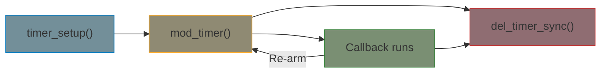

# Kernel Timers

Kernel timers schedule a callback to run at a specific future time. Unlike work queues (which run "as soon as possible" in process context), timers fire after a programmed delay in softirq context.

## When to Use Timers

| Mechanism | Context | Can Sleep? | Timing |
|-----------|---------|------------|--------|
| `timer_list` | Softirq | No | Jiffies resolution (~1-10ms) |
| `hrtimer` | Softirq/hardirq | No | Nanosecond resolution |
| `delayed_work` | Process | Yes | Jiffies resolution + process context |
| `msleep` / `usleep_range` | Process | Yes | Blocking delay |

Use `timer_list` for coarse periodic polling. Use `hrtimer` when you need precise timing. Use `delayed_work` when the callback needs to sleep.

## Timer Lifecycle



## timer_list Basics

### Setup and Arming

```c
#include <linux/timer.h>

struct my_device {
    struct timer_list poll_timer;
    unsigned long poll_interval;  /* jiffies */
    int status;
};

static void poll_timer_callback(struct timer_list *t)
{
    struct my_device *dev = from_timer(dev, t, poll_timer);

    /* Read hardware status */
    dev->status = read_status_register(dev);

    /* Re-arm for periodic polling */
    mod_timer(&dev->poll_timer,
              jiffies + dev->poll_interval);
}

static int my_probe(struct platform_device *pdev)
{
    struct my_device *dev;

    dev = devm_kzalloc(&pdev->dev, sizeof(*dev), GFP_KERNEL);
    if (!dev)
        return -ENOMEM;

    dev->poll_interval = msecs_to_jiffies(100);  /* 100ms */

    /* Initialize timer */
    timer_setup(&dev->poll_timer, poll_timer_callback, 0);

    /* Start polling */
    mod_timer(&dev->poll_timer,
              jiffies + dev->poll_interval);

    return 0;
}

static void my_remove(struct platform_device *pdev)
{
    struct my_device *dev = platform_get_drvdata(pdev);

    /* Cancel timer and wait for any running callback */
    del_timer_sync(&dev->poll_timer);
}
```

### Key Functions

| Function | Description |
|----------|-------------|
| `timer_setup(timer, callback, flags)` | Initialize timer |
| `mod_timer(timer, expires)` | Arm or re-arm timer |
| `del_timer(timer)` | Cancel timer (may still be running) |
| `del_timer_sync(timer)` | Cancel and wait for running callback |
| `timer_pending(timer)` | Check if timer is armed |

{: .warning }
Timer callbacks run in softirq context. You **cannot sleep** — no `mutex_lock()`, no `kmalloc(GFP_KERNEL)`, no `msleep()`. Use spinlocks for data protection.

## Jiffies and Time Conversions

The kernel tracks time in "jiffies" — ticks of the system clock. The tick rate is `HZ` (typically 100, 250, or 1000 per second).

```c
/* Convert between jiffies and human-readable units */
unsigned long j;

j = msecs_to_jiffies(500);    /* 500ms in jiffies */
j = usecs_to_jiffies(1000);   /* 1ms in jiffies */
j = HZ;                        /* 1 second */
j = 5 * HZ;                    /* 5 seconds */

/* Convert back */
unsigned int ms = jiffies_to_msecs(j);

/* Time comparisons (handles wraparound) */
if (time_after(jiffies, deadline))
    pr_info("Deadline passed\n");

if (time_before(jiffies, deadline))
    pr_info("Still time left\n");
```

{: .warning }
Never compare jiffies with `>` or `<` directly. Use `time_after()` and `time_before()` which handle 32-bit wraparound correctly.

## High-Resolution Timers (hrtimer)

When you need nanosecond precision (e.g., precise PWM timing, protocol deadlines):

```c
#include <linux/hrtimer.h>
#include <linux/ktime.h>

struct precise_device {
    struct hrtimer timer;
    ktime_t interval;
    int toggle_state;
};

static enum hrtimer_restart precise_callback(struct hrtimer *timer)
{
    struct precise_device *dev = container_of(timer,
                                              struct precise_device, timer);

    dev->toggle_state ^= 1;

    /* HRTIMER_RESTART: re-arm automatically */
    hrtimer_forward_now(timer, dev->interval);
    return HRTIMER_RESTART;

    /* Or HRTIMER_NORESTART for one-shot */
}

static int setup_hrtimer(struct precise_device *dev)
{
    dev->interval = ktime_set(0, 500000);  /* 500us */

    hrtimer_init(&dev->timer, CLOCK_MONOTONIC, HRTIMER_MODE_REL);
    dev->timer.function = precise_callback;

    hrtimer_start(&dev->timer, dev->interval, HRTIMER_MODE_REL);
    return 0;
}

static void teardown_hrtimer(struct precise_device *dev)
{
    hrtimer_cancel(&dev->timer);  /* Cancel and wait */
}
```

### hrtimer vs timer_list

| Feature | `timer_list` | `hrtimer` |
|---------|-------------|-----------|
| Resolution | Jiffies (~1-10ms) | Nanoseconds |
| Overhead | Minimal | Slightly higher |
| Clock base | Jiffies | CLOCK_MONOTONIC, CLOCK_REALTIME |
| Re-arm | `mod_timer()` manually | `HRTIMER_RESTART` automatic |
| Use case | Coarse polling, timeouts | Precise timing, protocols |

## Complete Example: Watchdog-Style Timeout

A common pattern — detect if hardware stops responding:

```c
#include <linux/module.h>
#include <linux/timer.h>
#include <linux/jiffies.h>

struct hw_monitor {
    struct timer_list watchdog;
    unsigned long last_activity;
    unsigned long timeout;  /* jiffies */
    bool hw_alive;
};

static struct hw_monitor monitor;

static void watchdog_expired(struct timer_list *t)
{
    struct hw_monitor *mon = from_timer(mon, t, watchdog);

    if (time_after(jiffies, mon->last_activity + mon->timeout)) {
        mon->hw_alive = false;
        pr_warn("hw_monitor: hardware not responding!\n");
        /* Trigger recovery... */
    } else {
        /* Hardware still active, check again later */
        mod_timer(&mon->watchdog, jiffies + mon->timeout);
    }
}

/* Call this from interrupt handler or data path */
void hw_activity_detected(void)
{
    monitor.last_activity = jiffies;
    monitor.hw_alive = true;
}

static int __init monitor_init(void)
{
    monitor.timeout = msecs_to_jiffies(5000);  /* 5 second timeout */
    monitor.last_activity = jiffies;
    monitor.hw_alive = true;

    timer_setup(&monitor.watchdog, watchdog_expired, 0);
    mod_timer(&monitor.watchdog, jiffies + monitor.timeout);

    pr_info("hw_monitor: started (timeout=%ums)\n",
            jiffies_to_msecs(monitor.timeout));
    return 0;
}

static void __exit monitor_exit(void)
{
    del_timer_sync(&monitor.watchdog);
    pr_info("hw_monitor: stopped\n");
}

module_init(monitor_init);
module_exit(monitor_exit);
MODULE_LICENSE("GPL");
```

## Best Practices

- **Always `del_timer_sync()` in cleanup** — ensures no callback is running when you free resources
- **Use `mod_timer()` to re-arm** — more efficient than `del_timer()` + `add_timer()`
- **Don't sleep in timer callbacks** — they run in softirq context
- **Protect shared data with spinlocks** — not mutexes (can't sleep)
- **Use `delayed_work` if you need to sleep** — it runs in process context
- **Prefer `hrtimer` only when you need it** — `timer_list` has less overhead for coarse timing

## Summary

- `timer_list` provides jiffies-resolution callbacks in softirq context
- `timer_setup()` + `mod_timer()` + `del_timer_sync()` is the core pattern
- `hrtimer` provides nanosecond resolution for precise timing needs
- Timer callbacks cannot sleep — use `delayed_work` for sleeping callbacks
- Always cancel timers before freeing the containing structure

## Next

Learn about [wait queues]() for sleeping until a condition becomes true.
