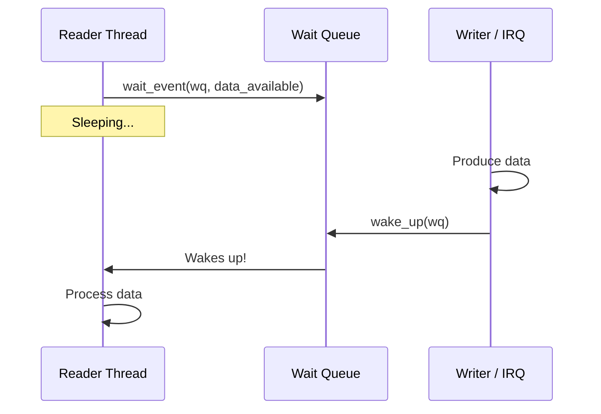

# Wait Queues

Wait queues are the kernel's mechanism for putting a process to sleep until a condition becomes true. They're the foundation for blocking I/O, synchronization between threads, and poll/select support.

## The Problem Wait Queues Solve



Without wait queues, a thread waiting for data would need to busy-loop, wasting CPU. Wait queues let the thread sleep efficiently and be woken only when the condition is met.

## Basic Usage

### Declaration

```c
#include <linux/wait.h>

/* Static declaration */
static DECLARE_WAIT_QUEUE_HEAD(my_wq);

/* Or dynamic initialization */
wait_queue_head_t my_wq;
init_waitqueue_head(&my_wq);
```

### Waiting and Waking

```c
/* Sleeping side: wait until condition is true */
wait_event(my_wq, condition);

/* Waking side: signal that condition may have changed */
wake_up(&my_wq);
```

The `condition` is a C expression re-evaluated each time the thread is woken. If the condition is still false, the thread goes back to sleep automatically.

## Wait Variants

| Function | Signals? | Timeout? | Return |
|----------|----------|----------|--------|
| `wait_event(wq, cond)` | No | No | void |
| `wait_event_interruptible(wq, cond)` | Yes | No | 0 or `-ERESTARTSYS` |
| `wait_event_timeout(wq, cond, timeout)` | No | Yes | 0=timeout, >0=remaining |
| `wait_event_interruptible_timeout(wq, cond, to)` | Yes | Yes | 0=timeout, <0=signal, >0=remaining |
| `wait_event_killable(wq, cond)` | Fatal only | No | 0 or `-ERESTARTSYS` |

{: .warning }
**Always prefer `_interruptible` variants** in driver code. Non-interruptible waits create unkillable processes if the wake-up never arrives.

### Interruptible Wait Pattern

```c
static bool data_ready;

static ssize_t my_read(struct file *file, char __user *buf,
                       size_t count, loff_t *ppos)
{
    int ret;

    /* Wait for data, but allow signals to interrupt */
    ret = wait_event_interruptible(my_wq, data_ready);
    if (ret)
        return -ERESTARTSYS;  /* Signal received */

    /* Data is ready, process it */
    data_ready = false;
    return copy_data_to_user(buf, count);
}
```

### Timeout Wait Pattern

```c
static int wait_for_hardware(struct my_device *dev)
{
    unsigned long timeout = msecs_to_jiffies(5000);
    long ret;

    ret = wait_event_interruptible_timeout(dev->wq,
                                           dev->hw_ready,
                                           timeout);
    if (ret == 0)
        return -ETIMEDOUT;   /* 5 seconds elapsed */
    if (ret < 0)
        return -ERESTARTSYS; /* Interrupted by signal */

    /* ret > 0: condition met, ret = remaining jiffies */
    return 0;
}
```

## Complete Example: Blocking Character Device

A circular buffer where `read()` blocks when empty and `write()` wakes readers:

```c
#include <linux/module.h>
#include <linux/fs.h>
#include <linux/miscdevice.h>
#include <linux/wait.h>
#include <linux/mutex.h>
#include <linux/uaccess.h>

#define BUF_SIZE 4096

struct pipe_dev {
    wait_queue_head_t read_wq;
    wait_queue_head_t write_wq;
    struct mutex lock;
    char buffer[BUF_SIZE];
    int head;  /* Write position */
    int tail;  /* Read position */
    int count; /* Bytes in buffer */
};

static struct pipe_dev pipe;

static int data_available(struct pipe_dev *p)
{
    return p->count > 0;
}

static int space_available(struct pipe_dev *p)
{
    return p->count < BUF_SIZE;
}

static ssize_t pipe_read(struct file *file, char __user *buf,
                         size_t count, loff_t *ppos)
{
    int ret;
    size_t to_read;

    /* Block until data is available */
    ret = wait_event_interruptible(pipe.read_wq,
                                   data_available(&pipe));
    if (ret)
        return -ERESTARTSYS;

    mutex_lock(&pipe.lock);

    to_read = min_t(size_t, count, pipe.count);
    if (pipe.tail + to_read > BUF_SIZE)
        to_read = BUF_SIZE - pipe.tail;  /* Don't wrap */

    if (copy_to_user(buf, &pipe.buffer[pipe.tail], to_read)) {
        mutex_unlock(&pipe.lock);
        return -EFAULT;
    }

    pipe.tail = (pipe.tail + to_read) % BUF_SIZE;
    pipe.count -= to_read;

    mutex_unlock(&pipe.lock);

    /* Wake writers waiting for space */
    wake_up_interruptible(&pipe.write_wq);

    return to_read;
}

static ssize_t pipe_write(struct file *file, const char __user *buf,
                          size_t count, loff_t *ppos)
{
    int ret;
    size_t to_write;

    ret = wait_event_interruptible(pipe.write_wq,
                                   space_available(&pipe));
    if (ret)
        return -ERESTARTSYS;

    mutex_lock(&pipe.lock);

    to_write = min_t(size_t, count, BUF_SIZE - pipe.count);
    if (pipe.head + to_write > BUF_SIZE)
        to_write = BUF_SIZE - pipe.head;

    if (copy_from_user(&pipe.buffer[pipe.head], buf, to_write)) {
        mutex_unlock(&pipe.lock);
        return -EFAULT;
    }

    pipe.head = (pipe.head + to_write) % BUF_SIZE;
    pipe.count += to_write;

    mutex_unlock(&pipe.lock);

    /* Wake readers waiting for data */
    wake_up_interruptible(&pipe.read_wq);

    return to_write;
}

static const struct file_operations pipe_fops = {
    .owner = THIS_MODULE,
    .read  = pipe_read,
    .write = pipe_write,
};

static struct miscdevice pipe_misc = {
    .minor = MISC_DYNAMIC_MINOR,
    .name  = "pipe_demo",
    .fops  = &pipe_fops,
};

static int __init pipe_init(void)
{
    init_waitqueue_head(&pipe.read_wq);
    init_waitqueue_head(&pipe.write_wq);
    mutex_init(&pipe.lock);

    return misc_register(&pipe_misc);
}

static void __exit pipe_exit(void)
{
    misc_deregister(&pipe_misc);
}

module_init(pipe_init);
module_exit(pipe_exit);
MODULE_LICENSE("GPL");
```

## Wake-Up Variants

| Function | Wakes |
|----------|-------|
| `wake_up(&wq)` | All non-exclusive waiters + one exclusive |
| `wake_up_interruptible(&wq)` | Same, but only interruptible waiters |
| `wake_up_all(&wq)` | All waiters |
| `wake_up_nr(&wq, n)` | Up to n exclusive waiters |

### Exclusive Waits

When many threads wait on the same queue, `wake_up()` causes a "thundering herd" — all threads wake, but only one gets the resource. Use exclusive waits to wake only one:

```c
/* Waiter side */
wait_event_interruptible_exclusive(wq, condition);

/* Or manually */
DEFINE_WAIT(wait);
prepare_to_wait_exclusive(&wq, &wait, TASK_INTERRUPTIBLE);
/* ... check condition ... */
schedule();
finish_wait(&wq, &wait);
```

## Wait Queues and poll()

The `poll()` file operation depends on wait queues. When user space calls `select()` or `poll()`, the kernel uses `poll_wait()` to register on your wait queues:

```c
static __poll_t my_poll(struct file *file,
                        struct poll_table_struct *wait)
{
    __poll_t mask = 0;

    poll_wait(file, &my_read_wq, wait);
    poll_wait(file, &my_write_wq, wait);

    if (data_available())
        mask |= EPOLLIN | EPOLLRDNORM;
    if (space_available())
        mask |= EPOLLOUT | EPOLLWRNORM;

    return mask;
}
```

See [Part 3 Chapter 6]() for the complete poll/select pattern.

## Comparison with Other Primitives

| Primitive | Use Case |
|-----------|----------|
| Wait queue | Sleep until arbitrary condition is true |
| Completion | One-shot "event happened" signaling |
| Mutex | Protect shared data (not for waiting on events) |
| Semaphore | Counting resource availability |

Use wait queues when the condition is a complex expression. Use completions when you just need "done/not done" signaling.

## Best Practices

- **Always use `_interruptible` variants** — avoids unkillable processes
- **Call `wake_up()` every time the condition might change** — missed wake-ups cause hangs
- **Keep the condition check cheap** — it runs each time the thread wakes
- **Protect shared state with a lock** — the condition variables must be updated atomically
- **Use `wait_event_interruptible_timeout()` in production** — combines signal handling and deadlock prevention

## Summary

- Wait queues sleep a process until a condition becomes true
- `wait_event_interruptible(wq, condition)` is the standard pattern
- `wake_up_interruptible(&wq)` signals that the condition may have changed
- Timeout variants prevent indefinite hangs
- Wait queues underpin blocking I/O and poll/select support

## Next

Learn about [kernel threads]() for running background tasks in process context.
