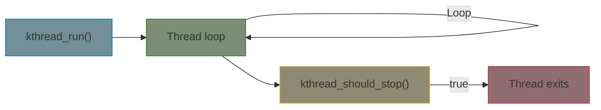
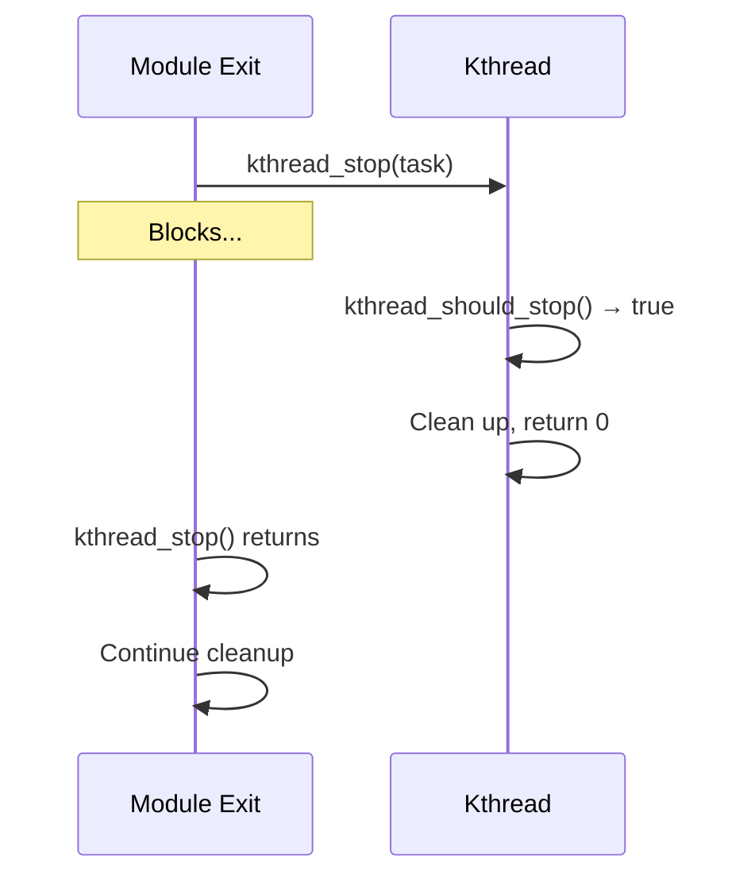

# Kernel Threads

Kernel threads (kthreads) are long-running background tasks that execute in process context. Unlike work queues (which handle individual work items), kthreads run a continuous loop — ideal for device monitoring, data processing pipelines, and protocol state machines.

## When to Use kthreads

| Mechanism | Best For |
|-----------|----------|
| Work queue | Individual, independent work items |
| Threaded IRQ | Bottom half of interrupt processing |
| kthread | Continuous background task with state |
| kthread_worker | Dedicated thread processing work items |

Use a kthread when you need a persistent thread with its own loop and state, not just a one-shot handler.

## Kthread Lifecycle



## Creating and Stopping Threads

### Basic Pattern

```c
#include <linux/kthread.h>

struct my_device {
    struct task_struct *thread;
    wait_queue_head_t wq;
    bool new_data;
    int data;
};

/* Thread function */
static int my_thread_fn(void *data)
{
    struct my_device *dev = data;

    pr_info("Thread started\n");

    while (!kthread_should_stop()) {
        /* Sleep until data arrives or stop is requested */
        wait_event_interruptible(dev->wq,
                                 dev->new_data ||
                                 kthread_should_stop());

        if (kthread_should_stop())
            break;

        /* Process data */
        dev->new_data = false;
        process_data(dev->data);
    }

    pr_info("Thread stopping\n");
    return 0;
}

/* In probe */
static int my_probe(struct platform_device *pdev)
{
    struct my_device *dev;

    dev = devm_kzalloc(&pdev->dev, sizeof(*dev), GFP_KERNEL);
    if (!dev)
        return -ENOMEM;

    init_waitqueue_head(&dev->wq);

    /* Create and start thread */
    dev->thread = kthread_run(my_thread_fn, dev, "my_worker");
    if (IS_ERR(dev->thread))
        return PTR_ERR(dev->thread);

    platform_set_drvdata(pdev, dev);
    return 0;
}

/* In remove */
static void my_remove(struct platform_device *pdev)
{
    struct my_device *dev = platform_get_drvdata(pdev);

    /* Signal thread to stop and wait for it to exit */
    kthread_stop(dev->thread);
}
```

### Two-Step Creation

Use `kthread_create()` + `wake_up_process()` when you need to configure the thread before it starts:

```c
dev->thread = kthread_create(my_thread_fn, dev, "my_worker");
if (IS_ERR(dev->thread))
    return PTR_ERR(dev->thread);

/* Pin to specific CPU (optional) */
kthread_bind(dev->thread, cpu);

/* Now start it */
wake_up_process(dev->thread);
```

### Thread Naming

The name appears in `ps` and `top`, helping identify your threads:

```c
/* Static name */
kthread_run(fn, data, "my_driver");

/* Dynamic name with format string */
kthread_run(fn, data, "my_drv/%d", port_num);
```

## Key Functions

| Function | Description |
|----------|-------------|
| `kthread_run(fn, data, name)` | Create and start a thread |
| `kthread_create(fn, data, name)` | Create (stopped) thread |
| `wake_up_process(task)` | Start a created thread |
| `kthread_should_stop()` | Check if stop was requested |
| `kthread_stop(task)` | Request stop and wait for exit |
| `kthread_bind(task, cpu)` | Bind to a CPU (before start) |

## The Stop Protocol

`kthread_stop()` and `kthread_should_stop()` form a cooperative shutdown mechanism:



{: .warning }
`kthread_stop()` blocks until the thread exits. If the thread is sleeping, it will be woken. But if it never checks `kthread_should_stop()`, you'll deadlock.

## Common Patterns

### Periodic Polling Thread

```c
static int poller_thread(void *data)
{
    struct my_device *dev = data;

    while (!kthread_should_stop()) {
        /* Do periodic work */
        dev->temperature = read_sensor(dev);

        /* Sleep for 1 second, interruptible by stop */
        wait_event_interruptible_timeout(dev->wq,
                                         kthread_should_stop(),
                                         HZ);
    }

    return 0;
}
```

### Event-Driven Thread

```c
static int event_thread(void *data)
{
    struct my_device *dev = data;

    while (!kthread_should_stop()) {
        /* Sleep until event or stop */
        wait_event_interruptible(dev->wq,
                                 dev->event_pending ||
                                 kthread_should_stop());

        if (kthread_should_stop())
            break;

        /* Handle event */
        dev->event_pending = false;
        handle_event(dev);
    }

    return 0;
}

/* From IRQ handler */
static irqreturn_t my_irq(int irq, void *data)
{
    struct my_device *dev = data;

    dev->event_pending = true;
    wake_up_interruptible(&dev->wq);

    return IRQ_HANDLED;
}
```

### Thread with Cleanup

```c
static int worker_thread(void *data)
{
    struct my_device *dev = data;
    void *buf;

    /* Thread-local resources */
    buf = kmalloc(PAGE_SIZE, GFP_KERNEL);
    if (!buf)
        return -ENOMEM;

    while (!kthread_should_stop()) {
        /* ... work with buf ... */
        schedule_timeout_interruptible(HZ);
    }

    /* Clean up thread-local resources */
    kfree(buf);
    return 0;
}
```

## kthread_worker: Dedicated Thread for Work Items

When you need a dedicated thread (not the shared system workqueue) processing individual work items:

```c
#include <linux/kthread.h>

struct my_device {
    struct kthread_worker *worker;
    struct kthread_work process_work;
};

static void process_fn(struct kthread_work *work)
{
    struct my_device *dev = container_of(work,
                                         struct my_device,
                                         process_work);
    /* Process one item - can sleep */
    do_heavy_processing(dev);
}

static int my_probe(struct platform_device *pdev)
{
    struct my_device *dev;

    dev = devm_kzalloc(&pdev->dev, sizeof(*dev), GFP_KERNEL);
    if (!dev)
        return -ENOMEM;

    dev->worker = kthread_create_worker(0, "my_worker");
    if (IS_ERR(dev->worker))
        return PTR_ERR(dev->worker);

    kthread_init_work(&dev->process_work, process_fn);

    platform_set_drvdata(pdev, dev);
    return 0;
}

/* Queue work to dedicated thread */
void submit_work(struct my_device *dev)
{
    kthread_queue_work(dev->worker, &dev->process_work);
}

static void my_remove(struct platform_device *pdev)
{
    struct my_device *dev = platform_get_drvdata(pdev);

    kthread_destroy_worker(dev->worker);
}
```

### kthread_worker vs Workqueue

| Feature | Workqueue | kthread_worker |
|---------|-----------|----------------|
| Thread | Shared pool | Dedicated thread |
| Priority | Normal (or WQ_HIGHPRI) | Configurable (SCHED_FIFO) |
| Ordering | May run concurrently | Strictly serialized |
| Use case | General deferred work | RT or ordered processing |

## Comparison: kthread vs workqueue vs threaded IRQ

| Feature | kthread | Workqueue | Threaded IRQ |
|---------|---------|-----------|--------------|
| Lifecycle | Continuous loop | Per-item callback | Per-interrupt |
| Context | Process | Process | Process |
| State | Maintains its own | Stateless items | Stateless |
| Scheduling | Full control | Managed by kernel | Managed by kernel |
| Best for | Background daemons | Deferred work items | Interrupt bottom halves |

## Best Practices

- **Always check `kthread_should_stop()` in your loop** — enables clean shutdown
- **Use `wait_event*` for sleeping** — don't busy-loop with `schedule()`
- **Include `kthread_should_stop()` in the wait condition** — ensures the thread wakes on stop
- **Call `kthread_stop()` in remove/exit** — blocks until thread is fully done
- **Don't call `kthread_stop()` on an already-exited thread** — causes use-after-free
- **Name your threads descriptively** — makes debugging with `ps` much easier

## Summary

- `kthread_run()` creates and starts a background kernel thread
- `kthread_should_stop()` / `kthread_stop()` provide cooperative shutdown
- Combine with `wait_event_interruptible()` for event-driven threads
- Use `wait_event_interruptible_timeout()` for periodic polling
- Use `kthread_worker` when you need a dedicated thread for work items

## Next

Continue to [Part 5: Memory Management]() to learn about kernel memory allocation.
