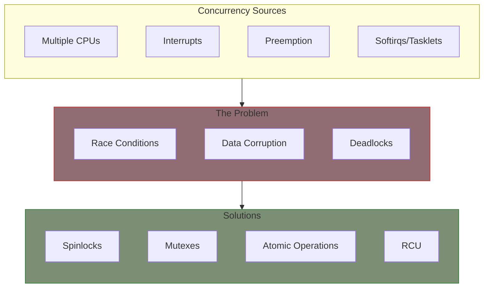
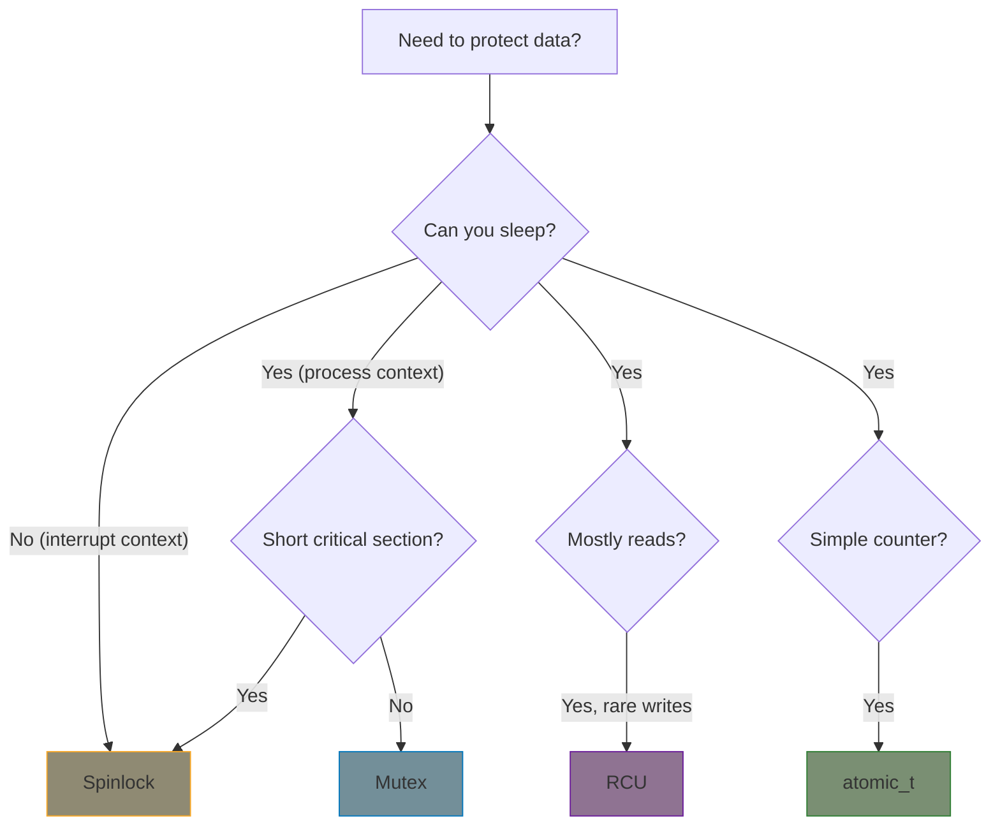

# Part 4: Concurrency and Synchronization

The Linux kernel is inherently concurrent - multiple CPUs, interrupts, and preemption mean your code can be interrupted or run simultaneously at any time. Understanding synchronization primitives is essential for writing correct, safe drivers.

## Why Concurrency Matters

## Chapter Contents

| Chapter | Topic | Key Concepts |
|---------|-------|--------------|
| [4.1]() | Concurrency Concepts | Race conditions, critical sections |
| [4.2]() | Spinlocks | spin_lock, spin_lock_irqsave |
| [4.3]() | Mutexes | Sleeping locks, mutex vs spinlock |
| [4.4]() | Semaphores | Counting semaphores |
| [4.5]() | Atomic Operations | atomic_t, bitwise atomics |
| [4.6]() | RCU | Read-Copy-Update |
| [4.7]() | Completions | Signaling between threads |
| [4.8]() | Work Queues | Deferred processing |
| [4.9]() | Lockdep | Deadlock detection |
| [4.10]() | Kernel Timers | timer_list, hrtimer |
| [4.11]() | Wait Queues | wait_event, wake_up |
| [4.12]() | Kernel Threads | kthread_run, kthread_stop |

## Quick Reference: Choosing a Lock

| Primitive | Sleep OK? | Interrupt Safe? | Best For |
|-----------|-----------|-----------------|----------|
| Spinlock | No | With irqsave | Short critical sections |
| Mutex | Yes | No | Longer critical sections |
| Semaphore | Yes | No | Resource counting |
| atomic_t | N/A | Yes | Simple counters |
| RCU | Read: Yes | Read: Yes | Read-heavy data |
| Completion | Yes | No | Thread synchronization |

## Examples

This part includes working examples:

- **spinlock-demo**: Spinlock usage patterns
- **workqueue-demo**: Deferred work processing
- **timer-demo**: Kernel timer and hrtimer usage
- **kthread-demo**: Background kernel threads

## Common Pitfalls

{: .warning }
**Deadlocks**: Taking locks in different orders across code paths

{: .warning }
**Priority inversion**: Low-priority task holds lock needed by high-priority task

{: .warning }
**Sleeping with spinlock**: Calling functions that might sleep while holding a spinlock

## Prerequisites

Before starting this part, ensure you understand:

- Process vs interrupt context (Part 2)
- Basic module structure (Part 1-2)
- Character device operations (Part 3)

## Further Reading

- [Locking Documentation](https://docs.kernel.org/locking/index.html) - Kernel locking guide
- [RCU Documentation](https://docs.kernel.org/RCU/index.html) - RCU concepts and API
- [Workqueue Documentation](https://docs.kernel.org/core-api/workqueue.html) - Work queue API
- [Timer Documentation](https://docs.kernel.org/timers/index.html) - Kernel timers
- [Kthread Documentation](https://docs.kernel.org/driver-api/basics.html#kernel-threads) - Kernel threads

## Next

Start with [Concurrency Concepts]() to understand why synchronization is necessary.
