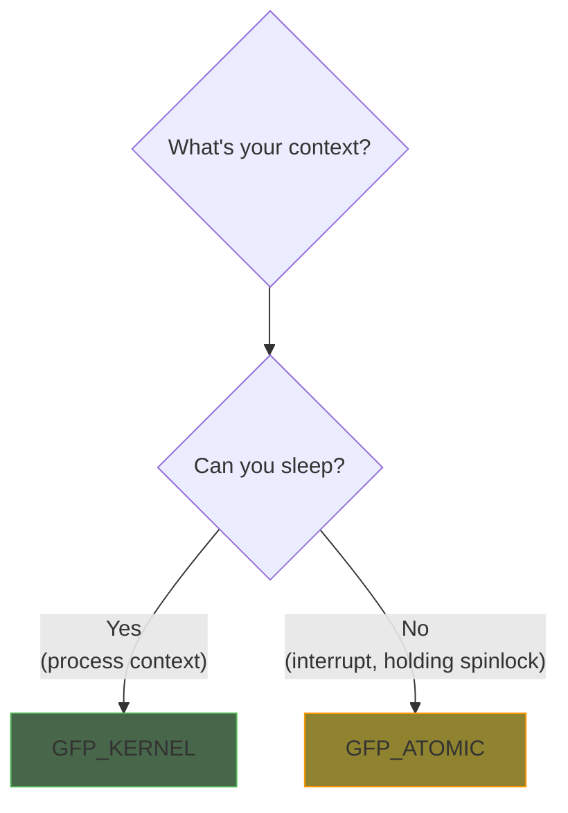

# GFP Flags

GFP (Get Free Pages) flags control how the kernel allocates memory. Choosing the right flags is critical - wrong flags can cause crashes or deadlocks.

## The Golden Rule



## Common GFP Flags

### GFP_KERNEL

The default flag for most allocations:

```c
/* Use when you CAN sleep */
ptr = kmalloc(size, GFP_KERNEL);
```

- Can sleep waiting for memory
- Can trigger memory reclaim
- Can start I/O to free memory
- Use in process context

### GFP_ATOMIC

For allocations that cannot sleep:

```c
/* Use when you CANNOT sleep */
ptr = kmalloc(size, GFP_ATOMIC);
```

- Never sleeps
- Uses emergency memory reserves
- Higher chance of failure
- Use in interrupt context or while holding spinlocks

### Other Common Flags

```c
/* User-space allocations (can fault) */
ptr = kmalloc(size, GFP_USER);

/* High memory (no direct kernel mapping) */
page = alloc_pages(GFP_HIGHUSER, 0);

/* No I/O during allocation */
ptr = kmalloc(size, GFP_NOIO);

/* No filesystem operations */
ptr = kmalloc(size, GFP_NOFS);

/* DMA-able memory (below 16MB on x86) */
ptr = kmalloc(size, GFP_DMA);

/* 32-bit DMA-able (below 4GB) */
ptr = kmalloc(size, GFP_DMA32);
```

## GFP Flag Components

Flags are composed of modifiers:

| Modifier | Meaning |
|----------|---------|
| `__GFP_WAIT` | Can sleep |
| `__GFP_IO` | Can start disk I/O |
| `__GFP_FS` | Can call into filesystem |
| `__GFP_DIRECT_RECLAIM` | Can try to reclaim pages |
| `__GFP_KSWAPD_RECLAIM` | Wake kswapd to reclaim |
| `__GFP_HIGH` | Use emergency reserves |
| `__GFP_ATOMIC` | Allocation is high priority |
| `__GFP_ZERO` | Zero the allocation |
| `__GFP_NOWARN` | Don't warn on failure |
| `__GFP_RETRY_MAYFAIL` | Try hard, but can fail |
| `__GFP_NOFAIL` | Never fail (dangerous!) |

### Flag Compositions

```c
/* GFP_KERNEL includes: */
#define GFP_KERNEL (__GFP_RECLAIM | __GFP_IO | __GFP_FS)

/* GFP_ATOMIC includes: */
#define GFP_ATOMIC (__GFP_HIGH | __GFP_ATOMIC | __GFP_KSWAPD_RECLAIM)

/* GFP_NOIO - for I/O path allocations */
#define GFP_NOIO (__GFP_RECLAIM)

/* GFP_NOFS - for filesystem allocations */
#define GFP_NOFS (__GFP_RECLAIM | __GFP_IO)
```

## Context-Specific Usage

### Process Context (can sleep)

```c
static ssize_t my_write(struct file *file, const char __user *buf,
                        size_t count, loff_t *ppos)
{
    void *data;

    /* GFP_KERNEL is safe in syscall/process context */
    data = kmalloc(count, GFP_KERNEL);
    if (!data)
        return -ENOMEM;

    /* ... */
    kfree(data);
    return count;
}
```

### Interrupt Context (cannot sleep)

```c
static irqreturn_t my_irq_handler(int irq, void *dev_id)
{
    struct my_device *dev = dev_id;
    void *buf;

    /* Must use GFP_ATOMIC in interrupt context! */
    buf = kmalloc(256, GFP_ATOMIC);
    if (!buf) {
        /* Higher chance of failure - handle gracefully */
        dev->dropped_irqs++;
        return IRQ_HANDLED;
    }

    /* ... quick processing ... */

    kfree(buf);
    return IRQ_HANDLED;
}
```

### Holding Spinlock

```c
void my_function(struct my_device *dev)
{
    void *buf;

    spin_lock(&dev->lock);

    /* Cannot sleep while holding spinlock! */
    buf = kmalloc(256, GFP_ATOMIC);
    if (buf) {
        /* ... */
        kfree(buf);
    }

    spin_unlock(&dev->lock);
}
```

### Holding Mutex

```c
void my_function(struct my_device *dev)
{
    void *buf;

    mutex_lock(&dev->mutex);

    /* Mutex allows sleeping - can use GFP_KERNEL */
    buf = kmalloc(256, GFP_KERNEL);
    if (!buf) {
        mutex_unlock(&dev->mutex);
        return;
    }

    /* ... */

    kfree(buf);
    mutex_unlock(&dev->mutex);
}
```

## Special Situations

### Memory Reclaim Path

When allocating in the memory reclaim path:

```c
/* In shrinker or reclaim callback */
ptr = kmalloc(size, GFP_NOIO);  /* No disk I/O */
/* or */
ptr = kmalloc(size, GFP_NOFS);  /* No filesystem calls */
```

### Memory Pressure

When memory is tight and failure is acceptable:

```c
/* Try hard but accept failure */
ptr = kmalloc(large_size, GFP_KERNEL | __GFP_RETRY_MAYFAIL);
if (!ptr) {
    /* Fallback to smaller allocation */
    ptr = kmalloc(small_size, GFP_KERNEL);
}
```

### Absolutely Must Succeed

```c
/* Only for critical allocations - can cause system hang! */
ptr = kmalloc(size, GFP_KERNEL | __GFP_NOFAIL);
/* ptr is guaranteed non-NULL */
```

{: .warning }
Avoid `__GFP_NOFAIL`. It can block indefinitely if memory is unavailable.

### Suppress Warning on Failure

```c
/* Don't print warning if allocation fails */
ptr = kmalloc(large_size, GFP_KERNEL | __GFP_NOWARN);
if (!ptr) {
    /* Handle quietly */
}
```

## Decision Table

| Context | Can Sleep? | Flag |
|---------|------------|------|
| Syscall handler | Yes | GFP_KERNEL |
| Work queue | Yes | GFP_KERNEL |
| Softirq | No | GFP_ATOMIC |
| Interrupt | No | GFP_ATOMIC |
| Holding spinlock | No | GFP_ATOMIC |
| Holding mutex | Yes | GFP_KERNEL |
| Filesystem code | Yes | GFP_NOFS |
| Block I/O code | Yes | GFP_NOIO |

## Checking Context

```c
#include <linux/preempt.h>
#include <linux/sched.h>

gfp_t get_safe_gfp(void)
{
    if (in_interrupt() || in_atomic())
        return GFP_ATOMIC;
    return GFP_KERNEL;
}

/* Or use built-in helper */
gfp_t flags = GFP_KERNEL;
if (in_atomic())
    flags = GFP_ATOMIC;
```

## DMA Flags

For DMA-capable memory:

```c
/* ISA DMA (first 16MB) */
ptr = kmalloc(size, GFP_KERNEL | GFP_DMA);

/* 32-bit DMA (first 4GB) */
ptr = kmalloc(size, GFP_KERNEL | GFP_DMA32);
```

{: .note }
Modern drivers should use the DMA API (`dma_alloc_coherent()`) instead of GFP_DMA flags.

## Zeroing Allocations

```c
/* Using kzalloc (preferred) */
ptr = kzalloc(size, GFP_KERNEL);

/* Using __GFP_ZERO */
ptr = kmalloc(size, GFP_KERNEL | __GFP_ZERO);
page = alloc_pages(GFP_KERNEL | __GFP_ZERO, order);
```

## Summary

| Flag | Sleep | Reclaim | Use Case |
|------|-------|---------|----------|
| GFP_KERNEL | Yes | Yes | Default for process context |
| GFP_ATOMIC | No | Limited | Interrupt/atomic context |
| GFP_NOIO | Yes | No I/O | Block I/O layer |
| GFP_NOFS | Yes | No FS | Filesystem code |
| GFP_USER | Yes | Yes | User-space pages |

- Always match GFP flags to your context
- Use `GFP_KERNEL` by default in process context
- Use `GFP_ATOMIC` when you cannot sleep
- Handle allocation failure gracefully, especially with GFP_ATOMIC

## Next

Learn about the [slab allocator]() for efficient object allocation.
