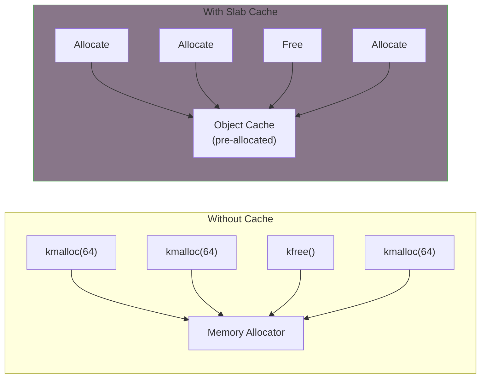

# Slab Allocator

The slab allocator provides efficient allocation for objects of the same size. When you frequently allocate and free the same type of structure, creating a dedicated cache can significantly improve performance.

## Why Use Slab Caches?



Benefits:
- Pre-allocated object pools
- No fragmentation for fixed-size objects
- Object reuse (no zeroing needed for same-type objects)
- Per-CPU caching for hot objects
- Constructor/destructor support

## Creating a Slab Cache

```c
#include <linux/slab.h>

static struct kmem_cache *my_cache;

/* Create cache during module init */
static int __init my_init(void)
{
    my_cache = kmem_cache_create(
        "my_objects",              /* Cache name (shows in /proc/slabinfo) */
        sizeof(struct my_object),  /* Object size */
        0,                         /* Alignment (0 = natural) */
        0,                         /* Flags */
        NULL                       /* Constructor function */
    );

    if (!my_cache)
        return -ENOMEM;

    return 0;
}

/* Destroy cache during module exit */
static void __exit my_exit(void)
{
    kmem_cache_destroy(my_cache);
}
```

## Allocating and Freeing Objects

```c
struct my_object *obj;

/* Allocate object from cache */
obj = kmem_cache_alloc(my_cache, GFP_KERNEL);
if (!obj)
    return -ENOMEM;

/* Use the object */
obj->field = value;

/* Free object back to cache */
kmem_cache_free(my_cache, obj);
```

### Zeroed Allocation

```c
/* Allocate and zero */
obj = kmem_cache_zalloc(my_cache, GFP_KERNEL);
```

## Constructor Function

Initialize objects when they're first allocated from the page allocator:

```c
static void my_object_init(void *ptr)
{
    struct my_object *obj = ptr;

    /* Initialize fields that stay constant across reuses */
    spin_lock_init(&obj->lock);
    INIT_LIST_HEAD(&obj->list);
    obj->magic = MY_MAGIC;
}

static int __init my_init(void)
{
    my_cache = kmem_cache_create(
        "my_objects",
        sizeof(struct my_object),
        0,
        SLAB_HWCACHE_ALIGN,  /* Align to cache line */
        my_object_init       /* Constructor */
    );

    return my_cache ? 0 : -ENOMEM;
}
```

{: .note }
The constructor runs once when objects are created, not on every allocation. Objects are reused without re-running the constructor.

## Slab Cache Flags

```c
/* Common flags */
SLAB_HWCACHE_ALIGN   /* Align to CPU cache line */
SLAB_RECLAIM_ACCOUNT /* Account for memory reclaim */
SLAB_PANIC           /* Panic if creation fails */
SLAB_TYPESAFE_BY_RCU /* RCU-safe reuse */
SLAB_MEM_SPREAD      /* Spread across NUMA nodes */

/* Debugging flags */
SLAB_POISON          /* Poison freed objects */
SLAB_RED_ZONE        /* Add guard zones */
SLAB_STORE_USER      /* Store alloc/free caller */

/* Example usage */
my_cache = kmem_cache_create("my_objects",
                             sizeof(struct my_object),
                             0,
                             SLAB_HWCACHE_ALIGN | SLAB_RECLAIM_ACCOUNT,
                             my_object_init);
```

## Complete Example

```c
#include <linux/module.h>
#include <linux/slab.h>
#include <linux/list.h>

struct my_object {
    struct list_head list;
    spinlock_t lock;
    int id;
    char data[64];
    unsigned long timestamp;
};

static struct kmem_cache *object_cache;
static LIST_HEAD(object_list);
static DEFINE_SPINLOCK(list_lock);
static int next_id;

static void object_init(void *ptr)
{
    struct my_object *obj = ptr;

    spin_lock_init(&obj->lock);
    INIT_LIST_HEAD(&obj->list);
}

struct my_object *create_object(const char *data)
{
    struct my_object *obj;

    obj = kmem_cache_alloc(object_cache, GFP_KERNEL);
    if (!obj)
        return NULL;

    obj->id = next_id++;
    strscpy(obj->data, data, sizeof(obj->data));
    obj->timestamp = jiffies;

    spin_lock(&list_lock);
    list_add(&obj->list, &object_list);
    spin_unlock(&list_lock);

    return obj;
}

void destroy_object(struct my_object *obj)
{
    spin_lock(&list_lock);
    list_del(&obj->list);
    spin_unlock(&list_lock);

    kmem_cache_free(object_cache, obj);
}

void destroy_all_objects(void)
{
    struct my_object *obj, *tmp;

    spin_lock(&list_lock);
    list_for_each_entry_safe(obj, tmp, &object_list, list) {
        list_del(&obj->list);
        kmem_cache_free(object_cache, obj);
    }
    spin_unlock(&list_lock);
}

static int __init my_init(void)
{
    object_cache = kmem_cache_create("my_objects",
                                     sizeof(struct my_object),
                                     0,
                                     SLAB_HWCACHE_ALIGN,
                                     object_init);
    if (!object_cache)
        return -ENOMEM;

    pr_info("Object cache created\n");
    return 0;
}

static void __exit my_exit(void)
{
    destroy_all_objects();
    kmem_cache_destroy(object_cache);
    pr_info("Object cache destroyed\n");
}

module_init(my_init);
module_exit(my_exit);
MODULE_LICENSE("GPL");
```

## Viewing Slab Information

```bash
# View all slab caches
cat /proc/slabinfo

# Detailed slab info
slabtop

# Specific cache info
cat /sys/kernel/slab/my_objects/object_size
cat /sys/kernel/slab/my_objects/objs_per_slab
```

## Memory-Managed (devm) Variant

For device-managed allocations:

```c
static int my_probe(struct platform_device *pdev)
{
    struct my_device *dev;

    /* Automatically freed on driver remove */
    dev = devm_kzalloc(&pdev->dev, sizeof(*dev), GFP_KERNEL);
    if (!dev)
        return -ENOMEM;

    /* No need to kfree - managed automatically */
    return 0;
}
```

{: .note }
There's no `devm_kmem_cache_create()`. Use regular slab caches and manage them in probe/remove.

## Bulk Allocation

Allocate multiple objects at once:

```c
#define BATCH_SIZE 16

struct my_object *objects[BATCH_SIZE];
int allocated;

/* Allocate batch */
allocated = kmem_cache_alloc_bulk(object_cache, GFP_KERNEL,
                                  BATCH_SIZE, (void **)objects);
if (allocated < BATCH_SIZE) {
    /* Partial allocation - handle or free */
    kmem_cache_free_bulk(object_cache, allocated, (void **)objects);
    return -ENOMEM;
}

/* Use objects */
/* ... */

/* Free batch */
kmem_cache_free_bulk(object_cache, BATCH_SIZE, (void **)objects);
```

## KMEM_CACHE Macro

Shorthand for common cases:

```c
/* Create cache with automatic alignment and name */
object_cache = KMEM_CACHE(my_object, SLAB_HWCACHE_ALIGN);

/* With constructor */
object_cache = KMEM_CACHE(my_object, 0);
```

## Shrinking Caches

For memory pressure situations:

```c
/* Reclaim free slabs */
kmem_cache_shrink(object_cache);
```

## When to Use Slab Caches

**Use slab cache when:**
- Frequently allocating/freeing same-size objects
- Need consistent allocation times
- Want to track specific object allocations
- Objects benefit from initialization caching

**Use kmalloc when:**
- Object sizes vary
- Allocations are infrequent
- Simple one-off allocations

## Summary

- Create caches with `kmem_cache_create()`
- Allocate with `kmem_cache_alloc()`, free with `kmem_cache_free()`
- Use constructors for common initialization
- Destroy cache after freeing all objects
- Use `SLAB_HWCACHE_ALIGN` for performance
- Monitor with `/proc/slabinfo`

## Next

Learn about [per-CPU variables]() for lock-free data.
