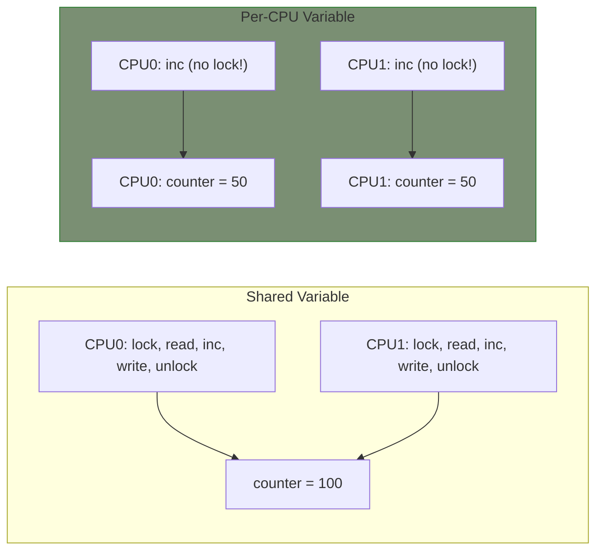

# Per-CPU Variables

Per-CPU variables provide each CPU with its own private copy of a variable. This eliminates the need for locking when accessing the variable, making them ideal for frequently updated counters and statistics.

## Why Per-CPU Variables?



Benefits:
- No locking needed for per-CPU access
- No cache line bouncing between CPUs
- Excellent scalability
- Very fast access

## Defining Per-CPU Variables

### Static Definition

```c
#include <linux/percpu.h>

/* Simple variable */
static DEFINE_PER_CPU(int, my_counter);

/* Structure */
static DEFINE_PER_CPU(struct my_stats, cpu_stats);

/* Array */
static DEFINE_PER_CPU(int[10], my_array);
```

### Dynamic Allocation

```c
int __percpu *dynamic_counter;

static int __init my_init(void)
{
    dynamic_counter = alloc_percpu(int);
    if (!dynamic_counter)
        return -ENOMEM;

    return 0;
}

static void __exit my_exit(void)
{
    free_percpu(dynamic_counter);
}
```

## Accessing Per-CPU Variables

### Disable Preemption

You must disable preemption when accessing per-CPU data to prevent migration to another CPU:

```c
/* Get pointer to current CPU's variable */
preempt_disable();
int *ptr = this_cpu_ptr(&my_counter);
(*ptr)++;
preempt_enable();

/* Or use the simpler macros */
preempt_disable();
__this_cpu_inc(my_counter);  /* Fast, unsafe without preempt disabled */
preempt_enable();

/* Or let the macro handle it */
this_cpu_inc(my_counter);  /* Includes preempt disable/enable */
```

### Quick Access Macros

```c
/* Read */
int val = this_cpu_read(my_counter);
int val = __this_cpu_read(my_counter);  /* Requires preempt disabled */

/* Write */
this_cpu_write(my_counter, 42);
__this_cpu_write(my_counter, 42);

/* Increment/Decrement */
this_cpu_inc(my_counter);
this_cpu_dec(my_counter);
__this_cpu_inc(my_counter);
__this_cpu_dec(my_counter);

/* Add/Subtract */
this_cpu_add(my_counter, 5);
this_cpu_sub(my_counter, 3);

/* Or operation */
this_cpu_or(my_flags, FLAG_ACTIVE);

/* And operation */
this_cpu_and(my_flags, ~FLAG_ACTIVE);
```

### Accessing Other CPU's Variables

```c
/* Get pointer to specific CPU's variable */
int *other_ptr = per_cpu_ptr(&my_counter, cpu);

/* Read from specific CPU */
int val = per_cpu(my_counter, cpu);

/* Iterate all CPUs */
int total = 0;
int cpu;

for_each_possible_cpu(cpu) {
    total += per_cpu(my_counter, cpu);
}
```

## Complete Example: Statistics Counter

```c
#include <linux/module.h>
#include <linux/percpu.h>
#include <linux/proc_fs.h>
#include <linux/seq_file.h>

struct my_stats {
    unsigned long packets;
    unsigned long bytes;
    unsigned long errors;
};

static DEFINE_PER_CPU(struct my_stats, cpu_stats);

/* Called from packet processing (frequent, performance-critical) */
void record_packet(size_t len, bool error)
{
    /* No locking needed! */
    this_cpu_inc(cpu_stats.packets);
    this_cpu_add(cpu_stats.bytes, len);
    if (error)
        this_cpu_inc(cpu_stats.errors);
}

/* Called from proc/stats (infrequent, can be slower) */
static int stats_show(struct seq_file *m, void *v)
{
    unsigned long total_packets = 0;
    unsigned long total_bytes = 0;
    unsigned long total_errors = 0;
    int cpu;

    /* Sum across all CPUs */
    for_each_possible_cpu(cpu) {
        struct my_stats *s = per_cpu_ptr(&cpu_stats, cpu);
        total_packets += s->packets;
        total_bytes += s->bytes;
        total_errors += s->errors;

        seq_printf(m, "CPU%d: packets=%lu bytes=%lu errors=%lu\n",
                   cpu, s->packets, s->bytes, s->errors);
    }

    seq_printf(m, "Total: packets=%lu bytes=%lu errors=%lu\n",
               total_packets, total_bytes, total_errors);

    return 0;
}

/* Reset statistics */
void reset_stats(void)
{
    int cpu;

    for_each_possible_cpu(cpu) {
        struct my_stats *s = per_cpu_ptr(&cpu_stats, cpu);
        s->packets = 0;
        s->bytes = 0;
        s->errors = 0;
    }
}
```

## Dynamic Per-CPU Allocation

```c
struct my_data {
    int counter;
    char buffer[64];
};

static struct my_data __percpu *dynamic_data;

static int __init my_init(void)
{
    int cpu;

    /* Allocate per-CPU structure */
    dynamic_data = alloc_percpu(struct my_data);
    if (!dynamic_data)
        return -ENOMEM;

    /* Initialize each CPU's copy */
    for_each_possible_cpu(cpu) {
        struct my_data *d = per_cpu_ptr(dynamic_data, cpu);
        d->counter = 0;
        snprintf(d->buffer, sizeof(d->buffer), "CPU%d data", cpu);
    }

    return 0;
}

static void __exit my_exit(void)
{
    free_percpu(dynamic_data);
}

void use_data(void)
{
    struct my_data *d;

    preempt_disable();
    d = this_cpu_ptr(dynamic_data);
    d->counter++;
    preempt_enable();
}
```

## Per-CPU in Interrupt Context

Per-CPU variables are safe in interrupt context (interrupts are on the same CPU):

```c
static DEFINE_PER_CPU(unsigned long, irq_count);

irqreturn_t my_irq_handler(int irq, void *dev_id)
{
    /* Safe - interrupts don't migrate */
    __this_cpu_inc(irq_count);  /* Can use __ variant */

    return IRQ_HANDLED;
}
```

## Combining with Other Locks

Sometimes you need both per-CPU data and shared state:

```c
struct global_state {
    spinlock_t lock;
    struct list_head list;
};

static DEFINE_PER_CPU(unsigned long, local_counter);
static struct global_state global;

void process_item(struct item *item)
{
    /* Update local counter (no lock) */
    this_cpu_inc(local_counter);

    /* Update global list (need lock) */
    spin_lock(&global.lock);
    list_add(&item->list, &global.list);
    spin_unlock(&global.lock);
}
```

## CPU Hotplug Considerations

Handle CPUs coming online/offline:

```c
#include <linux/cpu.h>

static int my_cpu_online(unsigned int cpu)
{
    struct my_data *d = per_cpu_ptr(dynamic_data, cpu);
    /* Initialize for newly online CPU */
    d->counter = 0;
    return 0;
}

static int my_cpu_offline(unsigned int cpu)
{
    struct my_data *d = per_cpu_ptr(dynamic_data, cpu);
    /* Save data before CPU goes offline */
    save_final_count(cpu, d->counter);
    return 0;
}

static int __init my_init(void)
{
    /* Register for CPU hotplug notifications */
    cpuhp_setup_state(CPUHP_AP_ONLINE_DYN,
                      "my_driver:online",
                      my_cpu_online,
                      my_cpu_offline);
    return 0;
}
```

## When to Use Per-CPU Variables

**Good candidates:**
- Statistics counters
- Per-CPU caches
- Frequently updated values
- Performance-critical paths

**Not suitable for:**
- Data that needs cross-CPU synchronization
- Data that needs atomic cross-CPU reads
- Small amounts of data (not worth the memory)

## Summary

- Per-CPU variables eliminate locking for CPU-local data
- Use `DEFINE_PER_CPU()` for static, `alloc_percpu()` for dynamic
- Use `this_cpu_*` macros for current CPU access
- Use `per_cpu_ptr()` to access specific CPU's data
- Disable preemption when accessing (or use safe macros)
- Aggregate by iterating `for_each_possible_cpu()`

## Next

Learn about [coherent DMA]() for hardware buffer allocation.
