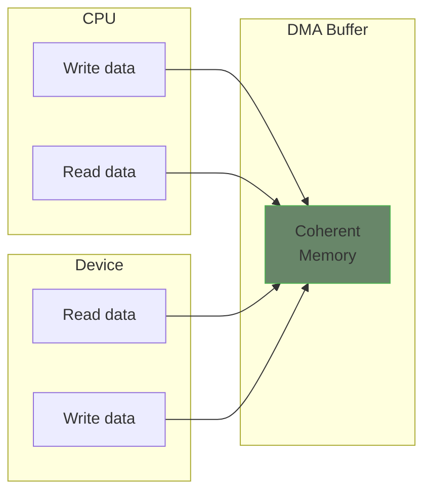

# Coherent DMA

Coherent DMA provides memory regions that are always synchronized between the CPU and device. Both can access the memory at any time without explicit synchronization operations.

## DMA Overview



## Allocating Coherent DMA Memory

```c
#include <linux/dma-mapping.h>

static dma_addr_t dma_handle;
static void *cpu_addr;
static size_t buffer_size = 4096;

static int my_probe(struct platform_device *pdev)
{
    struct device *dev = &pdev->dev;

    /* Allocate coherent DMA buffer */
    cpu_addr = dma_alloc_coherent(dev, buffer_size,
                                  &dma_handle, GFP_KERNEL);
    if (!cpu_addr) {
        dev_err(dev, "Failed to allocate DMA buffer\n");
        return -ENOMEM;
    }

    dev_info(dev, "DMA buffer: cpu_addr=%p, dma_addr=%pad\n",
             cpu_addr, &dma_handle);

    /*
     * cpu_addr: Virtual address for CPU access
     * dma_handle: Physical/bus address for device access
     */

    return 0;
}

static int my_remove(struct platform_device *pdev)
{
    struct device *dev = &pdev->dev;

    dma_free_coherent(dev, buffer_size, cpu_addr, dma_handle);
    return 0;
}
```

## Device-Managed Allocation

Using devm_ for automatic cleanup:

```c
static int my_probe(struct platform_device *pdev)
{
    struct device *dev = &pdev->dev;
    struct my_device *mydev;

    mydev = devm_kzalloc(dev, sizeof(*mydev), GFP_KERNEL);
    if (!mydev)
        return -ENOMEM;

    /* Automatically freed on driver remove */
    mydev->buffer = dmam_alloc_coherent(dev, 4096,
                                        &mydev->dma_handle,
                                        GFP_KERNEL);
    if (!mydev->buffer)
        return -ENOMEM;

    /* No need to call dma_free_coherent in remove */
    return 0;
}
```

## Using Coherent DMA

### Descriptor Ring Example

```c
struct dma_descriptor {
    __le32 control;
    __le32 length;
    __le64 address;
    __le32 status;
    __le32 reserved;
} __packed;

#define NUM_DESCRIPTORS 64

struct my_device {
    struct device *dev;
    struct dma_descriptor *desc_ring;  /* CPU address */
    dma_addr_t desc_ring_dma;          /* Device address */
    int current_desc;
};

static int init_descriptor_ring(struct my_device *mydev)
{
    size_t ring_size = NUM_DESCRIPTORS * sizeof(struct dma_descriptor);

    /* Allocate descriptor ring */
    mydev->desc_ring = dma_alloc_coherent(mydev->dev, ring_size,
                                          &mydev->desc_ring_dma,
                                          GFP_KERNEL);
    if (!mydev->desc_ring)
        return -ENOMEM;

    /* Initialize descriptors */
    memset(mydev->desc_ring, 0, ring_size);

    /* Tell hardware where the ring is */
    writel(lower_32_bits(mydev->desc_ring_dma),
           mydev->regs + DESC_RING_ADDR_LO);
    writel(upper_32_bits(mydev->desc_ring_dma),
           mydev->regs + DESC_RING_ADDR_HI);

    return 0;
}

static void setup_descriptor(struct my_device *mydev, int idx,
                             dma_addr_t data_addr, size_t len)
{
    struct dma_descriptor *desc = &mydev->desc_ring[idx];

    /* CPU writes directly - immediately visible to device */
    desc->address = cpu_to_le64(data_addr);
    desc->length = cpu_to_le32(len);
    desc->control = cpu_to_le32(DESC_CTRL_VALID | DESC_CTRL_IRQ);

    /* Memory barrier to ensure writes are visible */
    wmb();
}
```

### Circular Buffer Example

```c
struct ring_buffer {
    void *buffer;
    dma_addr_t dma_addr;
    size_t size;
    size_t head;  /* CPU writes here */
    size_t tail;  /* Device reads from here (or vice versa) */
};

static int init_ring_buffer(struct device *dev, struct ring_buffer *ring,
                            size_t size)
{
    ring->buffer = dma_alloc_coherent(dev, size, &ring->dma_addr,
                                      GFP_KERNEL);
    if (!ring->buffer)
        return -ENOMEM;

    ring->size = size;
    ring->head = ring->tail = 0;
    return 0;
}

static int write_to_ring(struct ring_buffer *ring, const void *data,
                         size_t len)
{
    size_t space = (ring->tail - ring->head - 1) % ring->size;

    if (len > space)
        return -ENOSPC;

    /* Write data to ring */
    if (ring->head + len <= ring->size) {
        memcpy(ring->buffer + ring->head, data, len);
    } else {
        /* Wrap around */
        size_t first = ring->size - ring->head;
        memcpy(ring->buffer + ring->head, data, first);
        memcpy(ring->buffer, data + first, len - first);
    }

    /* Update head - device sees new data immediately */
    wmb();
    ring->head = (ring->head + len) % ring->size;

    return len;
}
```

## DMA Masks

Set the device's DMA capability:

```c
static int my_probe(struct platform_device *pdev)
{
    struct device *dev = &pdev->dev;
    int ret;

    /* Set DMA mask - device can access all 64-bit addresses */
    ret = dma_set_mask_and_coherent(dev, DMA_BIT_MASK(64));
    if (ret) {
        /* Try 32-bit */
        ret = dma_set_mask_and_coherent(dev, DMA_BIT_MASK(32));
        if (ret) {
            dev_err(dev, "No suitable DMA mask\n");
            return ret;
        }
    }

    /* Now safe to allocate DMA buffers */
    return 0;
}
```

## Coherent vs Streaming DMA

| Aspect | Coherent | Streaming |
|--------|----------|-----------|
| Synchronization | Automatic | Manual (sync calls) |
| Setup cost | Higher | Lower |
| Memory | May be uncached | Normally cached |
| Use case | Long-lived buffers | Per-transfer buffers |
| Example | Descriptor rings | Data buffers |

## Memory Ordering

Coherent DMA doesn't guarantee ordering. Use barriers:

```c
/* Ensure all writes are visible before notifying device */
wmb();
writel(START_DMA, mydev->regs + CONTROL);

/* Ensure device writes are visible before reading */
readl(mydev->regs + STATUS);  /* Acts as read barrier */
rmb();
data = mydev->desc_ring[idx].status;
```

## Alignment and Size

```c
/* DMA buffers should be cache-line aligned */
/* dma_alloc_coherent handles this automatically */

/* For sub-page allocations, use DMA pool */
#include <linux/dmapool.h>

struct dma_pool *pool;

pool = dma_pool_create("my_pool", dev, 256, 64, 0);
/* 256-byte objects, 64-byte alignment */

void *obj = dma_pool_alloc(pool, GFP_KERNEL, &dma_handle);
/* ... */
dma_pool_free(pool, obj, dma_handle);

dma_pool_destroy(pool);
```

## Error Handling

```c
static int setup_dma_buffers(struct my_device *mydev)
{
    mydev->tx_buf = dma_alloc_coherent(mydev->dev, TX_BUF_SIZE,
                                       &mydev->tx_dma, GFP_KERNEL);
    if (!mydev->tx_buf)
        return -ENOMEM;

    mydev->rx_buf = dma_alloc_coherent(mydev->dev, RX_BUF_SIZE,
                                       &mydev->rx_dma, GFP_KERNEL);
    if (!mydev->rx_buf) {
        dma_free_coherent(mydev->dev, TX_BUF_SIZE,
                          mydev->tx_buf, mydev->tx_dma);
        return -ENOMEM;
    }

    return 0;
}
```

## Summary

- Use `dma_alloc_coherent()` for memory shared between CPU and device
- Memory is automatically synchronized - no explicit sync needed
- Set proper DMA mask before allocating
- Use `dmam_alloc_coherent()` for automatic cleanup
- Use barriers for memory ordering when needed
- Use DMA pools for small, frequent allocations
- Returns both CPU address and device address

## Next

Learn about [streaming DMA]() for per-transfer mappings.
