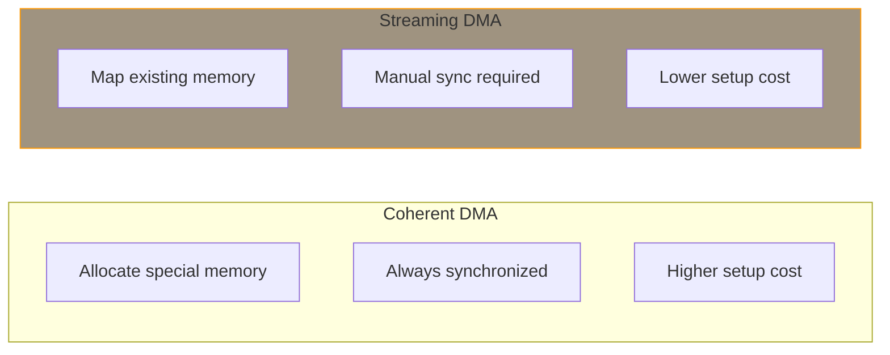

# Streaming DMA

Streaming DMA maps existing memory for DMA transfers. Unlike coherent DMA, you must explicitly synchronize the buffer between CPU and device access.

## Streaming vs Coherent DMA



| Use Case | Recommended |
|----------|-------------|
| Descriptor rings | Coherent |
| Network packet buffers | Streaming |
| Storage data transfers | Streaming |
| Long-lived shared buffers | Coherent |
| Per-packet/block data | Streaming |

## Single Buffer Mapping

### Map a Buffer

```c
#include <linux/dma-mapping.h>

struct my_device {
    struct device *dev;
    void *buffer;
    dma_addr_t dma_addr;
    size_t size;
};

/* Map buffer for device to read (DMA_TO_DEVICE) */
static int map_for_device_read(struct my_device *mydev)
{
    /* Allocate buffer */
    mydev->buffer = kmalloc(4096, GFP_KERNEL);
    if (!mydev->buffer)
        return -ENOMEM;

    mydev->size = 4096;

    /* Fill buffer with data */
    fill_buffer(mydev->buffer, mydev->size);

    /* Map for DMA */
    mydev->dma_addr = dma_map_single(mydev->dev,
                                     mydev->buffer,
                                     mydev->size,
                                     DMA_TO_DEVICE);

    if (dma_mapping_error(mydev->dev, mydev->dma_addr)) {
        kfree(mydev->buffer);
        return -ENOMEM;
    }

    /* Buffer is now owned by device */
    return 0;
}

/* Unmap when transfer complete */
static void unmap_buffer(struct my_device *mydev)
{
    dma_unmap_single(mydev->dev, mydev->dma_addr,
                     mydev->size, DMA_TO_DEVICE);
    /* Buffer ownership returns to CPU */
    kfree(mydev->buffer);
}
```

## DMA Directions

```c
/* CPU writes, device reads */
dma_map_single(dev, buf, size, DMA_TO_DEVICE);

/* Device writes, CPU reads */
dma_map_single(dev, buf, size, DMA_FROM_DEVICE);

/* Both CPU and device read/write */
dma_map_single(dev, buf, size, DMA_BIDIRECTIONAL);
```

| Direction | CPU Access | Device Access |
|-----------|------------|---------------|
| DMA_TO_DEVICE | Write before map | Read |
| DMA_FROM_DEVICE | Read after unmap | Write |
| DMA_BIDIRECTIONAL | Sync required | Read/Write |

## Buffer Synchronization

When the buffer needs to be accessed by CPU while still mapped:

### Sync for CPU Access

```c
/* Device has written to buffer, CPU needs to read */
dma_sync_single_for_cpu(mydev->dev, mydev->dma_addr,
                        mydev->size, DMA_FROM_DEVICE);

/* Now CPU can safely read */
process_data(mydev->buffer);
```

### Sync for Device Access

```c
/* CPU has written to buffer, device needs to read */
fill_buffer(mydev->buffer);

dma_sync_single_for_device(mydev->dev, mydev->dma_addr,
                           mydev->size, DMA_TO_DEVICE);

/* Now device can safely read */
start_dma_transfer(mydev);
```

### Partial Sync

```c
/* Sync only part of the buffer */
dma_sync_single_range_for_cpu(mydev->dev, mydev->dma_addr,
                              offset, length, direction);

dma_sync_single_range_for_device(mydev->dev, mydev->dma_addr,
                                 offset, length, direction);
```

## Scatter-Gather DMA

For non-contiguous memory:

```c
#include <linux/scatterlist.h>

#define NUM_PAGES 4

struct sg_transfer {
    struct device *dev;
    struct scatterlist sg[NUM_PAGES];
    struct page *pages[NUM_PAGES];
    int num_mapped;
};

static int setup_sg_transfer(struct sg_transfer *xfer)
{
    int i;

    sg_init_table(xfer->sg, NUM_PAGES);

    /* Allocate pages */
    for (i = 0; i < NUM_PAGES; i++) {
        xfer->pages[i] = alloc_page(GFP_KERNEL);
        if (!xfer->pages[i])
            goto err_alloc;

        sg_set_page(&xfer->sg[i], xfer->pages[i], PAGE_SIZE, 0);
    }

    /* Map scatter-gather list */
    xfer->num_mapped = dma_map_sg(xfer->dev, xfer->sg, NUM_PAGES,
                                  DMA_FROM_DEVICE);
    if (xfer->num_mapped == 0)
        goto err_map;

    return 0;

err_map:
err_alloc:
    while (--i >= 0)
        __free_page(xfer->pages[i]);
    return -ENOMEM;
}

static void program_sg_dma(struct sg_transfer *xfer,
                           void __iomem *dma_regs)
{
    struct scatterlist *sg;
    int i;

    for_each_sg(xfer->sg, sg, xfer->num_mapped, i) {
        dma_addr_t addr = sg_dma_address(sg);
        unsigned int len = sg_dma_len(sg);

        /* Program DMA controller */
        writel(lower_32_bits(addr), dma_regs + DMA_ADDR_LO(i));
        writel(upper_32_bits(addr), dma_regs + DMA_ADDR_HI(i));
        writel(len, dma_regs + DMA_LEN(i));
    }
}

static void cleanup_sg_transfer(struct sg_transfer *xfer)
{
    int i;

    dma_unmap_sg(xfer->dev, xfer->sg, NUM_PAGES, DMA_FROM_DEVICE);

    for (i = 0; i < NUM_PAGES; i++)
        __free_page(xfer->pages[i]);
}
```

## Page Mapping

For page-based transfers:

```c
/* Map a page */
dma_addr_t addr = dma_map_page(dev, page, offset, size, direction);
if (dma_mapping_error(dev, addr))
    return -ENOMEM;

/* Unmap */
dma_unmap_page(dev, addr, size, direction);
```

## Complete Network Example

```c
struct net_buffer {
    struct sk_buff *skb;
    dma_addr_t dma_addr;
    struct net_device *ndev;
};

/* TX: Send packet */
static int send_packet(struct net_device *ndev, struct sk_buff *skb)
{
    struct my_priv *priv = netdev_priv(ndev);
    dma_addr_t dma_addr;

    /* Map the packet data */
    dma_addr = dma_map_single(&priv->pdev->dev,
                              skb->data,
                              skb->len,
                              DMA_TO_DEVICE);

    if (dma_mapping_error(&priv->pdev->dev, dma_addr)) {
        dev_kfree_skb_any(skb);
        return NETDEV_TX_OK;
    }

    /* Save for TX completion */
    priv->tx_skb = skb;
    priv->tx_dma = dma_addr;

    /* Program DMA */
    write_dma_desc(priv, dma_addr, skb->len);
    start_tx(priv);

    return NETDEV_TX_OK;
}

/* TX completion interrupt */
static void tx_complete(struct my_priv *priv)
{
    /* Unmap the buffer */
    dma_unmap_single(&priv->pdev->dev,
                     priv->tx_dma,
                     priv->tx_skb->len,
                     DMA_TO_DEVICE);

    /* Free the skb */
    dev_kfree_skb_irq(priv->tx_skb);
    priv->tx_skb = NULL;
}

/* RX: Receive packet */
static int setup_rx_buffer(struct my_priv *priv)
{
    struct sk_buff *skb;
    dma_addr_t dma_addr;

    /* Allocate receive buffer */
    skb = netdev_alloc_skb(priv->ndev, RX_BUF_SIZE);
    if (!skb)
        return -ENOMEM;

    /* Map for device write */
    dma_addr = dma_map_single(&priv->pdev->dev,
                              skb->data,
                              RX_BUF_SIZE,
                              DMA_FROM_DEVICE);

    if (dma_mapping_error(&priv->pdev->dev, dma_addr)) {
        dev_kfree_skb_any(skb);
        return -ENOMEM;
    }

    priv->rx_skb = skb;
    priv->rx_dma = dma_addr;

    /* Program RX DMA */
    write_rx_desc(priv, dma_addr, RX_BUF_SIZE);

    return 0;
}

/* RX completion interrupt */
static void rx_complete(struct my_priv *priv, int len)
{
    struct sk_buff *skb = priv->rx_skb;

    /* Unmap buffer (sync to CPU) */
    dma_unmap_single(&priv->pdev->dev,
                     priv->rx_dma,
                     RX_BUF_SIZE,
                     DMA_FROM_DEVICE);

    /* Process received data */
    skb_put(skb, len);
    skb->protocol = eth_type_trans(skb, priv->ndev);
    netif_rx(skb);

    /* Allocate new buffer */
    setup_rx_buffer(priv);
}
```

## Best Practices

### Always Check for Errors

```c
dma_addr = dma_map_single(dev, buf, size, dir);
if (dma_mapping_error(dev, dma_addr)) {
    /* Handle error */
    return -ENOMEM;
}
```

### Match Map and Unmap

```c
/* Map with specific direction */
addr = dma_map_single(dev, buf, size, DMA_TO_DEVICE);

/* Must unmap with same direction */
dma_unmap_single(dev, addr, size, DMA_TO_DEVICE);  /* Correct */
dma_unmap_single(dev, addr, size, DMA_FROM_DEVICE);  /* WRONG! */
```

### Don't Access While Mapped

```c
addr = dma_map_single(dev, buf, size, DMA_TO_DEVICE);

/* WRONG - CPU shouldn't access while mapped */
memcpy(buf, new_data, size);

/* Either unmap first, or sync */
dma_sync_single_for_cpu(dev, addr, size, DMA_TO_DEVICE);
memcpy(buf, new_data, size);
dma_sync_single_for_device(dev, addr, size, DMA_TO_DEVICE);
```

## Summary

- Use streaming DMA for per-transfer buffer mapping
- Choose correct direction: TO_DEVICE, FROM_DEVICE, BIDIRECTIONAL
- Always check `dma_mapping_error()` after mapping
- Sync buffer when switching between CPU and device access
- Use scatter-gather for non-contiguous buffers
- Unmap before freeing memory

## Next

Learn about [ioremap]() for memory-mapped I/O.
