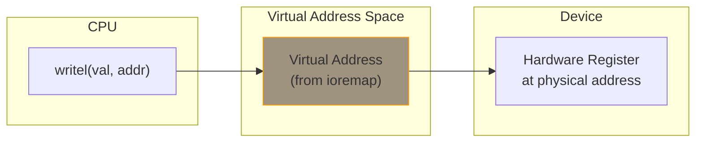

# Memory-Mapped I/O (MMIO)

Memory-mapped I/O allows CPUs to access device registers by reading and writing to memory addresses. The kernel uses `ioremap()` to create a virtual mapping for these physical addresses.

## The MMIO Concept



## Basic ioremap Usage

```c
#include <linux/io.h>

struct my_device {
    void __iomem *regs;
    resource_size_t phys_addr;
    resource_size_t size;
};

static int my_probe(struct platform_device *pdev)
{
    struct my_device *dev;
    struct resource *res;

    dev = devm_kzalloc(&pdev->dev, sizeof(*dev), GFP_KERNEL);
    if (!dev)
        return -ENOMEM;

    /* Get memory resource from device tree or ACPI */
    res = platform_get_resource(pdev, IORESOURCE_MEM, 0);
    if (!res)
        return -ENODEV;

    dev->phys_addr = res->start;
    dev->size = resource_size(res);

    /* Map the registers */
    dev->regs = ioremap(dev->phys_addr, dev->size);
    if (!dev->regs)
        return -ENOMEM;

    platform_set_drvdata(pdev, dev);
    return 0;
}

static int my_remove(struct platform_device *pdev)
{
    struct my_device *dev = platform_get_drvdata(pdev);

    iounmap(dev->regs);
    return 0;
}
```

## Device-Managed Mapping

Automatic cleanup on driver removal:

```c
static int my_probe(struct platform_device *pdev)
{
    struct my_device *dev;
    struct resource *res;

    dev = devm_kzalloc(&pdev->dev, sizeof(*dev), GFP_KERNEL);
    if (!dev)
        return -ENOMEM;

    res = platform_get_resource(pdev, IORESOURCE_MEM, 0);

    /* devm_ioremap_resource does request + remap */
    dev->regs = devm_ioremap_resource(&pdev->dev, res);
    if (IS_ERR(dev->regs))
        return PTR_ERR(dev->regs);

    /* No need to iounmap - automatic cleanup */
    return 0;
}
```

## Reading and Writing Registers

Always use the proper accessor functions:

```c
#include <linux/io.h>

void __iomem *regs;

/* 8-bit access */
u8 val = readb(regs + OFFSET);
writeb(val, regs + OFFSET);

/* 16-bit access */
u16 val = readw(regs + OFFSET);
writew(val, regs + OFFSET);

/* 32-bit access */
u32 val = readl(regs + OFFSET);
writel(val, regs + OFFSET);

/* 64-bit access */
u64 val = readq(regs + OFFSET);
writeq(val, regs + OFFSET);
```

### Why Not Direct Access?

```c
/* WRONG - never do this! */
*(volatile u32 *)regs = value;
value = *(volatile u32 *)regs;

/* Problems:
 * 1. No memory barriers
 * 2. May be wrong endianness
 * 3. Compiler might optimize incorrectly
 * 4. Not portable
 */
```

## Register Access Patterns

### Define Register Offsets

```c
/* Device registers */
#define REG_CONTROL     0x00
#define REG_STATUS      0x04
#define REG_DATA        0x08
#define REG_IRQ_ENABLE  0x0C
#define REG_IRQ_STATUS  0x10

/* Control register bits */
#define CTRL_ENABLE     BIT(0)
#define CTRL_RESET      BIT(1)
#define CTRL_IRQ_EN     BIT(2)

/* Status register bits */
#define STATUS_BUSY     BIT(0)
#define STATUS_DONE     BIT(1)
#define STATUS_ERROR    BIT(2)
```

### Access Functions

```c
struct my_device {
    void __iomem *regs;
};

static inline u32 my_read(struct my_device *dev, u32 reg)
{
    return readl(dev->regs + reg);
}

static inline void my_write(struct my_device *dev, u32 reg, u32 val)
{
    writel(val, dev->regs + reg);
}

static inline void my_set_bits(struct my_device *dev, u32 reg, u32 bits)
{
    u32 val = my_read(dev, reg);
    my_write(dev, reg, val | bits);
}

static inline void my_clear_bits(struct my_device *dev, u32 reg, u32 bits)
{
    u32 val = my_read(dev, reg);
    my_write(dev, reg, val & ~bits);
}
```

### Using the Functions

```c
static int my_device_enable(struct my_device *dev)
{
    u32 status;

    /* Reset the device */
    my_write(dev, REG_CONTROL, CTRL_RESET);

    /* Wait for reset to complete */
    do {
        status = my_read(dev, REG_STATUS);
    } while (status & STATUS_BUSY);

    /* Enable device */
    my_set_bits(dev, REG_CONTROL, CTRL_ENABLE | CTRL_IRQ_EN);

    return 0;
}
```

## Relaxed I/O Operations

When ordering between MMIO and memory accesses isn't needed:

```c
/* Relaxed versions - no memory barriers */
val = readl_relaxed(addr);
writel_relaxed(val, addr);

/* Use when:
 * - Accessing multiple registers in sequence
 * - Order between register accesses doesn't matter
 * - Performance is critical
 */

/* Example: Write multiple values then barrier */
writel_relaxed(val1, regs + REG1);
writel_relaxed(val2, regs + REG2);
writel_relaxed(val3, regs + REG3);
wmb();  /* Explicit barrier */
writel(val4, regs + REG_START);  /* Start command with barrier */
```

## Big-Endian Registers

Some devices have big-endian registers:

```c
/* Big-endian register access */
u32 val = ioread32be(regs + REG);
iowrite32be(val, regs + REG);

/* Generic (handles both endians) */
val = ioread32(regs + REG);  /* Uses CPU endianness */
```

## Polling with Timeout

```c
#include <linux/iopoll.h>

static int wait_for_ready(struct my_device *dev)
{
    u32 val;
    int ret;

    /* Poll until BUSY clears or timeout */
    ret = readl_poll_timeout(dev->regs + REG_STATUS, val,
                             !(val & STATUS_BUSY),
                             10,        /* delay between polls (us) */
                             1000000);  /* timeout (us) */

    if (ret) {
        dev_err(dev->dev, "Timeout waiting for device\n");
        return ret;
    }

    return 0;
}

/* Atomic version (no sleeping) */
ret = readl_poll_timeout_atomic(dev->regs + REG_STATUS, val,
                                !(val & STATUS_BUSY),
                                10, 1000);
```

## ioremap Variants

| Function | Cache | Use Case |
|----------|-------|----------|
| `ioremap()` | Uncached | Standard MMIO |
| `ioremap_wc()` | Write-combining | Frame buffers |
| `ioremap_cache()` | Cached | RAM (not registers!) |
| `ioremap_np()` | Non-posted | Ordered writes |

```c
/* Standard - for device registers */
regs = ioremap(phys, size);

/* Write-combining - for frame buffers, bulk data */
fb = ioremap_wc(fb_phys, fb_size);
```

## Request and Map Resource

Proper resource management:

```c
static int my_probe(struct platform_device *pdev)
{
    struct resource *res;

    res = platform_get_resource(pdev, IORESOURCE_MEM, 0);
    if (!res)
        return -ENODEV;

    /* Request the memory region (prevents conflicts) */
    if (!devm_request_mem_region(&pdev->dev, res->start,
                                 resource_size(res), pdev->name))
        return -EBUSY;

    /* Map it */
    dev->regs = devm_ioremap(&pdev->dev, res->start,
                             resource_size(res));
    if (!dev->regs)
        return -ENOMEM;

    return 0;
}

/* Or use the combined helper */
dev->regs = devm_ioremap_resource(&pdev->dev, res);
if (IS_ERR(dev->regs))
    return PTR_ERR(dev->regs);
```

## Memory vs I/O Port Space

On x86, there's also I/O port space:

```c
/* Memory-mapped I/O (most devices) */
readl(addr);
writel(val, addr);

/* I/O port space (legacy x86 devices) */
#include <linux/io.h>
u8 val = inb(port);
outb(val, port);
u32 val = inl(port);
outl(val, port);
```

## Summary

- Use `ioremap()` to map physical device addresses to virtual
- Always use `readl()`/`writel()` accessors, not pointer dereference
- Use `devm_ioremap_resource()` for automatic cleanup
- Use `_relaxed` variants for performance when ordering isn't needed
- Use `readl_poll_timeout()` for polling
- Request memory region to prevent conflicts

## Next

Learn about [mmap]() for sharing memory with user space.
