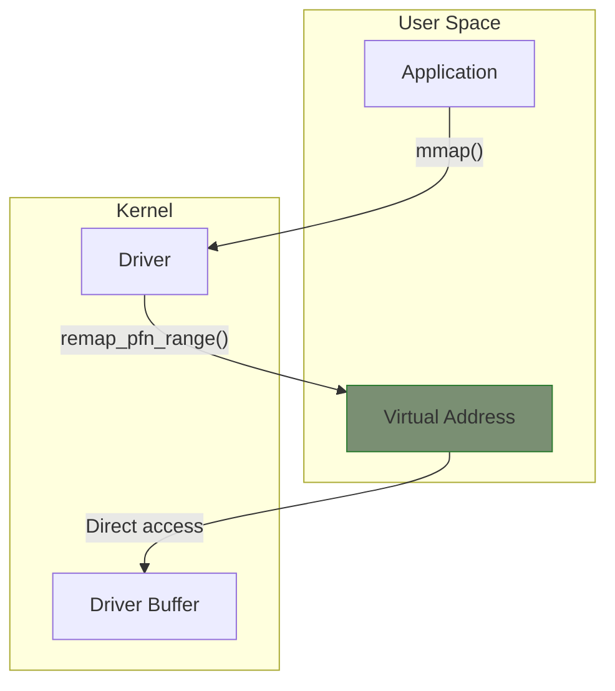

# Memory Mapping (mmap)

The mmap operation allows user space to directly access driver memory, avoiding the overhead of read/write system calls. This is essential for high-performance applications like graphics, video, and DMA buffers.

## The mmap Concept



## Implementing mmap

### Basic Structure

```c
#include <linux/mm.h>

static int my_mmap(struct file *file, struct vm_area_struct *vma)
{
    struct my_device *dev = file->private_data;
    unsigned long size = vma->vm_end - vma->vm_start;
    unsigned long pfn;

    /* Validate size */
    if (size > dev->buffer_size)
        return -EINVAL;

    /* Get page frame number */
    pfn = virt_to_phys(dev->buffer) >> PAGE_SHIFT;

    /* Set up page protection */
    vma->vm_page_prot = pgprot_noncached(vma->vm_page_prot);

    /* Map the buffer */
    if (remap_pfn_range(vma, vma->vm_start, pfn, size, vma->vm_page_prot))
        return -EAGAIN;

    return 0;
}

static const struct file_operations my_fops = {
    .owner = THIS_MODULE,
    .mmap = my_mmap,
    /* ... other ops ... */
};
```

### User Space Usage

```c
#include <sys/mman.h>

int fd = open("/dev/mydevice", O_RDWR);
if (fd < 0) {
    perror("open");
    exit(1);
}

/* Map 4KB of device memory */
void *ptr = mmap(NULL, 4096, PROT_READ | PROT_WRITE,
                 MAP_SHARED, fd, 0);
if (ptr == MAP_FAILED) {
    perror("mmap");
    exit(1);
}

/* Direct access to device memory */
uint32_t *data = (uint32_t *)ptr;
data[0] = 0x12345678;

/* Unmap when done */
munmap(ptr, 4096);
close(fd);
```

## Mapping Kernel Memory

### Mapping kmalloc Buffer

```c
static int my_mmap(struct file *file, struct vm_area_struct *vma)
{
    struct my_device *dev = file->private_data;
    unsigned long size = vma->vm_end - vma->vm_start;
    unsigned long pfn;
    int ret;

    if (size > dev->buffer_size)
        return -EINVAL;

    /* Buffer must be page-aligned */
    pfn = virt_to_phys(dev->buffer) >> PAGE_SHIFT;

    ret = remap_pfn_range(vma, vma->vm_start, pfn, size, vma->vm_page_prot);
    if (ret)
        return ret;

    return 0;
}
```

### Mapping vmalloc Buffer

vmalloc memory isn't physically contiguous - must map page by page:

```c
static vm_fault_t my_vm_fault(struct vm_fault *vmf)
{
    struct my_device *dev = vmf->vma->vm_private_data;
    unsigned long offset = vmf->pgoff << PAGE_SHIFT;
    struct page *page;

    if (offset >= dev->buffer_size)
        return VM_FAULT_SIGBUS;

    /* Get the page for this offset */
    page = vmalloc_to_page(dev->buffer + offset);
    if (!page)
        return VM_FAULT_SIGBUS;

    get_page(page);
    vmf->page = page;

    return 0;
}

static const struct vm_operations_struct my_vm_ops = {
    .fault = my_vm_fault,
};

static int my_mmap(struct file *file, struct vm_area_struct *vma)
{
    struct my_device *dev = file->private_data;

    vma->vm_ops = &my_vm_ops;
    vma->vm_private_data = dev;
    vma->vm_flags |= VM_DONTEXPAND | VM_DONTDUMP;

    return 0;
}
```

## Mapping DMA Buffers

### Coherent DMA Buffer

```c
static int my_mmap(struct file *file, struct vm_area_struct *vma)
{
    struct my_device *dev = file->private_data;
    unsigned long size = vma->vm_end - vma->vm_start;

    if (size > dev->dma_size)
        return -EINVAL;

    /* Use DMA-specific mmap helper */
    return dma_mmap_coherent(dev->dev, vma,
                             dev->dma_buffer,
                             dev->dma_handle,
                             size);
}
```

## Mapping Device Registers

For exposing hardware registers to user space (use with caution):

```c
static int my_mmap(struct file *file, struct vm_area_struct *vma)
{
    struct my_device *dev = file->private_data;
    unsigned long size = vma->vm_end - vma->vm_start;
    unsigned long pfn = dev->phys_addr >> PAGE_SHIFT;

    if (size > dev->regs_size)
        return -EINVAL;

    /* Set non-cached for MMIO */
    vma->vm_page_prot = pgprot_noncached(vma->vm_page_prot);

    /* Prevent caching and swapping */
    vma->vm_flags |= VM_IO | VM_DONTEXPAND | VM_DONTDUMP;

    return io_remap_pfn_range(vma, vma->vm_start, pfn,
                              size, vma->vm_page_prot);
}
```

## Page Protections

```c
/* Standard cached mapping */
vma->vm_page_prot = vma->vm_page_prot;

/* Uncached (for MMIO) */
vma->vm_page_prot = pgprot_noncached(vma->vm_page_prot);

/* Write-combined (for frame buffers) */
vma->vm_page_prot = pgprot_writecombine(vma->vm_page_prot);

/* Device memory */
vma->vm_page_prot = pgprot_device(vma->vm_page_prot);
```

## VM Flags

```c
/* Common flags to set */
vma->vm_flags |= VM_IO;        /* I/O memory */
vma->vm_flags |= VM_DONTEXPAND; /* Don't allow mremap to expand */
vma->vm_flags |= VM_DONTDUMP;   /* Don't include in core dump */
vma->vm_flags |= VM_DONTCOPY;   /* Don't copy on fork */

/* Read user-requested flags */
if (vma->vm_flags & VM_WRITE) {
    /* User requested write access */
}
```

## VMA Operations

Handle mapping lifecycle events:

```c
static void my_vm_open(struct vm_area_struct *vma)
{
    struct my_device *dev = vma->vm_private_data;
    atomic_inc(&dev->mmap_count);
    pr_info("VMA opened\n");
}

static void my_vm_close(struct vm_area_struct *vma)
{
    struct my_device *dev = vma->vm_private_data;
    atomic_dec(&dev->mmap_count);
    pr_info("VMA closed\n");
}

static vm_fault_t my_vm_fault(struct vm_fault *vmf)
{
    /* Handle page faults */
    return VM_FAULT_SIGBUS;
}

static const struct vm_operations_struct my_vm_ops = {
    .open = my_vm_open,
    .close = my_vm_close,
    .fault = my_vm_fault,
};

static int my_mmap(struct file *file, struct vm_area_struct *vma)
{
    vma->vm_ops = &my_vm_ops;
    vma->vm_private_data = file->private_data;

    /* Call open for initial mapping */
    my_vm_open(vma);

    return 0;
}
```

## Complete Example: Shared Buffer

```c
#include <linux/module.h>
#include <linux/fs.h>
#include <linux/mm.h>
#include <linux/slab.h>

#define BUFFER_SIZE (PAGE_SIZE * 4)

struct my_device {
    void *buffer;
    size_t size;
    atomic_t mmap_count;
};

static struct my_device *dev;

static int my_open(struct inode *inode, struct file *file)
{
    file->private_data = dev;
    return 0;
}

static int my_release(struct inode *inode, struct file *file)
{
    return 0;
}

static void my_vm_open(struct vm_area_struct *vma)
{
    struct my_device *d = vma->vm_private_data;
    atomic_inc(&d->mmap_count);
}

static void my_vm_close(struct vm_area_struct *vma)
{
    struct my_device *d = vma->vm_private_data;
    atomic_dec(&d->mmap_count);
}

static const struct vm_operations_struct my_vm_ops = {
    .open = my_vm_open,
    .close = my_vm_close,
};

static int my_mmap(struct file *file, struct vm_area_struct *vma)
{
    struct my_device *d = file->private_data;
    unsigned long size = vma->vm_end - vma->vm_start;
    unsigned long pfn;

    /* Validate size and offset */
    if (vma->vm_pgoff != 0)
        return -EINVAL;

    if (size > d->size)
        return -EINVAL;

    /* Get physical address */
    pfn = virt_to_phys(d->buffer) >> PAGE_SHIFT;

    /* Map the pages */
    if (remap_pfn_range(vma, vma->vm_start, pfn, size, vma->vm_page_prot))
        return -EAGAIN;

    /* Set up operations */
    vma->vm_ops = &my_vm_ops;
    vma->vm_private_data = d;
    vma->vm_flags |= VM_DONTEXPAND | VM_DONTDUMP;

    my_vm_open(vma);

    return 0;
}

static const struct file_operations my_fops = {
    .owner = THIS_MODULE,
    .open = my_open,
    .release = my_release,
    .mmap = my_mmap,
};

static int __init my_init(void)
{
    dev = kzalloc(sizeof(*dev), GFP_KERNEL);
    if (!dev)
        return -ENOMEM;

    /* Allocate page-aligned buffer */
    dev->buffer = (void *)__get_free_pages(GFP_KERNEL,
                                           get_order(BUFFER_SIZE));
    if (!dev->buffer) {
        kfree(dev);
        return -ENOMEM;
    }

    dev->size = BUFFER_SIZE;

    /* Initialize buffer with pattern */
    memset(dev->buffer, 0xAA, BUFFER_SIZE);

    /* Register char device ... */

    return 0;
}
```

## Security Considerations

{: .warning }
Be careful with mmap - it bypasses normal access controls!

```c
static int my_mmap(struct file *file, struct vm_area_struct *vma)
{
    /* Check capabilities if mapping sensitive memory */
    if (!capable(CAP_SYS_RAWIO))
        return -EPERM;

    /* Validate offset and size */
    if (vma->vm_pgoff > max_offset)
        return -EINVAL;

    /* Don't allow execute */
    if (vma->vm_flags & VM_EXEC)
        return -EPERM;

    /* ... proceed with mapping ... */
}
```

## Summary

- Use `remap_pfn_range()` for physically contiguous memory
- Use fault handler for vmalloc or paged memory
- Use `dma_mmap_coherent()` for DMA buffers
- Set appropriate page protections (cached, uncached, write-combined)
- Implement vm_operations for proper reference counting
- Validate user-provided sizes and offsets
- Consider security implications

## Next

Continue to [Part 6: Device Model]() to learn about the Linux device hierarchy.
