# Part 5: Memory Management

Memory management in the kernel is fundamentally different from user space. You have direct access to physical memory, must manage allocation contexts carefully, and need to understand DMA for hardware interaction.

## Memory Landscape

## Chapter Contents

| Chapter | Topic | Key Concepts |
|---------|-------|--------------|
| [5.1]() | Memory Allocators | kmalloc, kzalloc, vmalloc, kvmalloc |
| [5.2]() | GFP Flags | Allocation context, GFP_KERNEL vs GFP_ATOMIC |
| [5.3]() | Slab Allocator | kmem_cache, object pools |
| [5.4]() | Per-CPU Variables | Lock-free per-CPU data |
| [5.5]() | Coherent DMA | dma_alloc_coherent, consistent mappings |
| [5.6]() | Streaming DMA | dma_map_single, buffer synchronization |
| [5.7]() | Memory-Mapped I/O | ioremap, device registers |
| [5.8]() | mmap | Mapping memory to user space |

## Quick Reference: Choosing an Allocator

```mermaid
flowchart TD
    Start["Need memory?"]
    Size{"Size?"}
    Contig{"Need physically<br/>contiguous?"}
    Sleep{"Can sleep?"}
    Freq{"Frequent alloc/free<br/>of same size?"}

    Start --> Size
    Size -->|"< PAGE_SIZE"| Freq
    Freq -->|Yes| Slab["kmem_cache"]
    Freq -->|No| Small["kmalloc()"]
    Size -->|"≥ PAGE_SIZE"| Contig
    Contig -->|Yes| Pages["alloc_pages()<br/>or kmalloc()"]
    Contig -->|No| Large["vmalloc()"]
    Sleep -->|No| Atomic["GFP_ATOMIC"]
    Sleep -->|Yes| Kernel["GFP_KERNEL"]

    style Slab fill:#586659,stroke:#4caf50
    style Small fill:#63727d,stroke:#2196f3
    style Large fill:#9f7360,stroke:#ff9800
```

| Allocator | Size Range | Contiguous | Can Sleep | Use Case |
|-----------|------------|------------|-----------|----------|
| `kmalloc()` | < ~128KB | Physical | With GFP_KERNEL | General small allocations |
| `vmalloc()` | > PAGE_SIZE | Virtual only | Yes | Large allocations |
| `kvmalloc()` | Any | Best effort | Yes | Flexible sizing |
| `kmem_cache` | Fixed | Physical | Depends | Frequent same-size alloc |
| `alloc_pages()` | Pages | Physical | Depends | Page-aligned buffers |

## Examples

This part includes working examples:

- **kmem-cache-demo**: Custom slab cache usage
- **dma-demo**: DMA buffer mapping

## Key Differences from User Space

| Aspect | User Space | Kernel Space |
|--------|------------|--------------|
| Allocation failure | Returns NULL, can retry | May panic or return NULL |
| Sleeping | Always OK | Depends on context |
| Virtual memory | Unified address space | Split kernel/user |
| Page faults | Handled automatically | Can crash system |
| Memory limits | Per-process | System-wide |

## Prerequisites

Before starting this part, ensure you understand:

- Execution contexts (Part 2)
- Synchronization basics (Part 4)
- Module lifecycle (Part 2)

## Further Reading

- [Memory Allocation Guide](https://docs.kernel.org/core-api/memory-allocation.html) - Kernel memory allocation
- [DMA API Guide](https://docs.kernel.org/core-api/dma-api.html) - DMA mapping documentation

## Next

Start with [Memory Allocators]() to understand the basic allocation functions.
