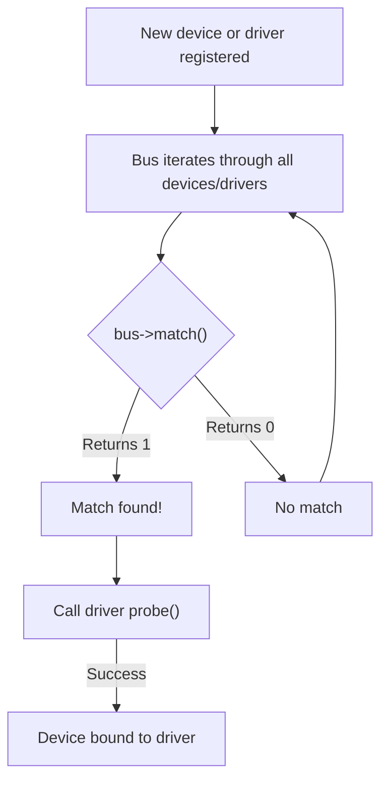

# Device Model Basics

The Linux device model provides a unified way to represent all devices, their drivers, and their relationships. It enables features like power management, hotplug, and sysfs visibility.

## Core Components

### struct device

Represents any device in the system:

```c
#include <linux/device.h>

struct device {
    struct device *parent;           /* Parent device */
    struct device_private *p;        /* Private data */
    struct kobject kobj;             /* Sysfs representation */
    const char *init_name;           /* Initial name */
    struct device_type *type;        /* Device type */
    struct bus_type *bus;            /* Bus this device is on */
    struct device_driver *driver;    /* Bound driver */
    void *platform_data;             /* Platform-specific data */
    void *driver_data;               /* Driver private data */
    struct dev_pm_info power;        /* Power management */
    /* ... */
};
```

### struct device_driver

Represents a driver that can handle devices:

```c
struct device_driver {
    const char *name;                /* Driver name */
    struct bus_type *bus;            /* Bus this driver works with */
    struct module *owner;            /* Module containing driver */
    const struct of_device_id *of_match_table;  /* Device tree matching */
    int (*probe)(struct device *dev);    /* Called when device binds */
    void (*remove)(struct device *dev);  /* Called when device unbinds */
    void (*shutdown)(struct device *dev);
    int (*suspend)(struct device *dev, pm_message_t state);
    int (*resume)(struct device *dev);
    /* ... */
};
```

### struct bus_type

Defines a bus and how devices and drivers interact:

```c
struct bus_type {
    const char *name;                /* Bus name */
    int (*match)(struct device *dev, struct device_driver *drv);
    int (*probe)(struct device *dev);
    void (*remove)(struct device *dev);
    /* ... */
};
```

## The Matching Process

When a device or driver is registered:



## Common Bus Types

### Platform Bus

For non-discoverable devices:

```c
#include <linux/platform_device.h>

/* Device */
struct platform_device {
    const char *name;
    int id;
    struct device dev;
    struct resource *resource;
    /* ... */
};

/* Driver */
struct platform_driver {
    int (*probe)(struct platform_device *);
    int (*remove)(struct platform_device *);
    struct device_driver driver;
    const struct platform_device_id *id_table;
};
```

### PCI Bus

For PCI devices:

```c
#include <linux/pci.h>

struct pci_dev {
    struct device dev;
    unsigned int devfn;
    unsigned short vendor;
    unsigned short device;
    /* ... */
};

struct pci_driver {
    const char *name;
    const struct pci_device_id *id_table;
    int (*probe)(struct pci_dev *dev, const struct pci_device_id *id);
    void (*remove)(struct pci_dev *dev);
    /* ... */
};
```

### I2C Bus

For I2C devices:

```c
#include <linux/i2c.h>

struct i2c_client {
    unsigned short addr;
    char name[I2C_NAME_SIZE];
    struct i2c_adapter *adapter;
    struct device dev;
    /* ... */
};

struct i2c_driver {
    int (*probe)(struct i2c_client *client);
    void (*remove)(struct i2c_client *client);
    struct device_driver driver;
    const struct i2c_device_id *id_table;
};
```

## Device Registration

### Creating a Device

```c
/* Allocate and register a device */
struct device *dev;

dev = kzalloc(sizeof(*dev), GFP_KERNEL);
device_initialize(dev);
dev->parent = parent_dev;
dev_set_name(dev, "mydevice%d", id);
dev->bus = &my_bus_type;

ret = device_add(dev);
if (ret) {
    put_device(dev);
    return ret;
}
```

### Removing a Device

```c
device_del(dev);
put_device(dev);  /* Release reference */
```

## Driver Registration

### Registering a Driver

```c
struct device_driver my_driver = {
    .name = "my_driver",
    .bus = &my_bus_type,
    .probe = my_probe,
    .remove = my_remove,
};

int ret = driver_register(&my_driver);
if (ret)
    return ret;
```

### Unregistering a Driver

```c
driver_unregister(&my_driver);
```

## Sysfs Representation

The device model creates a unified view in `/sys/`:

```bash
/sys/
├── bus/
│   ├── platform/
│   │   ├── devices/
│   │   │   └── mydevice -> ../../../devices/platform/mydevice
│   │   └── drivers/
│   │       └── mydriver/
│   │           └── mydevice -> ../../../../devices/platform/mydevice
│   └── pci/
│       └── ...
├── class/
│   └── myclass/
│       └── mydevice -> ../../devices/platform/mydevice
└── devices/
    └── platform/
        └── mydevice/
            ├── driver -> ../../../bus/platform/drivers/mydriver
            ├── power/
            ├── subsystem -> ../../../bus/platform
            └── uevent
```

## Device-Driver Data

### Setting Private Data

```c
/* In probe */
void *my_data = kzalloc(sizeof(*my_data), GFP_KERNEL);
dev_set_drvdata(dev, my_data);

/* Elsewhere */
void *my_data = dev_get_drvdata(dev);
```

### Platform-Specific Data

```c
/* Set in device registration */
platform_device.dev.platform_data = &my_platform_data;

/* Get in probe */
struct my_platform_data *pdata = dev_get_platdata(&pdev->dev);
```

## Device References

The device model uses reference counting:

```c
/* Get a reference */
struct device *ref = get_device(dev);

/* Release a reference */
put_device(dev);

/* Device is freed when refcount reaches 0 */
```

## Iterating Devices

```c
/* For each device on a bus */
bus_for_each_dev(&my_bus, NULL, data, callback);

/* For each device bound to a driver */
driver_for_each_device(&my_driver, NULL, data, callback);
```

## Device Events (uevent)

The device model notifies userspace via uevents:

```c
/* Trigger a uevent */
kobject_uevent(&dev->kobj, KOBJ_ADD);
kobject_uevent(&dev->kobj, KOBJ_REMOVE);
kobject_uevent(&dev->kobj, KOBJ_CHANGE);
```

Udev listens to these events to create device nodes.

## Summary

- The device model unifies device representation across all bus types
- Bus types define how devices and drivers are matched
- Devices and drivers are linked through probe/remove callbacks
- Sysfs provides a user-visible representation
- Reference counting manages device lifetime
- Uevents notify userspace of device changes

## Next

Learn about [kobjects]() - the foundation of the device model.
