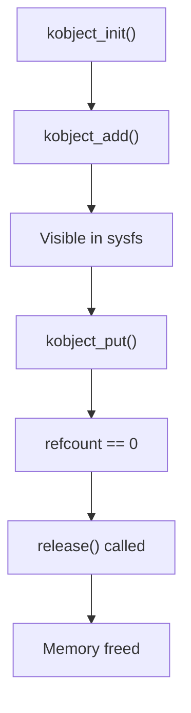

# Kobjects

Kobjects (kernel objects) are the foundation of the Linux device model. They provide reference counting, sysfs representation, and parent-child relationships for kernel data structures.

## What is a Kobject?

```c
#include <linux/kobject.h>

struct kobject {
    const char *name;           /* Name in sysfs */
    struct list_head entry;     /* Sibling list */
    struct kobject *parent;     /* Parent kobject */
    struct kset *kset;          /* Containing kset */
    struct kobj_type *ktype;    /* Type operations */
    struct kernfs_node *sd;     /* Sysfs directory */
    struct kref kref;           /* Reference count */
    /* ... */
};
```

Every kobject corresponds to a directory in sysfs.

## Kobject Lifecycle



## Basic Kobject Usage

### Initialization

```c
struct my_object {
    struct kobject kobj;
    int value;
    char name[32];
};

static void my_release(struct kobject *kobj)
{
    struct my_object *obj = container_of(kobj, struct my_object, kobj);
    pr_info("Releasing %s\n", kobject_name(kobj));
    kfree(obj);
}

static struct kobj_type my_ktype = {
    .release = my_release,
    .sysfs_ops = &kobj_sysfs_ops,
    /* .default_groups = my_groups, */
};
```

### Creating and Adding

```c
struct my_object *obj;

obj = kzalloc(sizeof(*obj), GFP_KERNEL);
if (!obj)
    return -ENOMEM;

kobject_init(&obj->kobj, &my_ktype);

ret = kobject_add(&obj->kobj, parent, "my_object");
if (ret) {
    kobject_put(&obj->kobj);  /* Calls release */
    return ret;
}

/* Or use combined init_and_add */
ret = kobject_init_and_add(&obj->kobj, &my_ktype, parent, "my_object");
```

### Reference Counting

```c
/* Get a reference */
kobject_get(&obj->kobj);

/* Release a reference */
kobject_put(&obj->kobj);

/* When refcount hits 0, ktype->release() is called */
```

### Removal

```c
/* Remove from sysfs */
kobject_del(&obj->kobj);

/* Release reference */
kobject_put(&obj->kobj);

/* Or combined */
kobject_put(&obj->kobj);  /* Calls del if needed */
```

## Ksets: Collections of Kobjects

A kset is a collection of kobjects of the same type:

```c
struct kset {
    struct list_head list;      /* List of kobjects */
    spinlock_t list_lock;
    struct kobject kobj;        /* The kset's own kobject */
    const struct kset_uevent_ops *uevent_ops;
};
```

### Creating a Kset

```c
static struct kset *my_kset;

static int __init my_init(void)
{
    /* Create kset under /sys/kernel/ */
    my_kset = kset_create_and_add("my_kset", NULL, kernel_kobj);
    if (!my_kset)
        return -ENOMEM;

    return 0;
}

static void __exit my_exit(void)
{
    kset_unregister(my_kset);
}
```

### Adding Objects to a Kset

```c
struct my_object *obj;

obj = kzalloc(sizeof(*obj), GFP_KERNEL);
kobject_init(&obj->kobj, &my_ktype);

/* Associate with kset */
obj->kobj.kset = my_kset;

/* Add to kset (parent will be kset's kobject) */
ret = kobject_add(&obj->kobj, NULL, "object%d", id);
```

## Sysfs Attributes

Kobjects can have attributes (files in their sysfs directory):

### Defining Attributes

```c
/* Attribute show function */
static ssize_t value_show(struct kobject *kobj, struct kobj_attribute *attr,
                          char *buf)
{
    struct my_object *obj = container_of(kobj, struct my_object, kobj);
    return sprintf(buf, "%d\n", obj->value);
}

/* Attribute store function */
static ssize_t value_store(struct kobject *kobj, struct kobj_attribute *attr,
                           const char *buf, size_t count)
{
    struct my_object *obj = container_of(kobj, struct my_object, kobj);
    int val;

    if (kstrtoint(buf, 10, &val))
        return -EINVAL;

    obj->value = val;
    return count;
}

/* Create the attribute */
static struct kobj_attribute value_attr =
    __ATTR(value, 0664, value_show, value_store);

/* Attribute array */
static struct attribute *my_attrs[] = {
    &value_attr.attr,
    NULL,
};

/* Attribute group */
static struct attribute_group my_group = {
    .attrs = my_attrs,
};

static const struct attribute_group *my_groups[] = {
    &my_group,
    NULL,
};
```

### Adding Attributes

```c
/* Method 1: Add to ktype (automatic with kobject_add) */
static struct kobj_type my_ktype = {
    .release = my_release,
    .sysfs_ops = &kobj_sysfs_ops,
    .default_groups = my_groups,
};

/* Method 2: Add manually */
ret = sysfs_create_file(&obj->kobj, &value_attr.attr);

/* Method 3: Add group */
ret = sysfs_create_group(&obj->kobj, &my_group);
```

## Complete Example

```c
#include <linux/module.h>
#include <linux/kobject.h>
#include <linux/sysfs.h>

struct my_obj {
    struct kobject kobj;
    int value;
};

static struct kset *my_kset;
static struct my_obj *objects[3];

static ssize_t value_show(struct kobject *kobj, struct kobj_attribute *attr,
                          char *buf)
{
    struct my_obj *obj = container_of(kobj, struct my_obj, kobj);
    return sprintf(buf, "%d\n", obj->value);
}

static ssize_t value_store(struct kobject *kobj, struct kobj_attribute *attr,
                           const char *buf, size_t count)
{
    struct my_obj *obj = container_of(kobj, struct my_obj, kobj);
    int val;

    if (kstrtoint(buf, 10, &val))
        return -EINVAL;

    obj->value = val;
    return count;
}

static struct kobj_attribute value_attr =
    __ATTR(value, 0664, value_show, value_store);

static struct attribute *my_attrs[] = {
    &value_attr.attr,
    NULL,
};

ATTRIBUTE_GROUPS(my);

static void my_release(struct kobject *kobj)
{
    struct my_obj *obj = container_of(kobj, struct my_obj, kobj);
    pr_info("Releasing %s\n", kobject_name(kobj));
    kfree(obj);
}

static struct kobj_type my_ktype = {
    .release = my_release,
    .sysfs_ops = &kobj_sysfs_ops,
    .default_groups = my_groups,
};

static struct my_obj *create_object(int id)
{
    struct my_obj *obj;
    int ret;

    obj = kzalloc(sizeof(*obj), GFP_KERNEL);
    if (!obj)
        return NULL;

    obj->value = id * 10;
    obj->kobj.kset = my_kset;

    ret = kobject_init_and_add(&obj->kobj, &my_ktype, NULL, "object%d", id);
    if (ret) {
        kobject_put(&obj->kobj);
        return NULL;
    }

    kobject_uevent(&obj->kobj, KOBJ_ADD);
    return obj;
}

static void destroy_object(struct my_obj *obj)
{
    if (!obj)
        return;
    kobject_put(&obj->kobj);
}

static int __init kobj_init(void)
{
    int i;

    my_kset = kset_create_and_add("my_kset", NULL, kernel_kobj);
    if (!my_kset)
        return -ENOMEM;

    for (i = 0; i < 3; i++) {
        objects[i] = create_object(i);
        if (!objects[i]) {
            pr_err("Failed to create object %d\n", i);
        }
    }

    pr_info("Kobjects created at /sys/kernel/my_kset/\n");
    return 0;
}

static void __exit kobj_exit(void)
{
    int i;

    for (i = 0; i < 3; i++)
        destroy_object(objects[i]);

    kset_unregister(my_kset);
    pr_info("Kobjects removed\n");
}

module_init(kobj_init);
module_exit(kobj_exit);
MODULE_LICENSE("GPL");
```

## Kobject vs Device

| Feature | kobject | struct device |
|---------|---------|---------------|
| Purpose | Generic sysfs object | Hardware representation |
| Sysfs location | Anywhere | /sys/devices/ |
| Power management | No | Yes |
| Bus integration | No | Yes |
| Driver binding | No | Yes |

Use `struct device` for hardware, raw kobjects for other sysfs objects.

## Summary

- Kobjects provide reference counting and sysfs representation
- Every kobject is a directory in sysfs
- Ksets group related kobjects
- ktype defines operations (release, sysfs_ops)
- Always use kobject_put() to release references
- The release() callback is called when refcount hits 0

## Next

Learn about [platform drivers]() - the most common driver type.
