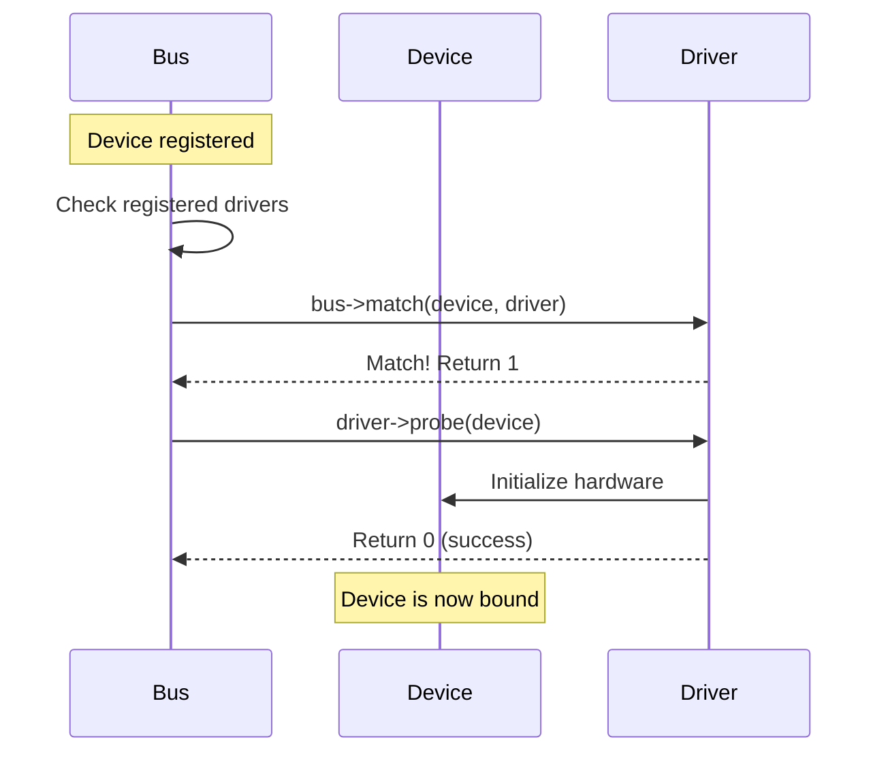
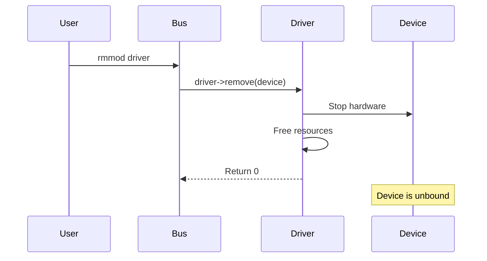
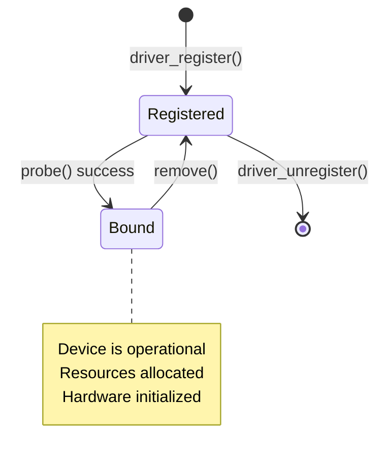

# Probe and Remove

The probe and remove callbacks are the heart of driver lifecycle management. Understanding when they're called and what should happen in each is essential for writing robust drivers.

## When Probe is Called



Probe is called when:
1. A device is registered and a matching driver exists
2. A driver is registered and matching devices exist
3. Both conditions happen (device and driver registered)

## Probe Function Structure

```c
static int my_probe(struct platform_device *pdev)
{
    struct my_device *mydev;
    struct resource *res;
    int ret;

    /* 1. Allocate driver data */
    mydev = devm_kzalloc(&pdev->dev, sizeof(*mydev), GFP_KERNEL);
    if (!mydev)
        return -ENOMEM;

    /* 2. Get platform resources */
    res = platform_get_resource(pdev, IORESOURCE_MEM, 0);
    mydev->regs = devm_ioremap_resource(&pdev->dev, res);
    if (IS_ERR(mydev->regs))
        return PTR_ERR(mydev->regs);

    mydev->irq = platform_get_irq(pdev, 0);
    if (mydev->irq < 0)
        return mydev->irq;

    /* 3. Initialize hardware */
    ret = my_hw_init(mydev);
    if (ret)
        return ret;

    /* 4. Request IRQ */
    ret = devm_request_irq(&pdev->dev, mydev->irq, my_irq_handler,
                           0, pdev->name, mydev);
    if (ret)
        return ret;

    /* 5. Register with subsystem (e.g., char device, input, etc.) */
    ret = my_register_device(mydev);
    if (ret)
        return ret;

    /* 6. Store driver data */
    platform_set_drvdata(pdev, mydev);

    dev_info(&pdev->dev, "Device probed successfully\n");
    return 0;
}
```

## Probe Error Handling

### Using goto Cleanup (Traditional)

```c
static int my_probe(struct platform_device *pdev)
{
    struct my_device *mydev;
    int ret;

    mydev = kzalloc(sizeof(*mydev), GFP_KERNEL);
    if (!mydev)
        return -ENOMEM;

    mydev->buffer = kmalloc(4096, GFP_KERNEL);
    if (!mydev->buffer) {
        ret = -ENOMEM;
        goto err_buffer;
    }

    ret = clk_prepare_enable(mydev->clk);
    if (ret)
        goto err_clk;

    ret = my_register_device(mydev);
    if (ret)
        goto err_register;

    platform_set_drvdata(pdev, mydev);
    return 0;

err_register:
    clk_disable_unprepare(mydev->clk);
err_clk:
    kfree(mydev->buffer);
err_buffer:
    kfree(mydev);
    return ret;
}
```

### Using devm_* (Recommended)

```c
static int my_probe(struct platform_device *pdev)
{
    struct my_device *mydev;
    int ret;

    /* All devm_* allocations are auto-freed on error or remove */
    mydev = devm_kzalloc(&pdev->dev, sizeof(*mydev), GFP_KERNEL);
    if (!mydev)
        return -ENOMEM;

    mydev->buffer = devm_kmalloc(&pdev->dev, 4096, GFP_KERNEL);
    if (!mydev->buffer)
        return -ENOMEM;

    mydev->clk = devm_clk_get(&pdev->dev, "main");
    if (IS_ERR(mydev->clk))
        return PTR_ERR(mydev->clk);

    ret = clk_prepare_enable(mydev->clk);
    if (ret)
        return ret;

    /* Add cleanup action for non-devm resources */
    ret = devm_add_action_or_reset(&pdev->dev, my_clk_disable, mydev->clk);
    if (ret)
        return ret;

    /* Everything else uses devm - no cleanup needed! */
    platform_set_drvdata(pdev, mydev);
    return 0;
}
```

## Remove Function Structure

```c
static int my_remove(struct platform_device *pdev)
{
    struct my_device *mydev = platform_get_drvdata(pdev);

    /* 1. Unregister from subsystem */
    my_unregister_device(mydev);

    /* 2. Stop hardware */
    my_hw_stop(mydev);

    /* 3. Disable clocks */
    clk_disable_unprepare(mydev->clk);

    /* 4. Free non-devm resources */
    kfree(mydev->buffer);
    kfree(mydev);

    dev_info(&pdev->dev, "Device removed\n");
    return 0;
}

/* With devm_*, remove is often minimal or empty */
static int my_remove(struct platform_device *pdev)
{
    /* devm resources are automatically released */
    dev_info(&pdev->dev, "Device removed\n");
    return 0;
}
```

## When Remove is Called

Remove is called when:
1. Driver is unregistered (module unload)
2. Device is unregistered (device tree overlay removal, sysfs unbind)
3. Device is hot-unplugged



## Binding and Unbinding via Sysfs

```bash
# Manual unbind
echo "device_name" > /sys/bus/platform/drivers/my_driver/unbind

# Manual bind
echo "device_name" > /sys/bus/platform/drivers/my_driver/bind
```

## Shutdown Callback

Called during system shutdown:

```c
static void my_shutdown(struct platform_device *pdev)
{
    struct my_device *mydev = platform_get_drvdata(pdev);

    /* Put device in safe state for power off */
    my_hw_stop(mydev);
    dev_info(&pdev->dev, "Device shutdown\n");
}

static struct platform_driver my_driver = {
    .probe = my_probe,
    .remove = my_remove,
    .shutdown = my_shutdown,
    /* ... */
};
```

## Probe Ordering

Control when probe runs relative to other devices:

### Using Device Links

```c
static int my_probe(struct platform_device *pdev)
{
    struct device *supplier;

    /* Wait for supplier device */
    supplier = get_supplier_device(pdev);
    if (!supplier)
        return -EPROBE_DEFER;

    /* Create device link */
    device_link_add(&pdev->dev, supplier, DL_FLAG_AUTOREMOVE_CONSUMER);

    /* Now safe to use supplier */
    return 0;
}
```

### Initcall Levels

```c
/* Earlier initialization */
subsys_initcall(my_early_init);  /* Before module_init */

/* Normal initialization */
module_init(my_init);            /* Standard */

/* Later initialization */
late_initcall(my_late_init);     /* After module_init */
```

## Probe/Remove Best Practices

### Do

```c
/* DO: Check all return values */
ret = my_operation();
if (ret)
    return ret;

/* DO: Use devm_* functions */
ptr = devm_kzalloc(&pdev->dev, size, GFP_KERNEL);

/* DO: Log errors with context */
if (ret) {
    dev_err(&pdev->dev, "Failed to init hardware: %d\n", ret);
    return ret;
}

/* DO: Return appropriate error codes */
if (!resource)
    return -ENODEV;  /* Not -EINVAL! */
```

### Don't

```c
/* DON'T: Ignore error handling */
my_operation();  /* What if it fails? */

/* DON'T: Return success on error */
if (error)
    return 0;  /* Should return error! */

/* DON'T: Leak resources */
ptr = kmalloc(...);
if (other_error)
    return other_error;  /* Memory leak! */

/* DON'T: Use after remove */
static struct my_device *global_dev;  /* Dangerous! */
```

## Lifecycle Summary



## Summary

- Probe is called when device and driver match
- Allocate resources, init hardware, register with subsystems in probe
- Release resources, stop hardware in remove
- Use devm_* for automatic cleanup
- Handle all errors properly - partial init requires partial cleanup
- Return -EPROBE_DEFER to retry later

## Next

Learn about [managed resources]() (devm_*) for automatic cleanup.
