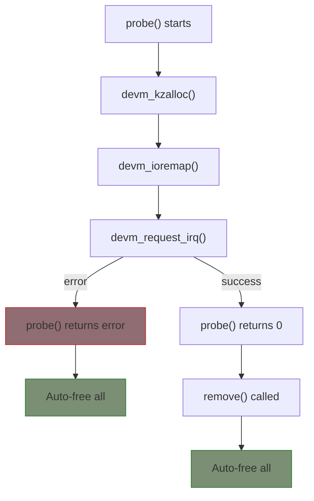

# Managed Resources (devres)

Device-managed resources (devm_*) are automatically released when a device is unbound from its driver. This dramatically simplifies cleanup code and prevents resource leaks.

## The Problem devm Solves

### Traditional Approach (Error-Prone)

```c
static int my_probe(struct platform_device *pdev)
{
    struct my_device *mydev;
    int ret;

    mydev = kzalloc(sizeof(*mydev), GFP_KERNEL);
    if (!mydev)
        return -ENOMEM;

    mydev->clk = clk_get(&pdev->dev, "main");
    if (IS_ERR(mydev->clk)) {
        ret = PTR_ERR(mydev->clk);
        goto err_clk;
    }

    mydev->regs = ioremap(res->start, resource_size(res));
    if (!mydev->regs) {
        ret = -ENOMEM;
        goto err_ioremap;
    }

    ret = request_irq(irq, handler, 0, "mydev", mydev);
    if (ret)
        goto err_irq;

    return 0;

err_irq:
    iounmap(mydev->regs);
err_ioremap:
    clk_put(mydev->clk);
err_clk:
    kfree(mydev);
    return ret;
}

static int my_remove(struct platform_device *pdev)
{
    struct my_device *mydev = platform_get_drvdata(pdev);

    free_irq(irq, mydev);
    iounmap(mydev->regs);
    clk_put(mydev->clk);
    kfree(mydev);
    return 0;
}
```

### devm Approach (Clean)

```c
static int my_probe(struct platform_device *pdev)
{
    struct my_device *mydev;

    mydev = devm_kzalloc(&pdev->dev, sizeof(*mydev), GFP_KERNEL);
    if (!mydev)
        return -ENOMEM;

    mydev->clk = devm_clk_get(&pdev->dev, "main");
    if (IS_ERR(mydev->clk))
        return PTR_ERR(mydev->clk);

    mydev->regs = devm_ioremap_resource(&pdev->dev, res);
    if (IS_ERR(mydev->regs))
        return PTR_ERR(mydev->regs);

    ret = devm_request_irq(&pdev->dev, irq, handler, 0, "mydev", mydev);
    if (ret)
        return ret;

    return 0;
}

static int my_remove(struct platform_device *pdev)
{
    /* Nothing to do - all resources are auto-freed! */
    return 0;
}
```

## How devres Works



Resources are freed in **reverse order** of allocation.

## Common devm Functions

### Memory Allocation

```c
/* kzalloc equivalent */
ptr = devm_kzalloc(&pdev->dev, size, GFP_KERNEL);

/* kmalloc equivalent */
ptr = devm_kmalloc(&pdev->dev, size, GFP_KERNEL);

/* Array allocation */
ptr = devm_kcalloc(&pdev->dev, n, size, GFP_KERNEL);
ptr = devm_kmalloc_array(&pdev->dev, n, size, GFP_KERNEL);

/* String duplication */
str = devm_kstrdup(&pdev->dev, src, GFP_KERNEL);
str = devm_kasprintf(&pdev->dev, GFP_KERNEL, "fmt %d", val);

/* Free early (optional - normally automatic) */
devm_kfree(&pdev->dev, ptr);
```

### I/O Memory

```c
/* ioremap equivalent */
void __iomem *regs = devm_ioremap(&pdev->dev, phys, size);

/* Request region + ioremap */
void __iomem *regs = devm_ioremap_resource(&pdev->dev, res);

/* Platform helper */
void __iomem *regs = devm_platform_ioremap_resource(pdev, index);
```

### Interrupts

```c
/* Request IRQ */
ret = devm_request_irq(&pdev->dev, irq, handler, flags, name, data);

/* Request threaded IRQ */
ret = devm_request_threaded_irq(&pdev->dev, irq,
                                handler, thread_fn,
                                flags, name, data);
```

### Clocks

```c
#include <linux/clk.h>

struct clk *clk = devm_clk_get(&pdev->dev, "main");

/* Optional clock (doesn't fail if not present) */
struct clk *clk = devm_clk_get_optional(&pdev->dev, "optional");

/* Get and prepare */
struct clk *clk = devm_clk_get_prepared(&pdev->dev, "main");

/* Get, prepare, and enable */
struct clk *clk = devm_clk_get_enabled(&pdev->dev, "main");
```

### GPIO

```c
#include <linux/gpio/consumer.h>

struct gpio_desc *gpio = devm_gpiod_get(&pdev->dev, "reset", GPIOD_OUT_LOW);
struct gpio_desc *gpio = devm_gpiod_get_optional(&pdev->dev, "enable", GPIOD_IN);
```

### Regulators

```c
#include <linux/regulator/consumer.h>

struct regulator *reg = devm_regulator_get(&pdev->dev, "vdd");
struct regulator *reg = devm_regulator_get_optional(&pdev->dev, "vdd");
```

### PWM

```c
#include <linux/pwm.h>

struct pwm_device *pwm = devm_pwm_get(&pdev->dev, "backlight");
```

### Reset Controllers

```c
#include <linux/reset.h>

struct reset_control *rst = devm_reset_control_get(&pdev->dev, "main");
struct reset_control *rst = devm_reset_control_get_exclusive(&pdev->dev, NULL);
```

## Custom Cleanup Actions

For resources without a devm_ variant:

```c
/* Cleanup function */
static void my_cleanup(void *data)
{
    struct my_resource *res = data;
    /* Cleanup code */
    my_free_resource(res);
}

static int my_probe(struct platform_device *pdev)
{
    struct my_resource *res;

    res = my_alloc_resource();
    if (!res)
        return -ENOMEM;

    /* Register cleanup action */
    ret = devm_add_action_or_reset(&pdev->dev, my_cleanup, res);
    if (ret)
        return ret;  /* my_cleanup already called */

    return 0;
}
```

### devm_add_action vs devm_add_action_or_reset

```c
/* devm_add_action: you handle failure */
ret = devm_add_action(&pdev->dev, cleanup, data);
if (ret) {
    cleanup(data);  /* Must call manually! */
    return ret;
}

/* devm_add_action_or_reset: calls cleanup on failure */
ret = devm_add_action_or_reset(&pdev->dev, cleanup, data);
if (ret)
    return ret;  /* cleanup was already called */
```

## Clock Enable/Disable Pattern

Clocks need enable/disable pairing:

```c
static void clk_disable_unprepare_action(void *data)
{
    clk_disable_unprepare(data);
}

static int my_probe(struct platform_device *pdev)
{
    struct clk *clk;
    int ret;

    clk = devm_clk_get(&pdev->dev, "main");
    if (IS_ERR(clk))
        return PTR_ERR(clk);

    ret = clk_prepare_enable(clk);
    if (ret)
        return ret;

    /* Register disable action */
    ret = devm_add_action_or_reset(&pdev->dev,
                                   clk_disable_unprepare_action, clk);
    if (ret)
        return ret;

    /* Now clk will be disabled on remove or error */
    return 0;
}
```

## Order of Cleanup

Resources are released in **LIFO** order (reverse of allocation):

```c
static int my_probe(struct platform_device *pdev)
{
    /* First allocation */
    a = devm_kzalloc(...);  /* Freed last */

    /* Second allocation */
    b = devm_kzalloc(...);  /* Freed second */

    /* Third allocation */
    c = devm_kzalloc(...);  /* Freed first */

    return 0;
}

/* On remove: c freed, then b, then a */
```

## Mixing devm and Non-devm

Be careful when mixing:

```c
static int my_probe(struct platform_device *pdev)
{
    /* devm - auto-freed */
    mydev = devm_kzalloc(&pdev->dev, sizeof(*mydev), GFP_KERNEL);

    /* Non-devm - must manually free */
    mydev->special = special_alloc();  /* No devm version */

    ret = devm_add_action_or_reset(&pdev->dev, special_free, mydev->special);
    if (ret)
        return ret;

    return 0;
}
```

## When Not to Use devm

Don't use devm for:
- Dynamically created objects unrelated to device lifecycle
- Resources that need explicit timing control
- Resources shared across multiple devices

```c
/* These might NOT be appropriate for devm */
static struct my_global *global;

static int my_probe(struct platform_device *pdev)
{
    /* Global resource - outlives device binding */
    global = kzalloc(sizeof(*global), GFP_KERNEL);  /* Non-devm */
}
```

## Summary

- devm_* functions automatically free resources on probe failure or remove
- Dramatically simplifies error handling
- Resources freed in reverse order of allocation
- Use `devm_add_action_or_reset()` for custom cleanup
- Most common subsystems have devm variants
- Make remove() function minimal or empty

## Next

Learn about [device attributes]() for sysfs integration.
