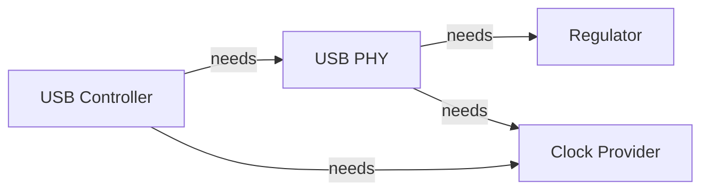
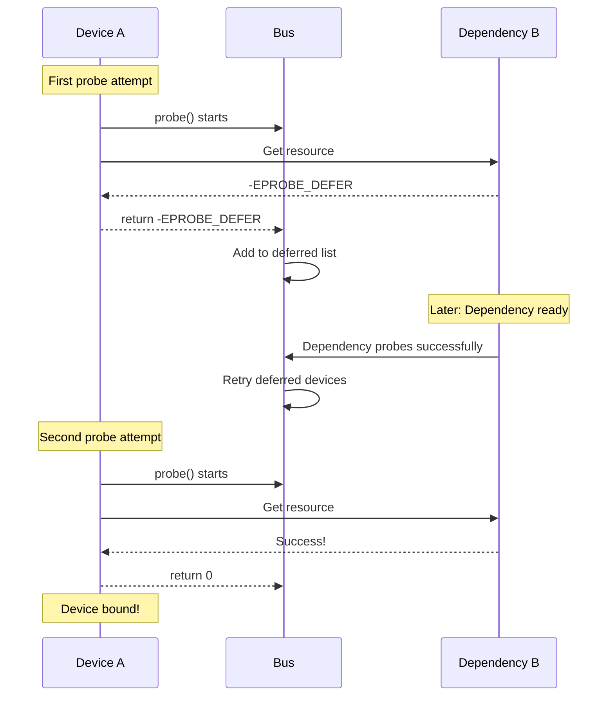

# Deferred Probe

Deferred probe (-EPROBE_DEFER) allows a driver to request that its probe be retried later when dependencies become available. This handles device initialization ordering without complex explicit dependencies.

## The Problem

Devices often depend on other devices:



If USB controller probes before the PHY is ready, what happens?

## The Solution: -EPROBE_DEFER

```c
static int my_probe(struct platform_device *pdev)
{
    struct my_device *mydev;
    int ret;

    mydev = devm_kzalloc(&pdev->dev, sizeof(*mydev), GFP_KERNEL);
    if (!mydev)
        return -ENOMEM;

    /* Get regulator - might not be ready yet */
    mydev->vdd = devm_regulator_get(&pdev->dev, "vdd");
    if (IS_ERR(mydev->vdd)) {
        ret = PTR_ERR(mydev->vdd);
        if (ret == -EPROBE_DEFER)
            dev_dbg(&pdev->dev, "Regulator not ready, deferring\n");
        return ret;  /* Will be retried later */
    }

    /* Get clock - might not be ready yet */
    mydev->clk = devm_clk_get(&pdev->dev, "main");
    if (IS_ERR(mydev->clk))
        return PTR_ERR(mydev->clk);  /* Might return -EPROBE_DEFER */

    /* All dependencies ready - continue with probe */
    dev_info(&pdev->dev, "All dependencies ready, probing\n");

    return 0;
}
```

## How Deferred Probe Works



## When to Return -EPROBE_DEFER

Return -EPROBE_DEFER when a required resource isn't available **yet**:

```c
/* Good - resource might become available */
if (IS_ERR(resource) && PTR_ERR(resource) == -EPROBE_DEFER)
    return -EPROBE_DEFER;

/* Good - using optional resource helper */
clk = devm_clk_get_optional(&pdev->dev, "optional");
if (IS_ERR(clk))
    return PTR_ERR(clk);  /* Might be -EPROBE_DEFER */

/* Bad - resource is truly missing (configuration error) */
if (something_is_fundamentally_wrong)
    return -EINVAL;  /* Don't defer, this won't fix itself */
```

## Common Deferrable Resources

```c
/* Regulators */
regulator = devm_regulator_get(&pdev->dev, "vdd");
if (IS_ERR(regulator))
    return PTR_ERR(regulator);

/* Clocks */
clk = devm_clk_get(&pdev->dev, "main");
if (IS_ERR(clk))
    return PTR_ERR(clk);

/* GPIO */
gpio = devm_gpiod_get(&pdev->dev, "reset", GPIOD_OUT_LOW);
if (IS_ERR(gpio))
    return PTR_ERR(gpio);

/* PHY */
phy = devm_phy_get(&pdev->dev, "usb");
if (IS_ERR(phy))
    return PTR_ERR(phy);

/* Reset controller */
rst = devm_reset_control_get(&pdev->dev, "main");
if (IS_ERR(rst))
    return PTR_ERR(rst);

/* PWM */
pwm = devm_pwm_get(&pdev->dev, NULL);
if (IS_ERR(pwm))
    return PTR_ERR(pwm);
```

## Debugging Deferred Probe

### View Deferred Devices

```bash
# List devices waiting for dependencies
cat /sys/kernel/debug/devices_deferred

# Example output:
# platform soc:usb@10000000
# platform soc:ethernet@20000000
```

### Check Why Device Deferred

```bash
# Get last defer reason (kernel 5.5+)
cat /sys/bus/platform/devices/soc\:usb@10000000/waiting_for_supplier
```

### Enable Debug Messages

```bash
# Boot with dynamic debug
dyndbg="file drivers/base/dd.c +p"

# Or at runtime
echo 'file drivers/base/dd.c +p' > /sys/kernel/debug/dynamic_debug/control
```

## Device Links for Ordering

Explicit device links ensure proper ordering:

```c
static int my_probe(struct platform_device *pdev)
{
    struct device *supplier;
    struct device_link *link;

    /* Find the supplier device */
    supplier = bus_find_device_by_name(&platform_bus_type, NULL,
                                       "my_supplier");
    if (!supplier)
        return -EPROBE_DEFER;

    /* Create device link */
    link = device_link_add(&pdev->dev, supplier,
                           DL_FLAG_STATELESS |
                           DL_FLAG_PM_RUNTIME);
    put_device(supplier);

    if (!link)
        return -EINVAL;

    /* Supplier is guaranteed to be bound */
    return 0;
}
```

### Device Link Flags

```c
DL_FLAG_STATELESS       /* Don't track binding state */
DL_FLAG_PM_RUNTIME      /* Manage runtime PM */
DL_FLAG_RPM_ACTIVE      /* Keep supplier active */
DL_FLAG_AUTOREMOVE_CONSUMER /* Auto-remove when consumer unbinds */
DL_FLAG_AUTOREMOVE_SUPPLIER /* Auto-remove when supplier unbinds */
```

## Best Practices

### Do

```c
/* DO: Propagate -EPROBE_DEFER */
resource = get_resource();
if (IS_ERR(resource))
    return PTR_ERR(resource);  /* Includes -EPROBE_DEFER */

/* DO: Use optional variants when resource is optional */
clk = devm_clk_get_optional(&pdev->dev, "maybe_clk");

/* DO: Log at debug level */
if (ret == -EPROBE_DEFER)
    dev_dbg(&pdev->dev, "Resource not ready\n");
```

### Don't

```c
/* DON'T: Hide -EPROBE_DEFER */
resource = get_resource();
if (IS_ERR(resource)) {
    dev_err(&pdev->dev, "Failed\n");
    return -ENODEV;  /* Lost -EPROBE_DEFER! */
}

/* DON'T: Defer forever */
/* Make sure the resource will actually become available */

/* DON'T: Log errors for expected defer */
if (IS_ERR(resource)) {
    dev_err(&pdev->dev, "Error!\n");  /* Noisy during boot */
    return PTR_ERR(resource);
}
```

## Example: Multiple Dependencies

```c
struct my_device {
    struct regulator *vdd;
    struct clk *clk;
    struct phy *phy;
    struct reset_control *rst;
};

static int my_probe(struct platform_device *pdev)
{
    struct my_device *mydev;
    int ret;

    mydev = devm_kzalloc(&pdev->dev, sizeof(*mydev), GFP_KERNEL);
    if (!mydev)
        return -ENOMEM;

    /* All of these might return -EPROBE_DEFER */

    mydev->vdd = devm_regulator_get(&pdev->dev, "vdd");
    if (IS_ERR(mydev->vdd))
        return dev_err_probe(&pdev->dev, PTR_ERR(mydev->vdd),
                             "Failed to get regulator\n");

    mydev->clk = devm_clk_get(&pdev->dev, "main");
    if (IS_ERR(mydev->clk))
        return dev_err_probe(&pdev->dev, PTR_ERR(mydev->clk),
                             "Failed to get clock\n");

    mydev->phy = devm_phy_get(&pdev->dev, "usb");
    if (IS_ERR(mydev->phy))
        return dev_err_probe(&pdev->dev, PTR_ERR(mydev->phy),
                             "Failed to get PHY\n");

    mydev->rst = devm_reset_control_get_exclusive(&pdev->dev, NULL);
    if (IS_ERR(mydev->rst))
        return dev_err_probe(&pdev->dev, PTR_ERR(mydev->rst),
                             "Failed to get reset\n");

    /* All dependencies available */
    dev_info(&pdev->dev, "Device probed successfully\n");
    return 0;
}
```

## dev_err_probe Helper

Handles error logging and -EPROBE_DEFER properly:

```c
/* This helper: */
return dev_err_probe(&pdev->dev, ret, "Failed to get resource\n");

/* Is equivalent to: */
if (ret != -EPROBE_DEFER)
    dev_err(&pdev->dev, "Failed to get resource\n");
return ret;
```

## Summary

- Return -EPROBE_DEFER when dependencies aren't ready yet
- Probe will be automatically retried when other devices probe
- Use `dev_err_probe()` for proper error handling
- Check /sys/kernel/debug/devices_deferred for debugging
- Device links can explicitly define dependencies
- Most devm_* functions return -EPROBE_DEFER appropriately

## Next

Continue to [Part 7: Interrupt Handling]() to learn about handling hardware interrupts.
