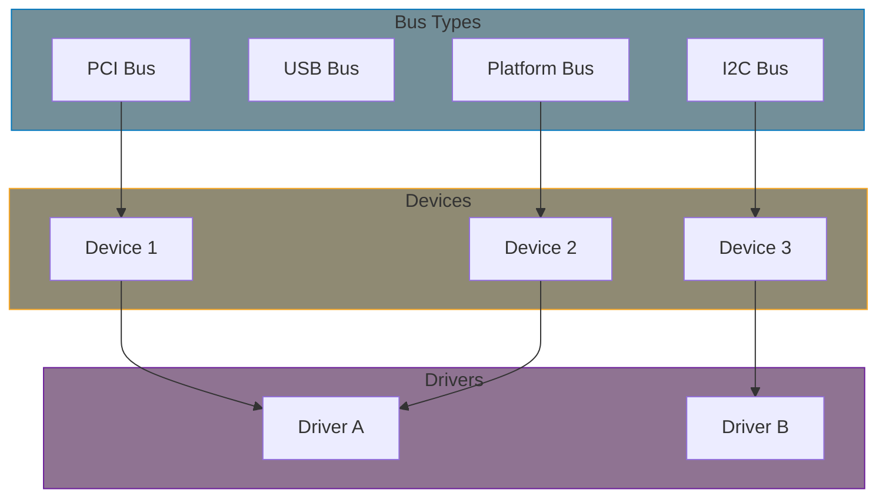
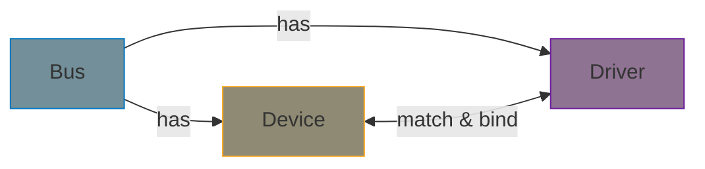
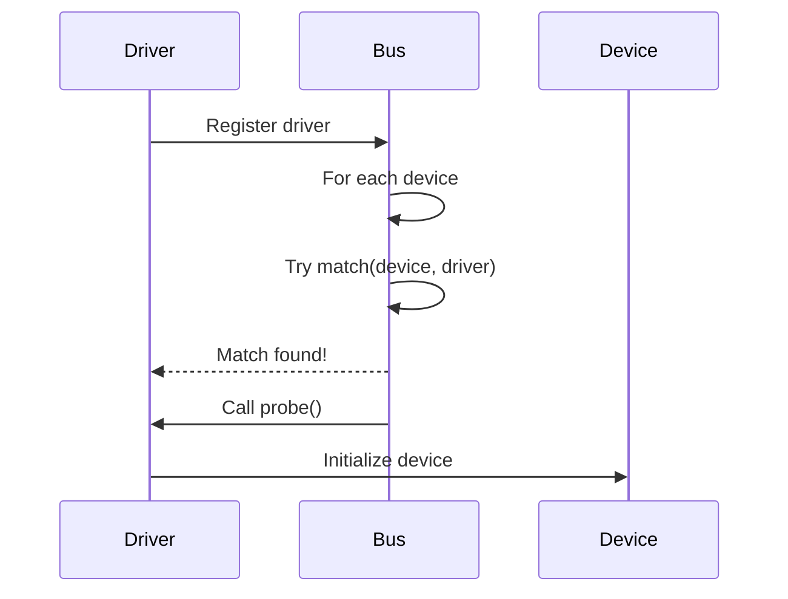

# Part 6: Device Model and Driver Framework

The Linux device model provides a unified framework for representing devices, their drivers, and their relationships. Understanding this model is essential for writing maintainable, well-integrated drivers.

## The Device Model Hierarchy

## Chapter Contents

| Chapter | Topic | Key Concepts |
|---------|-------|--------------|
| [6.1]() | Device Model | Buses, devices, drivers hierarchy |
| [6.2]() | Kobjects | kobject, kset, reference counting |
| [6.3]() | Platform Drivers | platform_device, platform_driver |
| [6.4]() | Probe and Remove | Driver lifecycle, binding |
| [6.5]() | Managed Resources | devm_* functions, automatic cleanup |
| [6.6]() | Device Attributes | sysfs interface, DEVICE_ATTR |
| [6.7]() | Deferred Probe | -EPROBE_DEFER handling |

## Key Concepts

### The Bus-Device-Driver Triangle

1. **Bus**: Defines how devices are discovered and how drivers are matched
2. **Device**: Represents a piece of hardware
3. **Driver**: Contains code to control a device

### Driver Registration Flow

## Why Platform Drivers?

Not all devices sit on discoverable buses (like PCI or USB). For:

- System-on-Chip (SoC) peripherals
- Memory-mapped devices
- Devices described in Device Tree

We use the **platform bus** - a virtual bus for non-discoverable devices.

## Examples

This part includes working examples:

- **platform-driver**: Complete platform driver implementation

## Prerequisites

Before starting this part, ensure you understand:

- Module lifecycle (Part 2)
- Character device basics (Part 3)
- Memory allocation and mapping (Part 5)

## Further Reading

- [Driver Model](https://docs.kernel.org/driver-api/driver-model/index.html) - Device model documentation
- [Platform Devices](https://docs.kernel.org/driver-api/driver-model/platform.html) - Platform bus guide
- [Devres](https://docs.kernel.org/driver-api/driver-model/devres.html) - Managed device resources

## Next

Start with [Device Model Basics]() to understand the kernel's unified device framework.
