# Interrupt Concepts

Hardware interrupts are signals from devices that need CPU attention. Understanding interrupt concepts is fundamental to writing responsive device drivers.

## What is an Interrupt?

An interrupt is an asynchronous signal indicating that a device needs attention:


## Types of Interrupts

### Hardware Interrupts (IRQs)

External signals from hardware devices:


### Software Interrupts (Exceptions)

Generated by software or CPU:
- **Exceptions**: Division by zero, page faults
- **System calls**: INT 0x80, SYSCALL instruction
- **Softirqs**: Deferred interrupt processing

## IRQ Numbers

Each interrupt source has a unique IRQ number:

```c
/* Getting IRQ number from platform device */
int irq = platform_get_irq(pdev, 0);  /* First IRQ */
int irq2 = platform_get_irq(pdev, 1); /* Second IRQ (if any) */

/* Named IRQ from Device Tree */
int irq = platform_get_irq_byname(pdev, "rx");

/* From Device Tree node directly */
int irq = of_irq_get(node, 0);

/* Legacy: From I/O resource */
struct resource *res = platform_get_resource(pdev, IORESOURCE_IRQ, 0);
int irq = res->start;
```

### Virtual vs Hardware IRQ Numbers

Linux uses virtual IRQ numbers that map to hardware interrupt lines:


## Interrupt Context

Code runs in different contexts with different rules:

### Process Context

Normal kernel code (system calls, kernel threads):
- Can sleep (wait_event, mutex_lock)
- Can allocate with GFP_KERNEL
- Has a valid `current` task
- Can access user space

### Interrupt Context (hardirq)

Interrupt handler code:
- **Cannot sleep**
- Must use GFP_ATOMIC for allocation
- `current` is undefined/unreliable
- Cannot access user space
- Should be fast

### Softirq/Tasklet Context

Deferred interrupt work:
- **Cannot sleep**
- Can be preempted by hardirqs
- GFP_ATOMIC required
- Can run concurrently on different CPUs (softirqs)

### Checking Context

```c
#include <linux/preempt.h>

/* Check if in interrupt context */
if (in_interrupt()) {
    /* hardirq, softirq, or NMI context */
    /* Cannot sleep! */
}

/* Check specifically in hardirq */
if (in_irq()) {
    /* In hardware interrupt handler */
}

/* Check if sleeping is allowed */
if (preemptible()) {
    /* Safe to sleep */
}

/* Better: might_sleep() debug check */
might_sleep();  /* Warns if called from atomic context */
```

## Interrupt Flow


## Interrupt Latency

Time from interrupt assertion to handler execution:


Factors affecting latency:
- Interrupt controller configuration
- CPU frequency and state
- Other IRQs being processed
- Preemption/interrupt disable periods

## Interrupt Affinity

IRQs can be pinned to specific CPUs:

```bash
# View current affinity
cat /proc/irq/45/smp_affinity

# Set affinity (hexadecimal CPU mask)
echo 2 > /proc/irq/45/smp_affinity  # CPU 1 only
echo f > /proc/irq/45/smp_affinity  # CPUs 0-3

# View effective affinity
cat /proc/irq/45/effective_affinity
```

Programmatic control:

```c
#include <linux/interrupt.h>

/* Set IRQ affinity */
cpumask_t mask;
cpumask_clear(&mask);
cpumask_set_cpu(2, &mask);  /* CPU 2 */
irq_set_affinity(irq, &mask);
```

## Edge vs Level Triggered

```mermaid
flowchart LR
    subgraph Edge["Edge Triggered"]
        direction LR
        E1["Signal: LOW → HIGH"]
        E2["IRQ fires once on transition"]
    end

    subgraph Level["Level Triggered"]
        direction LR
        L1["Signal: HIGH"]
        L2["IRQ fires while signal active"]
    end

    Edge --> EN["One IRQ per edge"]
    Level --> LN["Continuous until cleared"]

    style E1 fill:#73828d,stroke:#1976d2
    style L1 fill:#8f8370,stroke:#f57c00
```



### Edge Triggered
- Interrupt fires on signal transition (rising/falling edge)
- Miss interrupt if signal changes while processing
- Common for external events (button press)

### Level Triggered
- Interrupt fires while signal is active
- Must clear interrupt source or will re-trigger
- Common for device status (data available)

```c
/* Edge triggered */
ret = request_irq(irq, handler, IRQF_TRIGGER_RISING, "mydev", data);

/* Level triggered */
ret = request_irq(irq, handler, IRQF_TRIGGER_HIGH, "mydev", data);

/* Both edges */
ret = request_irq(irq, handler,
                  IRQF_TRIGGER_RISING | IRQF_TRIGGER_FALLING,
                  "mydev", data);
```

## Viewing System Interrupts

```bash
# View all interrupts and counts
cat /proc/interrupts

# Example output:
#            CPU0       CPU1       CPU2       CPU3
#   0:         23          0          0          0   IO-APIC   2-edge      timer
#   8:          0          0          0          1   IO-APIC   8-edge      rtc0
#  45:     124567       3241      12034       8234   PCI-MSI   524288-edge eth0
```

Columns show:
- IRQ number
- Per-CPU interrupt counts
- Interrupt controller type
- Trigger type
- Device name(s)

## Summary

- Interrupts are asynchronous hardware signals
- IRQ numbers uniquely identify interrupt sources
- Interrupt context has strict rules (no sleeping)
- Edge vs level triggering affects handler design
- Interrupt affinity controls CPU routing
- Check context with `in_interrupt()`, `in_irq()`

## Next

Learn how to [request and free IRQs]() in your driver.
