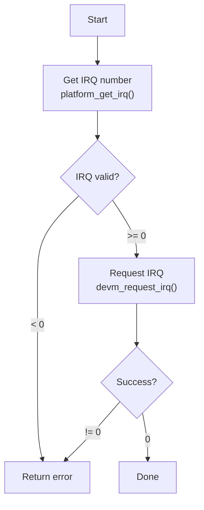

# Requesting IRQs

Before handling interrupts, you must register your handler with the kernel. This chapter covers requesting, managing, and freeing IRQs.

## Basic IRQ Request

```c
#include <linux/interrupt.h>

int request_irq(unsigned int irq,
                irq_handler_t handler,
                unsigned long flags,
                const char *name,
                void *dev_id);
```

### Parameters

| Parameter | Description |
|-----------|-------------|
| `irq` | IRQ number to request |
| `handler` | Function called when interrupt occurs |
| `flags` | IRQ flags (trigger type, sharing, etc.) |
| `name` | Name shown in /proc/interrupts |
| `dev_id` | Private data passed to handler |

### Example

```c
static irqreturn_t my_handler(int irq, void *dev_id)
{
    struct my_device *dev = dev_id;
    /* Handle interrupt */
    return IRQ_HANDLED;
}

static int my_probe(struct platform_device *pdev)
{
    struct my_device *mydev;
    int irq, ret;

    mydev = devm_kzalloc(&pdev->dev, sizeof(*mydev), GFP_KERNEL);
    if (!mydev)
        return -ENOMEM;

    /* Get IRQ number */
    irq = platform_get_irq(pdev, 0);
    if (irq < 0)
        return irq;

    /* Request IRQ */
    ret = request_irq(irq, my_handler, 0, "my_device", mydev);
    if (ret) {
        dev_err(&pdev->dev, "Failed to request IRQ %d: %d\n", irq, ret);
        return ret;
    }

    mydev->irq = irq;
    platform_set_drvdata(pdev, mydev);
    return 0;
}

static int my_remove(struct platform_device *pdev)
{
    struct my_device *mydev = platform_get_drvdata(pdev);

    free_irq(mydev->irq, mydev);
    return 0;
}
```

## Managed IRQ Request (Recommended)

Use `devm_request_irq()` for automatic cleanup:

```c
static int my_probe(struct platform_device *pdev)
{
    struct my_device *mydev;
    int irq, ret;

    mydev = devm_kzalloc(&pdev->dev, sizeof(*mydev), GFP_KERNEL);
    if (!mydev)
        return -ENOMEM;

    irq = platform_get_irq(pdev, 0);
    if (irq < 0)
        return irq;

    /* Managed request - auto-freed on driver unbind */
    ret = devm_request_irq(&pdev->dev, irq, my_handler, 0,
                           dev_name(&pdev->dev), mydev);
    if (ret)
        return dev_err_probe(&pdev->dev, ret, "Failed to request IRQ\n");

    return 0;
}

static int my_remove(struct platform_device *pdev)
{
    /* No need to free IRQ - automatically released */
    return 0;
}
```

## IRQ Flags

Common flags for `request_irq()`:

### Trigger Type Flags

```c
IRQF_TRIGGER_NONE       /* Use default/preconfigured trigger */
IRQF_TRIGGER_RISING     /* Edge: rising edge */
IRQF_TRIGGER_FALLING    /* Edge: falling edge */
IRQF_TRIGGER_HIGH       /* Level: active high */
IRQF_TRIGGER_LOW        /* Level: active low */
```

### Behavior Flags

```c
IRQF_SHARED             /* IRQ shared with other handlers */
IRQF_ONESHOT            /* Keep IRQ disabled until thread completes */
IRQF_NO_SUSPEND         /* Don't disable during suspend */
IRQF_NOBALANCING        /* Exclude from IRQ balancing */
IRQF_NO_THREAD          /* Don't allow threaded handling */
```

### Example with Flags

```c
/* Shared interrupt, level triggered high */
ret = request_irq(irq, my_handler,
                  IRQF_SHARED | IRQF_TRIGGER_HIGH,
                  "my_device", mydev);

/* Edge triggered, both edges */
ret = request_irq(irq, my_handler,
                  IRQF_TRIGGER_RISING | IRQF_TRIGGER_FALLING,
                  "my_device", mydev);
```

## Getting IRQ Numbers

### From Platform Device

```c
/* By index */
int irq = platform_get_irq(pdev, 0);  /* First IRQ */
int irq = platform_get_irq(pdev, 1);  /* Second IRQ */

/* By name (from Device Tree) */
int irq = platform_get_irq_byname(pdev, "rx");
int irq = platform_get_irq_byname(pdev, "tx");

/* Optional IRQ (returns 0 if not present) */
int irq = platform_get_irq_optional(pdev, 0);
```

### From PCI Device

```c
/* Legacy IRQ */
int irq = pdev->irq;

/* MSI/MSI-X */
ret = pci_alloc_irq_vectors(pdev, 1, nvecs, PCI_IRQ_MSI | PCI_IRQ_MSIX);
irq = pci_irq_vector(pdev, 0);  /* Vector 0 */
```

### From Device Tree

```c
#include <linux/of_irq.h>

struct device_node *np = pdev->dev.of_node;

/* By index */
int irq = of_irq_get(np, 0);

/* By name */
int irq = of_irq_get_byname(np, "error");
```

## Freeing IRQs

For non-managed requests:

```c
void free_irq(unsigned int irq, void *dev_id);
```

The `dev_id` must match what was passed to `request_irq()`:

```c
/* Must match the request */
request_irq(irq, handler, flags, name, mydev);
/* ... later ... */
free_irq(irq, mydev);  /* dev_id must match */
```

### Important: Order Matters

```c
static int my_remove(struct platform_device *pdev)
{
    struct my_device *mydev = platform_get_drvdata(pdev);

    /* 1. Disable device interrupts first */
    writel(0, mydev->regs + IRQ_ENABLE);

    /* 2. Then free the IRQ */
    free_irq(mydev->irq, mydev);

    /* 3. Then release other resources */
    /* ... */

    return 0;
}
```

## Error Handling

```c
static int my_probe(struct platform_device *pdev)
{
    int irq, ret;

    irq = platform_get_irq(pdev, 0);
    if (irq < 0) {
        /* platform_get_irq() returns -EPROBE_DEFER if not ready */
        return irq;  /* Propagate error */
    }

    ret = devm_request_irq(&pdev->dev, irq, my_handler, 0,
                           dev_name(&pdev->dev), mydev);
    if (ret) {
        /* Use dev_err_probe for proper -EPROBE_DEFER handling */
        return dev_err_probe(&pdev->dev, ret,
                             "Failed to request IRQ %d\n", irq);
    }

    return 0;
}
```

## Common Return Values

| Error | Meaning |
|-------|---------|
| 0 | Success |
| -EBUSY | IRQ already in use (and not shared) |
| -EINVAL | Invalid IRQ number or flags |
| -ENOMEM | Failed to allocate memory |
| -EPROBE_DEFER | IRQ not yet available, try later |

## Multiple IRQs

```c
struct my_device {
    int irq_rx;
    int irq_tx;
    int irq_err;
};

static int my_probe(struct platform_device *pdev)
{
    struct my_device *mydev;
    int ret;

    mydev = devm_kzalloc(&pdev->dev, sizeof(*mydev), GFP_KERNEL);
    if (!mydev)
        return -ENOMEM;

    /* Get multiple IRQs by name */
    mydev->irq_rx = platform_get_irq_byname(pdev, "rx");
    if (mydev->irq_rx < 0)
        return mydev->irq_rx;

    mydev->irq_tx = platform_get_irq_byname(pdev, "tx");
    if (mydev->irq_tx < 0)
        return mydev->irq_tx;

    mydev->irq_err = platform_get_irq_byname(pdev, "error");
    if (mydev->irq_err < 0)
        return mydev->irq_err;

    /* Request all IRQs */
    ret = devm_request_irq(&pdev->dev, mydev->irq_rx, rx_handler,
                           0, "mydev-rx", mydev);
    if (ret)
        return ret;

    ret = devm_request_irq(&pdev->dev, mydev->irq_tx, tx_handler,
                           0, "mydev-tx", mydev);
    if (ret)
        return ret;

    ret = devm_request_irq(&pdev->dev, mydev->irq_err, err_handler,
                           0, "mydev-err", mydev);
    if (ret)
        return ret;

    return 0;
}
```

## IRQ Request Flow



## Summary

- Use `devm_request_irq()` for automatic cleanup
- Get IRQ with `platform_get_irq()` or `platform_get_irq_byname()`
- Choose appropriate flags (trigger type, sharing)
- Handle -EPROBE_DEFER for deferred probe
- Free non-managed IRQs before releasing other resources
- `dev_id` must match between request and free

## Next

Learn how to write [interrupt handlers]() correctly.
