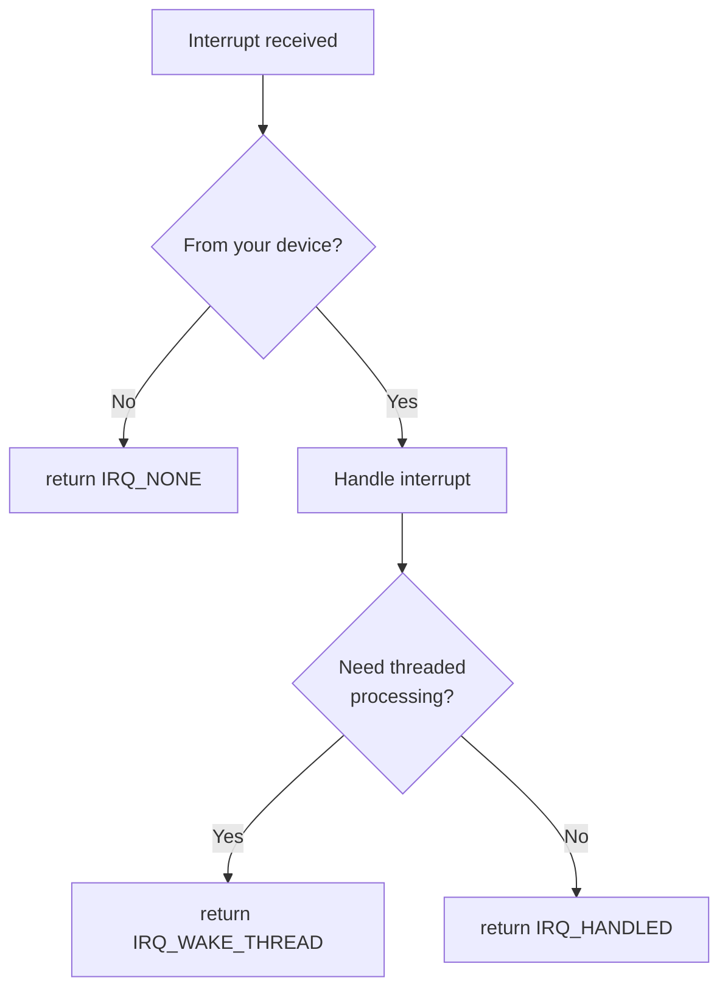

# Interrupt Handlers

Interrupt handlers are the functions called when your device generates an interrupt. Writing them correctly is critical for system stability.

## Handler Signature

```c
typedef irqreturn_t (*irq_handler_t)(int irq, void *dev_id);
```

- `irq`: The IRQ number that triggered
- `dev_id`: The private data passed to request_irq()
- Returns: `irqreturn_t` indicating what happened

## Return Values

```c
IRQ_NONE        /* Interrupt was not from this device */
IRQ_HANDLED     /* Interrupt was handled */
IRQ_WAKE_THREAD /* Wake the threaded handler */
```

### When to Return What



## Basic Handler Structure

```c
static irqreturn_t my_handler(int irq, void *dev_id)
{
    struct my_device *dev = dev_id;
    u32 status;

    /* 1. Read interrupt status */
    status = readl(dev->regs + IRQ_STATUS);

    /* 2. Check if this device generated the interrupt */
    if (!(status & IRQ_PENDING))
        return IRQ_NONE;

    /* 3. Acknowledge/clear the interrupt */
    writel(status, dev->regs + IRQ_CLEAR);

    /* 4. Handle the interrupt */
    if (status & RX_READY)
        handle_rx(dev);

    if (status & TX_EMPTY)
        handle_tx(dev);

    if (status & ERROR)
        handle_error(dev);

    /* 5. Return handled */
    return IRQ_HANDLED;
}
```

## Handler Rules

### What You MUST Do

```c
static irqreturn_t good_handler(int irq, void *dev_id)
{
    struct my_device *dev = dev_id;

    /* MUST: Check if interrupt is from your device */
    if (!my_device_has_interrupt(dev))
        return IRQ_NONE;

    /* MUST: Acknowledge/clear the interrupt source */
    writel(IRQ_ACK, dev->regs + IRQ_STATUS);

    /* MUST: Be fast! */
    return IRQ_HANDLED;
}
```

### What You CANNOT Do

```c
static irqreturn_t bad_handler(int irq, void *dev_id)
{
    struct my_device *dev = dev_id;

    /* CANNOT: Sleep */
    msleep(10);                          /* BAD! */
    wait_event(dev->wq, condition);      /* BAD! */

    /* CANNOT: Allocate with GFP_KERNEL */
    ptr = kmalloc(size, GFP_KERNEL);     /* BAD! */

    /* CANNOT: Acquire mutex */
    mutex_lock(&dev->mutex);             /* BAD! */

    /* CANNOT: Access user space */
    copy_from_user(buf, user, len);      /* BAD! */

    /* CANNOT: Take a long time */
    for (i = 0; i < 1000000; i++)        /* BAD! */
        do_work();

    return IRQ_HANDLED;
}
```

## Safe Operations in Handlers

### Memory Access

```c
/* OK: Atomic/GFP_ATOMIC allocations */
ptr = kmalloc(size, GFP_ATOMIC);

/* OK: Access pre-allocated memory */
dev->buffer[dev->idx++] = data;

/* OK: Memory-mapped I/O */
val = readl(dev->regs + OFFSET);
writel(val, dev->regs + OFFSET);
```

### Synchronization

```c
/* OK: Spinlocks */
spin_lock(&dev->lock);
/* critical section */
spin_unlock(&dev->lock);

/* OK: Atomic operations */
atomic_inc(&dev->count);

/* OK: Read-copy-update */
rcu_read_lock();
/* read data */
rcu_read_unlock();
```

### Waking Processes

```c
/* OK: Wake up waiting processes */
wake_up(&dev->wait_queue);
wake_up_interruptible(&dev->read_queue);

/* OK: Complete a completion */
complete(&dev->done);
```

### Scheduling Deferred Work

```c
/* OK: Schedule tasklet */
tasklet_schedule(&dev->tasklet);

/* OK: Schedule workqueue */
schedule_work(&dev->work);

/* OK: Wake threaded handler */
return IRQ_WAKE_THREAD;
```

## Handler with Spinlock

```c
struct my_device {
    spinlock_t lock;
    void __iomem *regs;
    u32 rx_data[16];
    int rx_head;
    int rx_tail;
    wait_queue_head_t rx_wait;
};

static irqreturn_t my_handler(int irq, void *dev_id)
{
    struct my_device *dev = dev_id;
    u32 status;
    unsigned long flags;

    status = readl(dev->regs + IRQ_STATUS);
    if (!(status & IRQ_PENDING))
        return IRQ_NONE;

    /* Clear interrupt */
    writel(status, dev->regs + IRQ_CLEAR);

    if (status & RX_READY) {
        spin_lock_irqsave(&dev->lock, flags);

        /* Read data into circular buffer */
        while (readl(dev->regs + RX_FIFO_COUNT)) {
            int next = (dev->rx_head + 1) % 16;
            if (next != dev->rx_tail) {
                dev->rx_data[dev->rx_head] = readl(dev->regs + RX_DATA);
                dev->rx_head = next;
            }
        }

        spin_unlock_irqrestore(&dev->lock, flags);

        /* Wake up readers */
        wake_up_interruptible(&dev->rx_wait);
    }

    return IRQ_HANDLED;
}
```

## Checking Interrupt Source

For shared interrupts or multiple interrupt sources:

```c
static irqreturn_t my_handler(int irq, void *dev_id)
{
    struct my_device *dev = dev_id;
    u32 status;
    irqreturn_t ret = IRQ_NONE;

    /* Read status - might have multiple bits set */
    status = readl(dev->regs + IRQ_STATUS);

    if (status & RX_INT) {
        writel(RX_INT, dev->regs + IRQ_CLEAR);
        handle_rx(dev);
        ret = IRQ_HANDLED;
    }

    if (status & TX_INT) {
        writel(TX_INT, dev->regs + IRQ_CLEAR);
        handle_tx(dev);
        ret = IRQ_HANDLED;
    }

    if (status & ERR_INT) {
        writel(ERR_INT, dev->regs + IRQ_CLEAR);
        handle_error(dev);
        ret = IRQ_HANDLED;
    }

    return ret;
}
```

## Statistics and Debugging

```c
struct my_device {
    atomic_t irq_count;
    atomic_t rx_count;
    atomic_t tx_count;
    u64 last_irq_time;
};

static irqreturn_t my_handler(int irq, void *dev_id)
{
    struct my_device *dev = dev_id;
    u32 status;

    status = readl(dev->regs + IRQ_STATUS);
    if (!(status & IRQ_PENDING))
        return IRQ_NONE;

    /* Statistics */
    atomic_inc(&dev->irq_count);
    dev->last_irq_time = ktime_get_ns();

    writel(status, dev->regs + IRQ_CLEAR);

    if (status & RX_INT) {
        atomic_inc(&dev->rx_count);
        handle_rx(dev);
    }

    if (status & TX_INT) {
        atomic_inc(&dev->tx_count);
        handle_tx(dev);
    }

    return IRQ_HANDLED;
}
```

## Handler Performance

### Keep It Fast

```c
/* GOOD: Minimal work in handler */
static irqreturn_t fast_handler(int irq, void *dev_id)
{
    struct my_device *dev = dev_id;

    /* Quick check and ack */
    if (!readl(dev->regs + IRQ_STATUS))
        return IRQ_NONE;

    writel(1, dev->regs + IRQ_ACK);

    /* Just grab the data */
    dev->data = readl(dev->regs + DATA);

    /* Schedule real work for later */
    return IRQ_WAKE_THREAD;
}
```

### Avoid Loops

```c
/* BAD: Unbounded loop */
static irqreturn_t slow_handler(int irq, void *dev_id)
{
    struct my_device *dev = dev_id;

    while (data_available(dev))  /* Might loop forever! */
        process_data(dev);

    return IRQ_HANDLED;
}

/* GOOD: Bounded loop */
static irqreturn_t bounded_handler(int irq, void *dev_id)
{
    struct my_device *dev = dev_id;
    int count = 0;

    while (data_available(dev) && count < 16) {
        read_data(dev);
        count++;
    }

    if (data_available(dev))
        schedule_work(&dev->work);  /* Handle rest later */

    return IRQ_HANDLED;
}
```

## Common Mistakes

### Mistake 1: Not Checking Interrupt Source

```c
/* BAD: Assumes interrupt is ours */
static irqreturn_t bad_handler(int irq, void *dev_id)
{
    struct my_device *dev = dev_id;

    /* Process without checking */
    process_data(dev);
    return IRQ_HANDLED;  /* Wrong if not our interrupt! */
}

/* GOOD: Always check */
static irqreturn_t good_handler(int irq, void *dev_id)
{
    struct my_device *dev = dev_id;

    if (!(readl(dev->regs + STATUS) & IRQ_PENDING))
        return IRQ_NONE;

    process_data(dev);
    return IRQ_HANDLED;
}
```

### Mistake 2: Not Clearing Interrupt

```c
/* BAD: Interrupt not cleared */
static irqreturn_t bad_handler(int irq, void *dev_id)
{
    process_data(dev);
    return IRQ_HANDLED;
    /* Interrupt still pending - will fire again! */
}

/* GOOD: Clear interrupt source */
static irqreturn_t good_handler(int irq, void *dev_id)
{
    u32 status = readl(dev->regs + STATUS);
    writel(status, dev->regs + STATUS);  /* Clear */
    process_data(dev);
    return IRQ_HANDLED;
}
```

## Summary

- Return `IRQ_NONE` if interrupt isn't from your device
- Always check and clear the interrupt source
- Keep handlers fast - defer heavy work
- Use spinlocks for synchronization, not mutexes
- Use atomic operations and GFP_ATOMIC
- Never sleep or call functions that might sleep
- Consider using threaded handlers for complex work

## Next

Learn about [top and bottom halves]() for splitting interrupt work.
