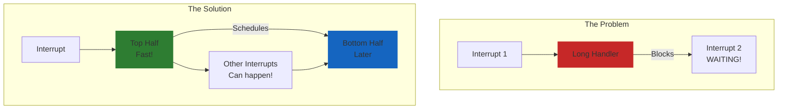
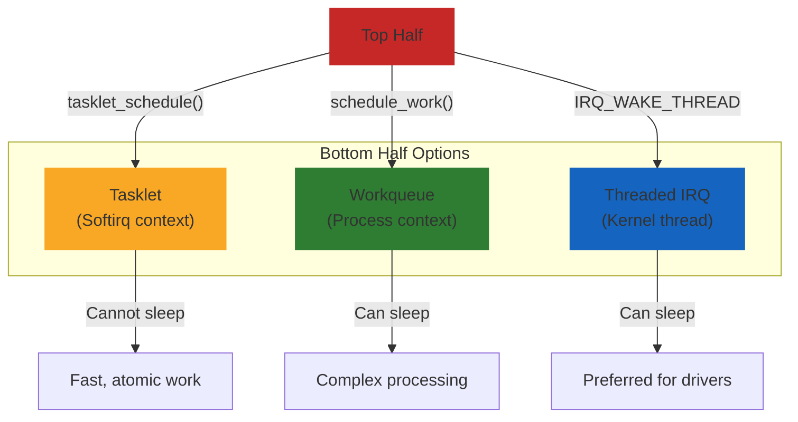
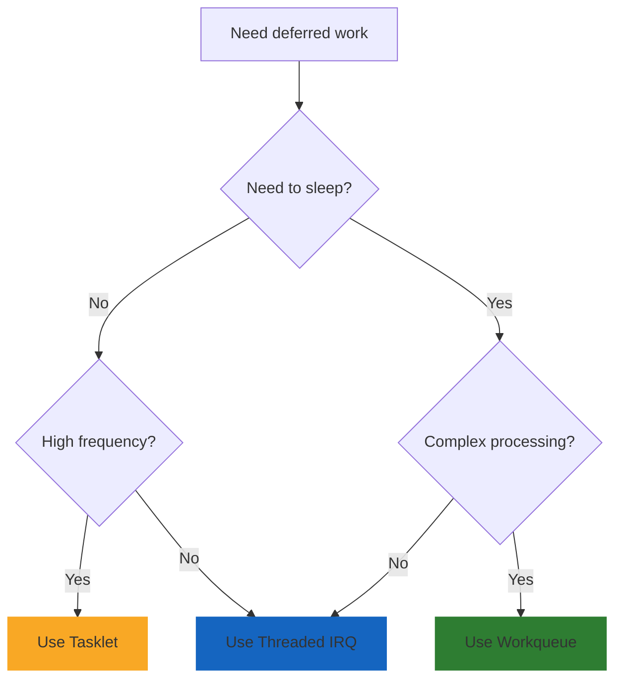
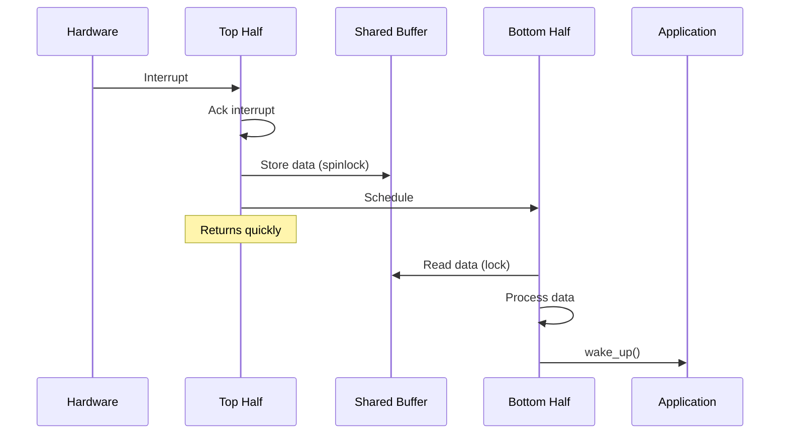

# Top and Bottom Halves

Interrupt handling is split into two parts: a fast "top half" that runs immediately with interrupts disabled, and a "bottom half" that does the heavy lifting later.

## Why Split?



## Top Half (Hardirq)

The top half runs immediately when the interrupt fires:

- Runs with interrupts disabled (or at least the same IRQ masked)
- Must be fast
- Cannot sleep
- Does minimal work: acknowledge interrupt, read urgent data

```c
static irqreturn_t top_half(int irq, void *dev_id)
{
    struct my_device *dev = dev_id;

    /* Check if our interrupt */
    if (!(readl(dev->regs + STATUS) & IRQ_PENDING))
        return IRQ_NONE;

    /* Acknowledge interrupt - must be fast */
    writel(IRQ_ACK, dev->regs + IRQ_CLEAR);

    /* Grab data from hardware FIFO */
    dev->pending_data = readl(dev->regs + DATA);

    /* Schedule bottom half for processing */
    tasklet_schedule(&dev->tasklet);

    return IRQ_HANDLED;
}
```

## Bottom Half Mechanisms

### Overview



### Comparison

| Mechanism | Context | Can Sleep | Use Case |
|-----------|---------|-----------|----------|
| Softirq | Softirq | No | High-performance networking |
| Tasklet | Softirq | No | Simple deferred work |
| Workqueue | Process | Yes | Complex processing |
| Threaded IRQ | Thread | Yes | Most driver work |

## Tasklet Example

```c
#include <linux/interrupt.h>

struct my_device {
    void __iomem *regs;
    struct tasklet_struct tasklet;
    u32 pending_data;
};

/* Bottom half - runs in softirq context */
static void my_tasklet_func(struct tasklet_struct *t)
{
    struct my_device *dev = from_tasklet(dev, t, tasklet);

    /* Process the data - cannot sleep here either! */
    process_data(dev->pending_data);

    /* Enable interrupt for next data */
    writel(IRQ_ENABLE, dev->regs + IRQ_CTRL);
}

/* Top half */
static irqreturn_t my_handler(int irq, void *dev_id)
{
    struct my_device *dev = dev_id;

    if (!(readl(dev->regs + STATUS) & IRQ_PENDING))
        return IRQ_NONE;

    /* Disable interrupt until tasklet processes */
    writel(0, dev->regs + IRQ_CTRL);

    /* Acknowledge */
    writel(IRQ_ACK, dev->regs + IRQ_CLEAR);

    /* Get data */
    dev->pending_data = readl(dev->regs + DATA);

    /* Schedule tasklet */
    tasklet_schedule(&dev->tasklet);

    return IRQ_HANDLED;
}

static int my_probe(struct platform_device *pdev)
{
    struct my_device *dev;

    dev = devm_kzalloc(&pdev->dev, sizeof(*dev), GFP_KERNEL);
    if (!dev)
        return -ENOMEM;

    /* Initialize tasklet */
    tasklet_setup(&dev->tasklet, my_tasklet_func);

    /* Request IRQ */
    return devm_request_irq(&pdev->dev, irq, my_handler, 0,
                            "mydev", dev);
}
```

## Workqueue Example

```c
#include <linux/workqueue.h>

struct my_device {
    void __iomem *regs;
    struct work_struct work;
    spinlock_t lock;
    u32 data_buffer[64];
    int data_count;
};

/* Bottom half - runs in process context, CAN SLEEP */
static void my_work_func(struct work_struct *work)
{
    struct my_device *dev = container_of(work, struct my_device, work);
    u32 local_buffer[64];
    int count;
    unsigned long flags;

    /* Copy data with lock */
    spin_lock_irqsave(&dev->lock, flags);
    count = dev->data_count;
    memcpy(local_buffer, dev->data_buffer, count * sizeof(u32));
    dev->data_count = 0;
    spin_unlock_irqrestore(&dev->lock, flags);

    /* Process data - can sleep here! */
    for (int i = 0; i < count; i++) {
        process_item(local_buffer[i]);
        /* Can call sleeping functions */
        msleep(1);
    }

    /* Re-enable interrupts */
    writel(IRQ_ENABLE, dev->regs + IRQ_CTRL);
}

/* Top half */
static irqreturn_t my_handler(int irq, void *dev_id)
{
    struct my_device *dev = dev_id;
    unsigned long flags;

    if (!(readl(dev->regs + STATUS) & IRQ_PENDING))
        return IRQ_NONE;

    writel(0, dev->regs + IRQ_CTRL);  /* Disable */
    writel(IRQ_ACK, dev->regs + IRQ_CLEAR);

    /* Store data quickly */
    spin_lock_irqsave(&dev->lock, flags);
    while (readl(dev->regs + FIFO_COUNT) && dev->data_count < 64) {
        dev->data_buffer[dev->data_count++] = readl(dev->regs + DATA);
    }
    spin_unlock_irqrestore(&dev->lock, flags);

    /* Schedule work */
    schedule_work(&dev->work);

    return IRQ_HANDLED;
}

static int my_probe(struct platform_device *pdev)
{
    struct my_device *dev;

    dev = devm_kzalloc(&pdev->dev, sizeof(*dev), GFP_KERNEL);
    if (!dev)
        return -ENOMEM;

    spin_lock_init(&dev->lock);
    INIT_WORK(&dev->work, my_work_func);

    return devm_request_irq(&pdev->dev, irq, my_handler, 0,
                            "mydev", dev);
}
```

## Threaded IRQ (Preferred)

The simplest and preferred approach for most drivers:

```c
/* Fast top half */
static irqreturn_t my_hardirq(int irq, void *dev_id)
{
    struct my_device *dev = dev_id;

    /* Quick check */
    if (!(readl(dev->regs + STATUS) & IRQ_PENDING))
        return IRQ_NONE;

    /* Acknowledge hardware */
    writel(IRQ_ACK, dev->regs + IRQ_CLEAR);

    /* Wake the threaded handler */
    return IRQ_WAKE_THREAD;
}

/* Threaded handler - runs in kernel thread, CAN SLEEP */
static irqreturn_t my_thread(int irq, void *dev_id)
{
    struct my_device *dev = dev_id;

    /* Full processing - can sleep */
    mutex_lock(&dev->mutex);

    process_all_data(dev);
    update_state(dev);

    mutex_unlock(&dev->mutex);

    wake_up_interruptible(&dev->waitq);

    return IRQ_HANDLED;
}

static int my_probe(struct platform_device *pdev)
{
    return devm_request_threaded_irq(&pdev->dev, irq,
                                     my_hardirq, my_thread,
                                     IRQF_ONESHOT,
                                     "mydev", dev);
}
```

## Choosing a Bottom Half



### Guidelines

- **Threaded IRQ**: Default choice for most drivers
- **Workqueue**: When you need a custom workqueue or delayed work
- **Tasklet**: Only for legacy code or very specific needs

## Data Flow Pattern



## Common Mistakes

### Mistake 1: Too Much Work in Top Half

```c
/* BAD: Processing in top half */
static irqreturn_t bad_handler(int irq, void *dev_id)
{
    struct my_device *dev = dev_id;

    writel(IRQ_ACK, dev->regs + IRQ_CLEAR);

    /* BAD: Heavy processing blocks other interrupts */
    for (int i = 0; i < 1000; i++)
        process_packet(dev);

    return IRQ_HANDLED;
}

/* GOOD: Defer processing */
static irqreturn_t good_handler(int irq, void *dev_id)
{
    struct my_device *dev = dev_id;

    writel(IRQ_ACK, dev->regs + IRQ_CLEAR);

    /* Store minimal data */
    dev->packets_pending = readl(dev->regs + PKT_COUNT);

    /* Defer heavy work */
    return IRQ_WAKE_THREAD;
}
```

### Mistake 2: Sleeping in Tasklet

```c
/* BAD: Sleeping in tasklet */
static void bad_tasklet(struct tasklet_struct *t)
{
    struct my_device *dev = from_tasklet(dev, t, tasklet);

    mutex_lock(&dev->mutex);  /* BAD: Can't sleep! */
    msleep(10);               /* BAD: Can't sleep! */
}

/* GOOD: Use workqueue if you need to sleep */
static void good_work(struct work_struct *work)
{
    struct my_device *dev = container_of(work, struct my_device, work);

    mutex_lock(&dev->mutex);  /* OK: Process context */
    msleep(10);               /* OK: Process context */
    mutex_unlock(&dev->mutex);
}
```

## Summary

- Split interrupt handling into fast top half and deferred bottom half
- Top half: acknowledge interrupt, grab essential data, schedule bottom half
- Bottom half options: tasklet (no sleep), workqueue (can sleep), threaded IRQ (can sleep)
- **Prefer threaded IRQs** for most driver work
- Use spinlocks to share data between top and bottom halves
- Keep top half as fast as possible

## Next

Learn about [tasklets]() for simple deferred work.
