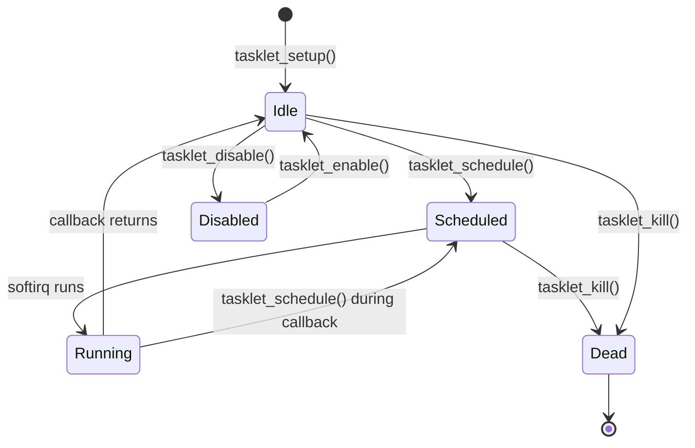

# Tasklets

Tasklets provide a simple mechanism for deferring work from interrupt context. They run in softirq context and cannot sleep.

## Tasklet Basics

```c
#include <linux/interrupt.h>

struct tasklet_struct {
    struct tasklet_struct *next;
    unsigned long state;
    atomic_t count;
    void (*callback)(struct tasklet_struct *t);
    /* ... */
};
```

### Key Properties

- Run in softirq context (interrupts enabled)
- Cannot sleep or block
- Same tasklet never runs concurrently on multiple CPUs
- Different tasklets can run concurrently
- Run on the CPU that scheduled them (usually)

## Creating Tasklets

### Static Declaration

```c
/* Old API (deprecated) */
DECLARE_TASKLET(my_tasklet, my_tasklet_func, data);

/* New API (kernel 5.9+) */
static void my_tasklet_func(struct tasklet_struct *t);
DECLARE_TASKLET(my_tasklet, my_tasklet_func);
```

### Dynamic Initialization

```c
struct my_device {
    struct tasklet_struct tasklet;
    /* ... */
};

static void my_tasklet_func(struct tasklet_struct *t)
{
    struct my_device *dev = from_tasklet(dev, t, tasklet);
    /* Process data */
}

static int my_probe(struct platform_device *pdev)
{
    struct my_device *dev;

    dev = devm_kzalloc(&pdev->dev, sizeof(*dev), GFP_KERNEL);
    if (!dev)
        return -ENOMEM;

    /* Initialize tasklet */
    tasklet_setup(&dev->tasklet, my_tasklet_func);

    return 0;
}
```

## Tasklet API

### Scheduling

```c
/* Schedule tasklet to run */
tasklet_schedule(&dev->tasklet);

/* Schedule with high priority */
tasklet_hi_schedule(&dev->tasklet);
```

### Control

```c
/* Disable tasklet (increments count) */
tasklet_disable(&dev->tasklet);

/* Re-enable tasklet */
tasklet_enable(&dev->tasklet);

/* Kill tasklet - wait for completion and prevent rescheduling */
tasklet_kill(&dev->tasklet);
```

## Complete Example

```c
#include <linux/module.h>
#include <linux/platform_device.h>
#include <linux/interrupt.h>
#include <linux/io.h>

struct my_device {
    void __iomem *regs;
    struct tasklet_struct tasklet;
    spinlock_t lock;
    u32 rx_buffer[256];
    int rx_head;
    int rx_tail;
    wait_queue_head_t rx_wait;
};

/* Tasklet function - softirq context, cannot sleep */
static void rx_tasklet_func(struct tasklet_struct *t)
{
    struct my_device *dev = from_tasklet(dev, t, tasklet);
    unsigned long flags;
    u32 data;

    spin_lock_irqsave(&dev->lock, flags);

    /* Process all available data */
    while (dev->rx_head != dev->rx_tail) {
        data = dev->rx_buffer[dev->rx_tail];
        dev->rx_tail = (dev->rx_tail + 1) % 256;

        spin_unlock_irqrestore(&dev->lock, flags);

        /* Process this item (still in softirq context) */
        process_rx_data(data);

        spin_lock_irqsave(&dev->lock, flags);
    }

    spin_unlock_irqrestore(&dev->lock, flags);

    /* Wake up readers */
    wake_up_interruptible(&dev->rx_wait);

    /* Re-enable device interrupt */
    writel(IRQ_ENABLE, dev->regs + IRQ_CTRL);
}

/* Interrupt handler - hardirq context */
static irqreturn_t my_irq_handler(int irq, void *dev_id)
{
    struct my_device *dev = dev_id;
    unsigned long flags;
    u32 status;

    status = readl(dev->regs + IRQ_STATUS);
    if (!(status & RX_IRQ))
        return IRQ_NONE;

    /* Disable interrupt until tasklet processes */
    writel(0, dev->regs + IRQ_CTRL);

    /* Acknowledge */
    writel(RX_IRQ, dev->regs + IRQ_CLEAR);

    /* Read all available data into buffer */
    spin_lock_irqsave(&dev->lock, flags);

    while (readl(dev->regs + RX_FIFO_COUNT)) {
        int next = (dev->rx_head + 1) % 256;

        if (next == dev->rx_tail) {
            /* Buffer full - drop data */
            readl(dev->regs + RX_DATA);  /* Discard */
            continue;
        }

        dev->rx_buffer[dev->rx_head] = readl(dev->regs + RX_DATA);
        dev->rx_head = next;
    }

    spin_unlock_irqrestore(&dev->lock, flags);

    /* Schedule tasklet */
    tasklet_schedule(&dev->tasklet);

    return IRQ_HANDLED;
}

static int my_probe(struct platform_device *pdev)
{
    struct my_device *dev;
    int irq, ret;

    dev = devm_kzalloc(&pdev->dev, sizeof(*dev), GFP_KERNEL);
    if (!dev)
        return -ENOMEM;

    spin_lock_init(&dev->lock);
    init_waitqueue_head(&dev->rx_wait);
    tasklet_setup(&dev->tasklet, rx_tasklet_func);

    dev->regs = devm_platform_ioremap_resource(pdev, 0);
    if (IS_ERR(dev->regs))
        return PTR_ERR(dev->regs);

    irq = platform_get_irq(pdev, 0);
    if (irq < 0)
        return irq;

    ret = devm_request_irq(&pdev->dev, irq, my_irq_handler,
                           0, "mydev", dev);
    if (ret)
        return ret;

    platform_set_drvdata(pdev, dev);
    return 0;
}

static int my_remove(struct platform_device *pdev)
{
    struct my_device *dev = platform_get_drvdata(pdev);

    /* Disable hardware interrupts first */
    writel(0, dev->regs + IRQ_CTRL);

    /* Kill tasklet - waits for completion */
    tasklet_kill(&dev->tasklet);

    return 0;
}
```

## Tasklet States



## Tasklet vs Other Mechanisms

### Tasklet vs Workqueue

| Aspect | Tasklet | Workqueue |
|--------|---------|-----------|
| Context | Softirq | Process |
| Can sleep | No | Yes |
| Concurrency | Single CPU | Multi-CPU |
| Use case | Simple, fast work | Complex processing |

### Tasklet vs Threaded IRQ

| Aspect | Tasklet | Threaded IRQ |
|--------|---------|--------------|
| Setup | Manual | Automatic |
| Context | Softirq | Thread |
| Can sleep | No | Yes |
| Preferred | Legacy | New drivers |

## Best Practices

### Do

```c
/* DO: Keep tasklet work minimal */
static void good_tasklet(struct tasklet_struct *t)
{
    struct my_device *dev = from_tasklet(dev, t, tasklet);

    /* Quick data processing */
    process_data(dev);

    /* Wake waiters */
    wake_up(&dev->waitq);
}

/* DO: Use spinlocks for shared data */
static void good_tasklet(struct tasklet_struct *t)
{
    struct my_device *dev = from_tasklet(dev, t, tasklet);
    unsigned long flags;

    spin_lock_irqsave(&dev->lock, flags);
    /* Access shared data */
    spin_unlock_irqrestore(&dev->lock, flags);
}

/* DO: Kill tasklet on removal */
static int my_remove(struct platform_device *pdev)
{
    struct my_device *dev = platform_get_drvdata(pdev);
    tasklet_kill(&dev->tasklet);
    return 0;
}
```

### Don't

```c
/* DON'T: Sleep in tasklet */
static void bad_tasklet(struct tasklet_struct *t)
{
    msleep(10);                          /* BAD! */
    mutex_lock(&mutex);                  /* BAD! */
    kmalloc(size, GFP_KERNEL);           /* BAD! */
}

/* DON'T: Do heavy work in tasklet */
static void bad_tasklet(struct tasklet_struct *t)
{
    for (int i = 0; i < 1000000; i++)    /* BAD! */
        heavy_computation();
}

/* DON'T: Forget to kill on module exit */
static int bad_remove(struct platform_device *pdev)
{
    /* Tasklet might still be scheduled! */
    return 0;
}
```

## High Priority Tasklets

For time-critical work:

```c
/* Normal priority */
tasklet_schedule(&dev->tasklet);

/* High priority - runs before normal tasklets */
tasklet_hi_schedule(&dev->tasklet);
```

High-priority tasklets are used sparingly for:
- Time-critical data (e.g., audio samples)
- Protocol timing requirements

## Disabling Tasklets

```c
/* Disable for critical section */
tasklet_disable(&dev->tasklet);

/* Do something that conflicts with tasklet */
update_hardware_config(dev);

/* Re-enable */
tasklet_enable(&dev->tasklet);
```

`tasklet_disable()` is nestable - must call `tasklet_enable()` the same number of times.

## Migration Note

Tasklets are being phased out in favor of threaded IRQs. For new code:

```c
/* Old way: tasklet */
tasklet_setup(&dev->tasklet, my_tasklet_func);
request_irq(irq, handler, 0, "dev", dev);

/* Preferred: threaded IRQ */
request_threaded_irq(irq, hardirq_handler, threaded_handler,
                     IRQF_ONESHOT, "dev", dev);
```

## Summary

- Tasklets run in softirq context, cannot sleep
- Use `tasklet_setup()` to initialize
- Use `tasklet_schedule()` to queue execution
- Always call `tasklet_kill()` on driver removal
- Prefer threaded IRQs for new drivers
- Same tasklet never runs concurrently on multiple CPUs

## Next

Learn about [threaded IRQs](), the preferred method for modern drivers.
