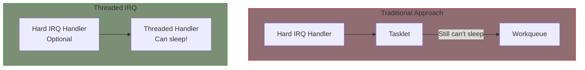
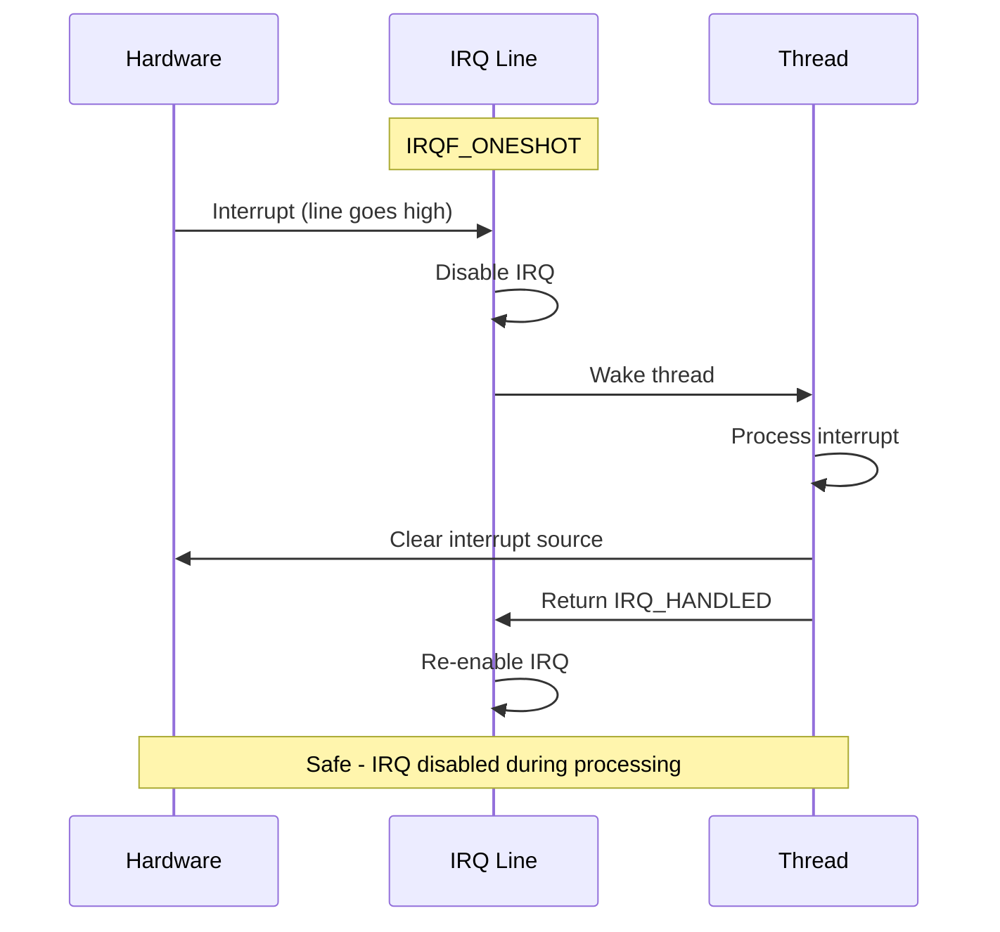

# Threaded IRQs

Threaded IRQs are the preferred mechanism for handling interrupts in modern Linux drivers. They combine the responsiveness of hardirq handlers with the flexibility of process context.

## Why Threaded IRQs?



### Benefits

- **Can sleep**: Mutexes, blocking I/O, memory allocation with GFP_KERNEL
- **Simpler code**: No separate tasklet or workqueue setup
- **Better latency**: Kernel scheduler manages thread priority
- **Preemptible**: Won't block other threads unnecessarily

## Basic Usage

```c
#include <linux/interrupt.h>

int request_threaded_irq(unsigned int irq,
                         irq_handler_t handler,        /* hardirq (optional) */
                         irq_handler_t thread_fn,      /* threaded handler */
                         unsigned long flags,
                         const char *name,
                         void *dev_id);

/* Managed version (auto cleanup) */
int devm_request_threaded_irq(struct device *dev,
                              unsigned int irq,
                              irq_handler_t handler,
                              irq_handler_t thread_fn,
                              unsigned long flags,
                              const char *name,
                              void *dev_id);
```

## Threaded Handler Only

When you don't need a hardirq handler:

```c
/* Handler is NULL - kernel provides default */
static irqreturn_t my_thread_handler(int irq, void *dev_id)
{
    struct my_device *dev = dev_id;

    /* Process interrupt - can sleep! */
    mutex_lock(&dev->mutex);

    data = read_device_data(dev);
    process_data(dev, data);

    mutex_unlock(&dev->mutex);

    return IRQ_HANDLED;
}

static int my_probe(struct platform_device *pdev)
{
    int irq, ret;

    irq = platform_get_irq(pdev, 0);
    if (irq < 0)
        return irq;

    /* NULL hardirq handler - use threaded only */
    ret = devm_request_threaded_irq(&pdev->dev, irq,
                                    NULL,              /* No hardirq */
                                    my_thread_handler,
                                    IRQF_ONESHOT,
                                    "mydev", dev);
    return ret;
}
```

## With Hardirq Handler

When you need immediate hardware acknowledgment:

```c
/* Fast hardirq handler */
static irqreturn_t my_hardirq(int irq, void *dev_id)
{
    struct my_device *dev = dev_id;
    u32 status;

    /* Quick check - is this our interrupt? */
    status = readl(dev->regs + IRQ_STATUS);
    if (!(status & IRQ_PENDING))
        return IRQ_NONE;

    /* Acknowledge hardware immediately */
    writel(status, dev->regs + IRQ_CLEAR);

    /* Save status for thread */
    dev->irq_status = status;

    /* Wake the threaded handler */
    return IRQ_WAKE_THREAD;
}

/* Threaded handler - can sleep */
static irqreturn_t my_thread(int irq, void *dev_id)
{
    struct my_device *dev = dev_id;

    /* Process based on saved status */
    if (dev->irq_status & RX_READY) {
        mutex_lock(&dev->rx_mutex);
        handle_rx(dev);
        mutex_unlock(&dev->rx_mutex);
    }

    if (dev->irq_status & TX_EMPTY) {
        mutex_lock(&dev->tx_mutex);
        handle_tx(dev);
        mutex_unlock(&dev->tx_mutex);
    }

    return IRQ_HANDLED;
}

static int my_probe(struct platform_device *pdev)
{
    return devm_request_threaded_irq(&pdev->dev, irq,
                                     my_hardirq,
                                     my_thread,
                                     IRQF_ONESHOT,
                                     "mydev", dev);
}
```

## Return Values

### From Hardirq Handler

```c
IRQ_NONE        /* Not our interrupt */
IRQ_HANDLED     /* Handled, don't run thread */
IRQ_WAKE_THREAD /* Run the threaded handler */
```

### From Threaded Handler

```c
IRQ_NONE        /* Spurious (shouldn't happen) */
IRQ_HANDLED     /* Processed successfully */
```

## IRQF_ONESHOT Flag

Critical for threaded-only handlers:

```c
/* IRQF_ONESHOT keeps the IRQ disabled until thread completes */
devm_request_threaded_irq(&pdev->dev, irq,
                          NULL,              /* No hardirq */
                          my_thread,
                          IRQF_ONESHOT,      /* Required! */
                          "mydev", dev);
```

Without IRQF_ONESHOT:
- Level-triggered IRQ would fire repeatedly
- Thread could be interrupted by same IRQ



## Complete Example

```c
#include <linux/module.h>
#include <linux/platform_device.h>
#include <linux/interrupt.h>
#include <linux/mutex.h>
#include <linux/wait.h>

struct sensor_device {
    void __iomem *regs;
    struct mutex data_mutex;
    wait_queue_head_t data_ready;
    u32 sensor_data[16];
    int data_count;
    bool data_available;
};

/* Hardirq: Quick check and ack */
static irqreturn_t sensor_hardirq(int irq, void *dev_id)
{
    struct sensor_device *dev = dev_id;
    u32 status;

    status = readl(dev->regs + IRQ_STATUS);
    if (!(status & DATA_READY))
        return IRQ_NONE;

    /* Acknowledge interrupt */
    writel(DATA_READY, dev->regs + IRQ_CLEAR);

    return IRQ_WAKE_THREAD;
}

/* Threaded handler: Full processing */
static irqreturn_t sensor_thread(int irq, void *dev_id)
{
    struct sensor_device *dev = dev_id;
    int i;

    /* Lock for data access - can sleep! */
    mutex_lock(&dev->data_mutex);

    /* Read all available samples */
    dev->data_count = 0;
    while (readl(dev->regs + FIFO_STATUS) & FIFO_NOT_EMPTY) {
        if (dev->data_count >= 16)
            break;
        dev->sensor_data[dev->data_count++] = readl(dev->regs + FIFO_DATA);
    }

    /* Optional: Post-process data */
    for (i = 0; i < dev->data_count; i++) {
        dev->sensor_data[i] = calibrate_reading(dev->sensor_data[i]);
    }

    dev->data_available = true;

    mutex_unlock(&dev->data_mutex);

    /* Wake up readers */
    wake_up_interruptible(&dev->data_ready);

    return IRQ_HANDLED;
}

/* Read function - blocks until data available */
static ssize_t sensor_read(struct file *file, char __user *buf,
                           size_t count, loff_t *ppos)
{
    struct sensor_device *dev = file->private_data;
    int ret;

    /* Wait for data */
    ret = wait_event_interruptible(dev->data_ready, dev->data_available);
    if (ret)
        return ret;

    mutex_lock(&dev->data_mutex);

    /* Copy data to user */
    if (count > dev->data_count * sizeof(u32))
        count = dev->data_count * sizeof(u32);

    if (copy_to_user(buf, dev->sensor_data, count)) {
        mutex_unlock(&dev->data_mutex);
        return -EFAULT;
    }

    dev->data_available = false;

    mutex_unlock(&dev->data_mutex);

    return count;
}

static int sensor_probe(struct platform_device *pdev)
{
    struct sensor_device *dev;
    int irq, ret;

    dev = devm_kzalloc(&pdev->dev, sizeof(*dev), GFP_KERNEL);
    if (!dev)
        return -ENOMEM;

    mutex_init(&dev->data_mutex);
    init_waitqueue_head(&dev->data_ready);

    dev->regs = devm_platform_ioremap_resource(pdev, 0);
    if (IS_ERR(dev->regs))
        return PTR_ERR(dev->regs);

    irq = platform_get_irq(pdev, 0);
    if (irq < 0)
        return irq;

    ret = devm_request_threaded_irq(&pdev->dev, irq,
                                    sensor_hardirq,
                                    sensor_thread,
                                    IRQF_ONESHOT,
                                    dev_name(&pdev->dev), dev);
    if (ret)
        return dev_err_probe(&pdev->dev, ret, "Failed to request IRQ\n");

    /* Enable device interrupts */
    writel(DATA_READY, dev->regs + IRQ_ENABLE);

    platform_set_drvdata(pdev, dev);
    return 0;
}

static int sensor_remove(struct platform_device *pdev)
{
    struct sensor_device *dev = platform_get_drvdata(pdev);

    /* Disable interrupts before cleanup */
    writel(0, dev->regs + IRQ_ENABLE);

    /* devm handles IRQ freeing */
    return 0;
}
```

## Thread Naming

The kernel creates threads named `irq/<irq>-<name>`:

```bash
$ ps aux | grep irq
root      1234  0.0  0.0      0     0 ?   S    10:00   0:00 [irq/45-sensor]
root      1235  0.0  0.0      0     0 ?   S    10:00   0:00 [irq/46-uart]
```

## Priority Control

Threaded handlers run as SCHED_FIFO real-time threads by default:

```bash
# View thread priority
$ chrt -p $(pgrep -f "irq/45")
pid 1234's current scheduling policy: SCHED_FIFO
pid 1234's current scheduling priority: 50

# Change priority (as root)
$ chrt -f -p 99 1234
```

Programmatic control:

```c
#include <linux/sched.h>

/* In threaded handler or probe */
sched_set_fifo(current);  /* Set to real-time FIFO */
```

## When to Use Threaded IRQs

### Use Threaded IRQs When:

- Need to sleep (mutex, memory allocation, I/O)
- Processing takes more than a few microseconds
- Want simpler code without separate workqueue
- Writing new driver code

### Don't Use When:

- Ultra-low latency required (networking hot path)
- Processing is trivially fast
- Need softirq priorities (rare)

## Migration from Tasklets

```c
/* Before: Tasklet */
static void my_tasklet_func(struct tasklet_struct *t) { ... }
tasklet_setup(&dev->tasklet, my_tasklet_func);
request_irq(irq, my_handler, 0, "dev", dev);

/* After: Threaded IRQ */
static irqreturn_t my_thread(int irq, void *data) { ... }
request_threaded_irq(irq, my_hardirq, my_thread,
                     IRQF_ONESHOT, "dev", dev);
```

## Summary

- Threaded IRQs are the preferred mechanism for modern drivers
- Use `devm_request_threaded_irq()` for managed allocation
- Threaded handler runs in process context (can sleep)
- Use `IRQF_ONESHOT` for threaded-only handlers
- Return `IRQ_WAKE_THREAD` from hardirq to invoke threaded handler
- Simpler than tasklet + workqueue combinations

## Next

Learn about [shared interrupts]() for devices that share IRQ lines.
