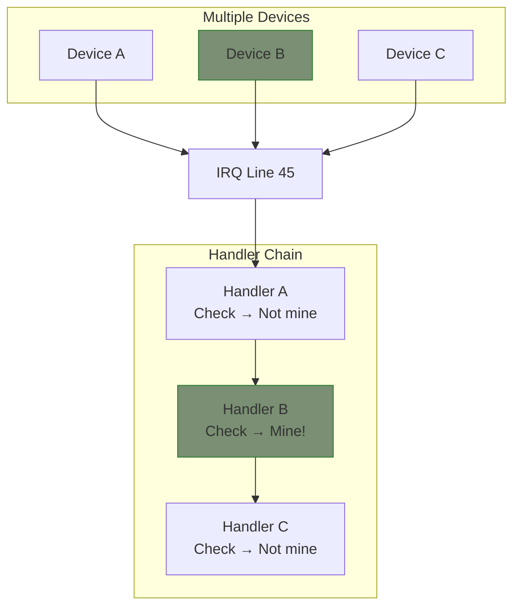
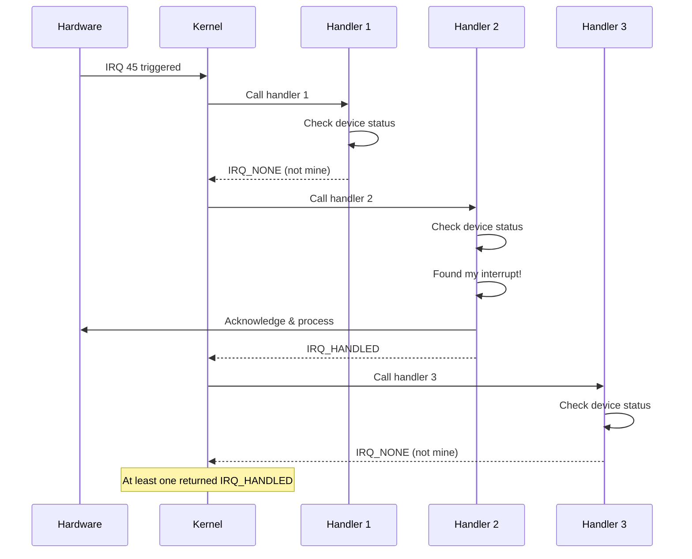

# Shared Interrupts

Multiple devices can share the same IRQ line. Your driver must handle this correctly by checking if the interrupt came from its device.

## Why Shared Interrupts?



### Common Scenarios

- PCI devices often share IRQ lines
- Legacy ISA bus devices
- Embedded systems with limited interrupt lines
- Multi-function devices

## Requesting Shared IRQs

```c
/* Must specify IRQF_SHARED */
ret = request_irq(irq, my_handler,
                  IRQF_SHARED,     /* Required for sharing */
                  "my_device",
                  dev);            /* dev_id must be non-NULL */
```

### Requirements for IRQF_SHARED

1. **All handlers must agree**: Every handler for this IRQ must use IRQF_SHARED
2. **dev_id must be non-NULL**: Used to identify which handler to remove
3. **Handler must check ownership**: Return IRQ_NONE if not your interrupt
4. **Trigger type must match**: All handlers use same edge/level trigger

## Handler Structure

```c
static irqreturn_t my_shared_handler(int irq, void *dev_id)
{
    struct my_device *dev = dev_id;
    u32 status;

    /* MUST: Check if this interrupt is from our device */
    status = readl(dev->regs + IRQ_STATUS);

    if (!(status & IRQ_PENDING)) {
        /* Not our interrupt - let other handlers check */
        return IRQ_NONE;
    }

    /* Our interrupt - handle it */
    writel(status, dev->regs + IRQ_CLEAR);

    /* Process interrupt */
    handle_device_event(dev, status);

    return IRQ_HANDLED;
}
```

## Complete Example

```c
#include <linux/module.h>
#include <linux/pci.h>
#include <linux/interrupt.h>

struct my_pci_device {
    void __iomem *regs;
    struct pci_dev *pdev;
    spinlock_t lock;
};

/* Shared interrupt handler */
static irqreturn_t my_pci_handler(int irq, void *dev_id)
{
    struct my_pci_device *dev = dev_id;
    u32 status;
    unsigned long flags;

    /* Check if our device generated the interrupt */
    status = readl(dev->regs + IRQ_STATUS);

    if (!(status & MY_IRQ_PENDING))
        return IRQ_NONE;  /* Not ours */

    /* Acknowledge interrupt */
    writel(status, dev->regs + IRQ_CLEAR);

    /* Handle the interrupt */
    spin_lock_irqsave(&dev->lock, flags);

    if (status & RX_COMPLETE)
        handle_rx(dev);

    if (status & TX_COMPLETE)
        handle_tx(dev);

    spin_unlock_irqrestore(&dev->lock, flags);

    return IRQ_HANDLED;
}

static int my_pci_probe(struct pci_dev *pdev,
                        const struct pci_device_id *id)
{
    struct my_pci_device *dev;
    int ret;

    dev = devm_kzalloc(&pdev->dev, sizeof(*dev), GFP_KERNEL);
    if (!dev)
        return -ENOMEM;

    dev->pdev = pdev;
    spin_lock_init(&dev->lock);

    ret = pcim_enable_device(pdev);
    if (ret)
        return ret;

    dev->regs = pcim_iomap(pdev, 0, 0);
    if (!dev->regs)
        return -ENOMEM;

    /* Request shared interrupt */
    ret = devm_request_irq(&pdev->dev, pdev->irq,
                           my_pci_handler,
                           IRQF_SHARED,
                           "my_pci_device",
                           dev);  /* dev_id = device struct */
    if (ret)
        return dev_err_probe(&pdev->dev, ret,
                             "Failed to request IRQ %d\n", pdev->irq);

    pci_set_drvdata(pdev, dev);

    /* Enable device interrupts */
    writel(IRQ_ENABLE_ALL, dev->regs + IRQ_CTRL);

    return 0;
}

static void my_pci_remove(struct pci_dev *pdev)
{
    struct my_pci_device *dev = pci_get_drvdata(pdev);

    /* Disable device interrupts before cleanup */
    writel(0, dev->regs + IRQ_CTRL);

    /* devm handles IRQ freeing */
}
```

## Handler Chain Execution



## Common Patterns

### Check Status Register

```c
static irqreturn_t handler(int irq, void *dev_id)
{
    struct my_device *dev = dev_id;

    /* Read status - device should clear bit if interrupt pending */
    if (!(readl(dev->regs + STATUS) & IRQ_PENDING))
        return IRQ_NONE;

    /* Handle interrupt */
    return IRQ_HANDLED;
}
```

### Check Config Space (PCI)

```c
static irqreturn_t pci_handler(int irq, void *dev_id)
{
    struct my_device *dev = dev_id;
    u16 status;

    /* Read PCI status register */
    pci_read_config_word(dev->pdev, PCI_STATUS, &status);

    if (!(status & PCI_STATUS_INTERRUPT))
        return IRQ_NONE;

    /* Handle interrupt */
    return IRQ_HANDLED;
}
```

### Check Interrupt Mask

```c
static irqreturn_t handler(int irq, void *dev_id)
{
    struct my_device *dev = dev_id;
    u32 status, enabled;

    status = readl(dev->regs + IRQ_STATUS);
    enabled = readl(dev->regs + IRQ_ENABLE);

    /* Only handle enabled interrupts */
    status &= enabled;

    if (!status)
        return IRQ_NONE;

    /* Clear and handle only our interrupts */
    writel(status, dev->regs + IRQ_CLEAR);
    process_events(dev, status);

    return IRQ_HANDLED;
}
```

## Error Handling

### Registration Failures

```c
ret = request_irq(irq, handler, IRQF_SHARED, "mydev", dev);
if (ret == -EBUSY) {
    /* IRQ in use and either:
     * - Existing handler doesn't use IRQF_SHARED
     * - Trigger type mismatch
     */
    dev_err(&pdev->dev, "IRQ %d busy, cannot share\n", irq);
    return ret;
}
```

### Checking Sharability

```c
struct irq_desc *desc = irq_to_desc(irq);

if (desc && desc->action) {
    /* IRQ already has handlers */
    if (!(desc->action->flags & IRQF_SHARED)) {
        dev_warn(&pdev->dev, "IRQ %d not shared by existing handler\n", irq);
    }
}
```

## Shared Threaded IRQs

```c
/* Shared threaded interrupt */
ret = devm_request_threaded_irq(&pdev->dev, irq,
                                my_hardirq,    /* Check ownership here */
                                my_thread,     /* Process here */
                                IRQF_SHARED | IRQF_ONESHOT,
                                "mydev", dev);

static irqreturn_t my_hardirq(int irq, void *dev_id)
{
    struct my_device *dev = dev_id;

    /* Quick check if our interrupt */
    if (!(readl(dev->regs + STATUS) & IRQ_PENDING))
        return IRQ_NONE;

    /* Acknowledge */
    writel(IRQ_ACK, dev->regs + STATUS);

    return IRQ_WAKE_THREAD;
}

static irqreturn_t my_thread(int irq, void *dev_id)
{
    struct my_device *dev = dev_id;

    /* Full processing - hardirq already confirmed it's ours */
    mutex_lock(&dev->mutex);
    process_data(dev);
    mutex_unlock(&dev->mutex);

    return IRQ_HANDLED;
}
```

## Best Practices

### Do

```c
/* DO: Always check if interrupt is yours */
static irqreturn_t good_handler(int irq, void *dev_id)
{
    struct my_device *dev = dev_id;

    if (!my_device_has_interrupt(dev))
        return IRQ_NONE;

    handle_interrupt(dev);
    return IRQ_HANDLED;
}

/* DO: Use unique dev_id */
ret = request_irq(irq, handler, IRQF_SHARED, name, unique_dev_ptr);

/* DO: Disable device interrupts before freeing */
static int remove(struct platform_device *pdev)
{
    writel(0, dev->regs + IRQ_ENABLE);  /* Disable first */
    free_irq(irq, dev);
    return 0;
}
```

### Don't

```c
/* DON'T: Assume interrupt is yours */
static irqreturn_t bad_handler(int irq, void *dev_id)
{
    handle_interrupt(dev);  /* BAD: Might not be our interrupt! */
    return IRQ_HANDLED;
}

/* DON'T: Use NULL dev_id with shared IRQ */
ret = request_irq(irq, handler, IRQF_SHARED, name, NULL);  /* FAILS! */

/* DON'T: Return IRQ_HANDLED without checking */
static irqreturn_t bad_handler(int irq, void *dev_id)
{
    return IRQ_HANDLED;  /* BAD: Lies about handling */
}
```

## Debugging Shared IRQs

```bash
# View shared IRQ handlers
cat /proc/interrupts
#  45:      12345      67890   PCI-MSI  524288-edge  device1, device2, device3

# Check specific IRQ
ls -la /sys/kernel/irq/45/

# View handler chain
cat /sys/kernel/debug/irq/45/actions
```

## Summary

- Use `IRQF_SHARED` when multiple devices share an IRQ
- `dev_id` must be unique and non-NULL
- Always check if interrupt is from your device
- Return `IRQ_NONE` if not your interrupt
- All handlers must agree on trigger type
- Disable device interrupts before freeing the IRQ

## Next

Learn about [interrupt control]() including enable/disable and IRQ affinity.
