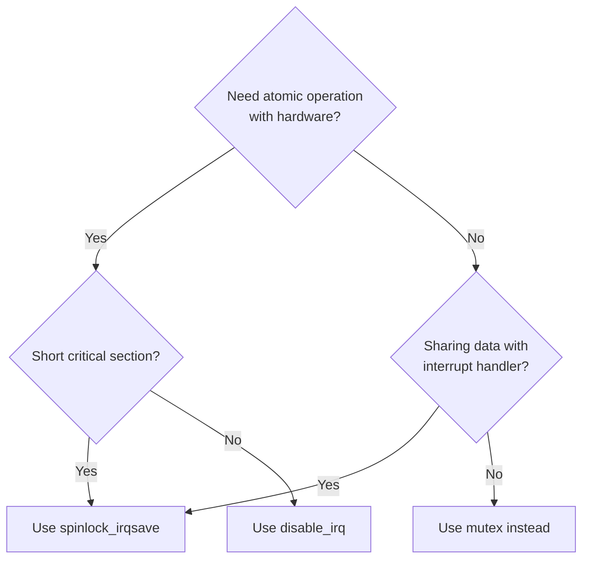
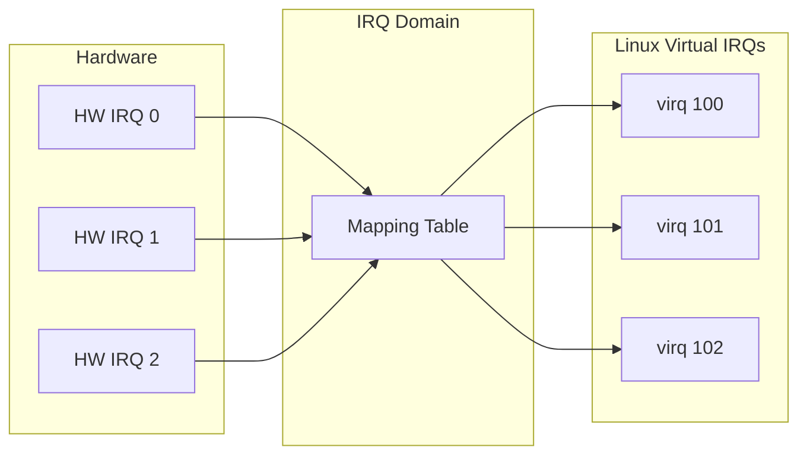

# Interrupt Control

This chapter covers managing interrupts: enabling/disabling, CPU affinity, trigger types, and interrupt domains for controllers.

## Enabling and Disabling Interrupts

### Local CPU Interrupts

```c
#include <linux/irqflags.h>

/* Disable interrupts on local CPU */
local_irq_disable();
/* Critical section - interrupts disabled */
local_irq_enable();

/* Save and restore state (preferred) */
unsigned long flags;
local_irq_save(flags);    /* Disable and save state */
/* Critical section */
local_irq_restore(flags); /* Restore previous state */
```

### Specific IRQ Line

```c
#include <linux/interrupt.h>

/* Disable specific IRQ (all CPUs) */
disable_irq(irq);     /* Waits for running handlers */
/* ... */
enable_irq(irq);

/* Non-blocking disable */
disable_irq_nosync(irq);  /* Returns immediately */
```

### When to Disable IRQs



## IRQ Affinity

Control which CPUs can handle an interrupt:

### Viewing Affinity

```bash
# View current affinity (hex bitmask)
cat /proc/irq/45/smp_affinity
# f    (all 4 CPUs: 0x1111)

# View as CPU list
cat /proc/irq/45/smp_affinity_list
# 0-3

# View effective affinity (after system adjustments)
cat /proc/irq/45/effective_affinity
```

### Setting Affinity

```bash
# Pin to CPU 0 only
echo 1 > /proc/irq/45/smp_affinity

# Pin to CPU 2 only
echo 4 > /proc/irq/45/smp_affinity

# CPUs 0 and 2
echo 5 > /proc/irq/45/smp_affinity

# All CPUs on 8-core system
echo ff > /proc/irq/45/smp_affinity

# Using CPU list format
echo 0,2-3 > /proc/irq/45/smp_affinity_list
```

### Programmatic Affinity Control

```c
#include <linux/interrupt.h>
#include <linux/cpumask.h>

/* Set affinity to specific CPU */
int irq_set_affinity(unsigned int irq, const struct cpumask *mask);

/* Example: Pin to CPU 2 */
cpumask_t mask;
cpumask_clear(&mask);
cpumask_set_cpu(2, &mask);
irq_set_affinity(dev->irq, &mask);

/* Set affinity hint (advisory) */
int irq_set_affinity_hint(unsigned int irq, const struct cpumask *mask);

/* Per-device affinity in probe */
static int my_probe(struct platform_device *pdev)
{
    cpumask_t mask;
    int cpu;

    /* Use local CPU for this device's IRQ */
    cpu = raw_smp_processor_id();
    cpumask_clear(&mask);
    cpumask_set_cpu(cpu, &mask);

    irq_set_affinity_hint(dev->irq, &mask);

    return 0;
}
```

## Edge vs Level Trigger Configuration

### Setting Trigger Type

```c
/* At request time */
request_irq(irq, handler, IRQF_TRIGGER_RISING, name, dev);
request_irq(irq, handler, IRQF_TRIGGER_FALLING, name, dev);
request_irq(irq, handler, IRQF_TRIGGER_HIGH, name, dev);
request_irq(irq, handler, IRQF_TRIGGER_LOW, name, dev);

/* Both edges */
request_irq(irq, handler,
            IRQF_TRIGGER_RISING | IRQF_TRIGGER_FALLING,
            name, dev);
```

### Checking Trigger Type

```c
#include <linux/irq.h>

struct irq_data *data = irq_get_irq_data(irq);
u32 type = irqd_get_trigger_type(data);

if (type & IRQ_TYPE_EDGE_RISING)
    pr_info("Rising edge trigger\n");
if (type & IRQ_TYPE_LEVEL_HIGH)
    pr_info("Level high trigger\n");
```

### Trigger Type Constants

```c
IRQ_TYPE_NONE           /* Use device default */
IRQ_TYPE_EDGE_RISING    /* Rising edge */
IRQ_TYPE_EDGE_FALLING   /* Falling edge */
IRQ_TYPE_EDGE_BOTH      /* Both edges */
IRQ_TYPE_LEVEL_HIGH     /* Active high level */
IRQ_TYPE_LEVEL_LOW      /* Active low level */
```

## IRQ Domain (for Controller Drivers)

IRQ domains map hardware interrupt numbers to Linux virtual IRQ numbers:



### Creating an IRQ Domain

```c
#include <linux/irqdomain.h>

static const struct irq_domain_ops my_domain_ops = {
    .xlate = irq_domain_xlate_twocell,
    .map = my_irq_domain_map,
};

static int my_irq_domain_map(struct irq_domain *d,
                             unsigned int virq,
                             irq_hw_number_t hwirq)
{
    struct my_irq_chip *chip = d->host_data;

    irq_set_chip_and_handler(virq, &chip->chip, handle_level_irq);
    irq_set_chip_data(virq, chip);

    return 0;
}

static int my_irq_controller_probe(struct platform_device *pdev)
{
    struct my_irq_chip *chip;

    chip = devm_kzalloc(&pdev->dev, sizeof(*chip), GFP_KERNEL);
    if (!chip)
        return -ENOMEM;

    /* Create IRQ domain */
    chip->domain = irq_domain_add_linear(pdev->dev.of_node,
                                         32,  /* Number of IRQs */
                                         &my_domain_ops,
                                         chip);
    if (!chip->domain)
        return -ENOMEM;

    return 0;
}
```

## IRQ Chip (for Controller Drivers)

```c
#include <linux/irq.h>

static void my_irq_mask(struct irq_data *d)
{
    struct my_irq_chip *chip = irq_data_get_irq_chip_data(d);
    u32 mask = readl(chip->regs + IRQ_MASK);

    mask &= ~BIT(d->hwirq);
    writel(mask, chip->regs + IRQ_MASK);
}

static void my_irq_unmask(struct irq_data *d)
{
    struct my_irq_chip *chip = irq_data_get_irq_chip_data(d);
    u32 mask = readl(chip->regs + IRQ_MASK);

    mask |= BIT(d->hwirq);
    writel(mask, chip->regs + IRQ_MASK);
}

static void my_irq_ack(struct irq_data *d)
{
    struct my_irq_chip *chip = irq_data_get_irq_chip_data(d);

    writel(BIT(d->hwirq), chip->regs + IRQ_CLEAR);
}

static struct irq_chip my_irq_chip = {
    .name = "my-irq",
    .irq_mask = my_irq_mask,
    .irq_unmask = my_irq_unmask,
    .irq_ack = my_irq_ack,
};
```

## Synchronization Helpers

### Synchronize with Handler

```c
/* Wait for any running handler to complete */
synchronize_irq(irq);

/* Use during cleanup */
static int my_remove(struct platform_device *pdev)
{
    struct my_device *dev = platform_get_drvdata(pdev);

    /* Stop device from generating interrupts */
    writel(0, dev->regs + IRQ_ENABLE);

    /* Wait for any running handler */
    synchronize_irq(dev->irq);

    /* Now safe to free resources handler uses */
    free_irq(dev->irq, dev);

    return 0;
}
```

### Check Handler Running

```c
#include <linux/interrupt.h>

/* Check if handler is currently running */
if (irq_has_action(irq)) {
    pr_info("IRQ %d has registered handler\n", irq);
}
```

## IRQ Statistics

### Viewing Statistics

```bash
# Interrupt counts per CPU
cat /proc/interrupts

# Detailed stats
cat /proc/irq/45/spurious

# Per-IRQ information
ls /sys/kernel/irq/45/
# actions  chip_name  hwirq  name  per_cpu_count  type  wakeup
```

### Accessing Programmatically

```c
#include <linux/irqdesc.h>

struct irq_desc *desc = irq_to_desc(irq);
if (desc) {
    unsigned int count;

    /* Total interrupt count */
    count = desc->irq_count;

    /* Per-CPU counts */
    count = *per_cpu_ptr(desc->kstat_irqs, cpu);
}
```

## Wakeup IRQs

Configure an IRQ to wake the system from suspend:

```c
/* Enable wakeup capability */
ret = enable_irq_wake(irq);
if (ret)
    dev_warn(dev, "Cannot enable wakeup: %d\n", ret);

/* Disable wakeup */
disable_irq_wake(irq);

/* Check if wakeup enabled */
if (irqd_is_wakeup_set(irq_get_irq_data(irq)))
    pr_info("Wakeup enabled for IRQ %d\n", irq);
```

### Device Tree Wakeup

```dts
gpio-keys {
    compatible = "gpio-keys";
    wakeup-source;  /* Mark as wakeup capable */

    button {
        gpios = <&gpio 5 GPIO_ACTIVE_LOW>;
        interrupts = <5 IRQ_TYPE_EDGE_FALLING>;
        wakeup-source;
    };
};
```

## Common Patterns

### Disable During Configuration

```c
static int my_configure(struct my_device *dev, struct config *cfg)
{
    unsigned long flags;

    /* Disable IRQ during reconfiguration */
    disable_irq(dev->irq);

    /* Reconfigure hardware */
    writel(cfg->mode, dev->regs + MODE);
    writel(cfg->rate, dev->regs + RATE);

    /* Clear any pending interrupts */
    writel(0xFFFFFFFF, dev->regs + IRQ_CLEAR);

    enable_irq(dev->irq);

    return 0;
}
```

### Affinity for Performance

```c
/* Pin network IRQ to CPU handling network traffic */
static void optimize_net_irq(struct net_device *ndev)
{
    struct my_net_dev *priv = netdev_priv(ndev);
    cpumask_t mask;

    /* Use CPU 0 for RX, CPU 1 for TX */
    cpumask_clear(&mask);
    cpumask_set_cpu(0, &mask);
    irq_set_affinity_hint(priv->rx_irq, &mask);

    cpumask_clear(&mask);
    cpumask_set_cpu(1, &mask);
    irq_set_affinity_hint(priv->tx_irq, &mask);
}
```

## Summary

- Use `local_irq_save/restore` for short critical sections
- Use `disable_irq/enable_irq` to manage specific IRQ lines
- Set IRQ affinity for performance optimization
- Configure trigger type at request time
- IRQ domains map hardware to virtual IRQ numbers
- `synchronize_irq()` ensures handlers complete before cleanup
- Enable `irq_wake` for wakeup-capable interrupts

## Next

Continue to [Part 8: Platform Bus and Device Tree]() to learn about device tree and platform device integration.
