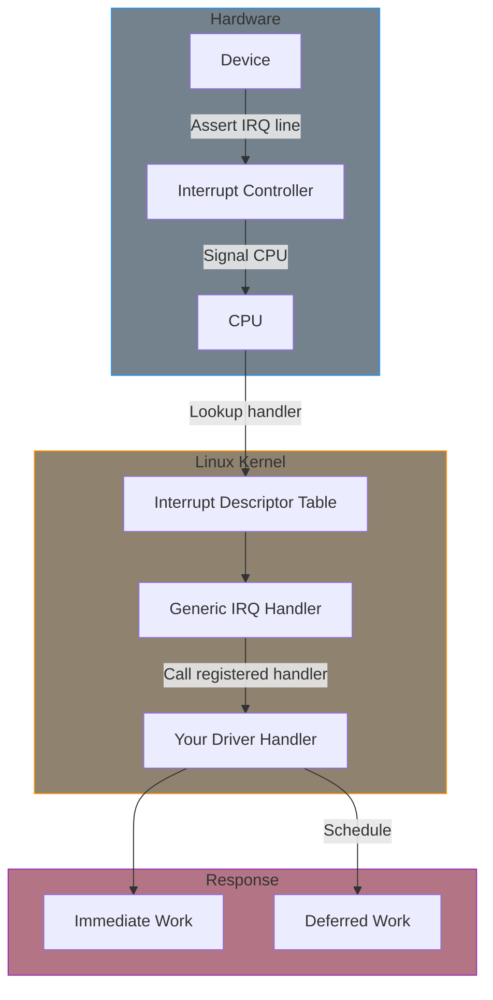
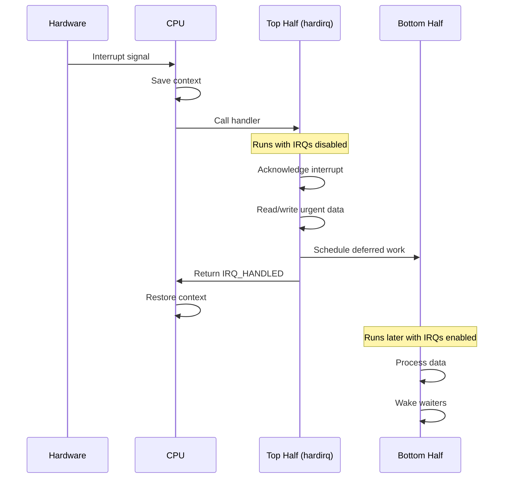
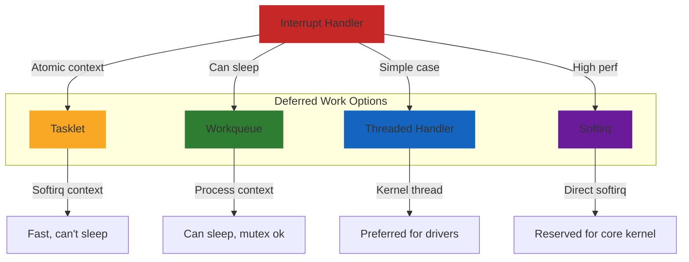

# Part 7: Interrupt Handling

Interrupts allow hardware to signal the CPU that an event has occurred. Writing correct interrupt handlers is critical for responsive, stable drivers.

## Interrupt Flow Overview



## Chapter Contents

| Chapter | Topic | Key Concepts |
|---------|-------|--------------|
| [7.1]() | Interrupt Concepts | Hardware interrupts, IRQ numbers, contexts |
| [7.2]() | Requesting IRQs | request_irq, devm_request_irq, free_irq |
| [7.3]() | Interrupt Handlers | Handler structure, return values, context |
| [7.4]() | Top and Bottom Halves | Splitting work, deferred execution |
| [7.5]() | Tasklets | tasklet_struct, scheduling, usage |
| [7.6]() | Threaded IRQs | request_threaded_irq, hard/thread handlers |
| [7.7]() | Shared Interrupts | IRQF_SHARED, checking ownership |
| [7.8]() | Interrupt Control | Enable/disable, IRQ affinity, edge vs level |

## Key Concepts

### The Interrupt Handling Model



### Why Split Work?

Interrupt handlers run with interrupts disabled (or at least their own IRQ masked). Long handlers:

- **Increase latency** for other interrupts
- **Block preemption** on that CPU
- **Can cause system instability** if they take too long

The solution: **Do minimal work in the handler, defer the rest.**

### Bottom Half Mechanisms



## Interrupt Handler Rules

### What You CAN Do

- Read/write device registers
- Acknowledge the interrupt
- Schedule deferred work
- Wake up waiting processes
- Update statistics (atomic operations)

### What You CANNOT Do

- Sleep or call functions that might sleep
- Allocate memory with GFP_KERNEL
- Acquire mutexes
- Call copy_to_user/copy_from_user
- Take a long time (keep it fast!)

## Common Patterns

### Simple Handler (No Deferred Work)

```c
static irqreturn_t simple_handler(int irq, void *dev_id)
{
    struct my_device *dev = dev_id;

    /* Read status and acknowledge */
    u32 status = readl(dev->regs + STATUS);
    writel(status, dev->regs + STATUS);  /* Clear interrupt */

    return IRQ_HANDLED;
}
```

### Handler with Threaded Work

```c
/* Fast top half */
static irqreturn_t my_hardirq(int irq, void *dev_id)
{
    struct my_device *dev = dev_id;

    if (!device_generated_irq(dev))
        return IRQ_NONE;

    /* Acknowledge hardware */
    writel(0, dev->regs + IRQ_ACK);

    return IRQ_WAKE_THREAD;  /* Run threaded handler */
}

/* Threaded bottom half - can sleep */
static irqreturn_t my_thread(int irq, void *dev_id)
{
    struct my_device *dev = dev_id;

    /* Process data, can sleep here */
    process_data(dev);
    wake_up_interruptible(&dev->waitq);

    return IRQ_HANDLED;
}
```

## Examples

This part includes working examples:

- **irq-handler**: Complete interrupt handling with threaded IRQ

## Prerequisites

Before starting this part, ensure you understand:

- Device model and platform drivers (Part 6)
- Concurrency concepts (Part 4)
- Memory management (Part 5)

## Further Reading

- [IRQ Domain Documentation](https://docs.kernel.org/core-api/irq/index.html) - IRQ subsystem guide
- [Generic IRQ](https://docs.kernel.org/core-api/genericirq.html) - Generic IRQ handling

## Next

Start with [Interrupt Concepts]() to understand how hardware interrupts work.
