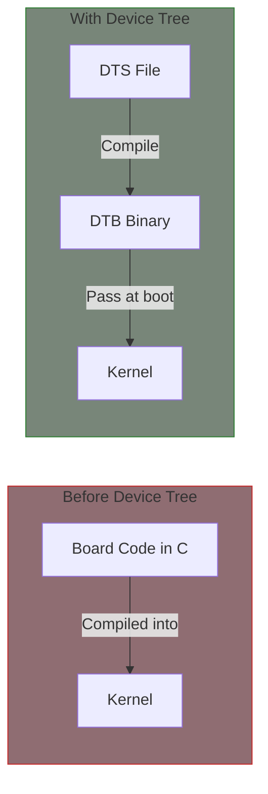

# Device Tree Basics

Device Tree is a data structure that describes hardware. The kernel uses it to discover and configure devices at runtime.

## What is Device Tree?

Device Tree provides:
- Hardware description separate from driver code
- Board-specific configuration without recompiling kernel
- Standardized format for describing devices



## File Types

| Extension | Description |
|-----------|-------------|
| `.dts` | Device Tree Source (main board file) |
| `.dtsi` | Device Tree Source Include (shared/SoC file) |
| `.dtb` | Device Tree Blob (compiled binary) |
| `.dtbo` | Device Tree Blob Overlay |

## Basic Syntax

### Nodes

```dts
/* Root node */
/ {
    /* Child nodes */
    node_name {
        /* Properties */
        property = "value";

        /* Nested child */
        child_node {
            another-property;
        };
    };
};
```

### Node Naming

```dts
/* Format: name@unit-address */
uart0: serial@10000000 {
    /* ... */
};

/*
 * uart0     = label (for phandle references)
 * serial    = generic name
 * 10000000  = unit address (first reg value)
 */
```

### Properties

```dts
node {
    /* String */
    compatible = "vendor,device";

    /* String list */
    compatible = "vendor,device-v2", "vendor,device";

    /* 32-bit cells */
    reg = <0x10000000 0x1000>;

    /* 64-bit value (two 32-bit cells) */
    reg = <0x0 0x10000000 0x0 0x1000>;

    /* Empty/boolean (presence means true) */
    read-only;

    /* phandle reference */
    clocks = <&clk_provider>;

    /* phandle with arguments */
    interrupts-extended = <&gic 0 15 4>;

    /* Byte array */
    mac-address = [00 11 22 33 44 55];
};
```

## Standard Properties

### compatible

Identifies the device and matches to drivers:

```dts
uart@10000000 {
    /* Most specific to least specific */
    compatible = "vendor,uart-v2", "vendor,uart", "ns16550a";
};
```

Driver matching:
```c
static const struct of_device_id my_of_match[] = {
    { .compatible = "vendor,uart-v2" },
    { .compatible = "vendor,uart" },
    { }
};
```

### reg

Specifies memory-mapped addresses:

```dts
/* Parent defines cell sizes */
soc {
    #address-cells = <1>;  /* 1 cell for address */
    #size-cells = <1>;     /* 1 cell for size */

    uart@10000000 {
        reg = <0x10000000 0x1000>;
        /*      ^address   ^size */
    };
};

/* 64-bit addressing */
soc {
    #address-cells = <2>;
    #size-cells = <2>;

    device@100000000 {
        reg = <0x1 0x00000000 0x0 0x10000>;
        /*     ^--address--^  ^--size--^ */
    };
};

/* Multiple regions */
device@10000000 {
    reg = <0x10000000 0x1000>,  /* Region 0 */
          <0x10002000 0x100>;   /* Region 1 */
    reg-names = "regs", "fifo";
};
```

### interrupts

Specifies interrupt connections:

```dts
/* Simple format */
device@10000000 {
    interrupts = <15>;  /* IRQ 15 */
};

/* GIC format: <type num flags> */
device@10000000 {
    interrupt-parent = <&gic>;
    interrupts = <0 15 4>;
    /*           ^  ^  ^
     *           |  |  |_ flags (4 = level high)
     *           |  |___ interrupt number
     *           |______ type (0=SPI, 1=PPI)
     */
};

/* Multiple interrupts */
device@10000000 {
    interrupts = <0 15 4>, <0 16 4>;
    interrupt-names = "rx", "tx";
};
```

### status

Controls device enabling:

```dts
/* Device is enabled */
device@10000000 {
    status = "okay";
};

/* Device is disabled */
device@10000000 {
    status = "disabled";
};

/* SoC dtsi disables, board dts enables */
/* In SoC.dtsi: */
uart0: serial@10000000 {
    status = "disabled";
};

/* In board.dts: */
&uart0 {
    status = "okay";
};
```

## Including Files

### Basic Include

```dts
/dts-v1/;

/* Include SoC definitions */
#include "soc.dtsi"

/ {
    model = "My Board";
    compatible = "vendor,my-board";

    /* Board-specific additions */
};
```

### Overriding Properties

```dts
/* In soc.dtsi */
uart0: serial@10000000 {
    compatible = "vendor,uart";
    reg = <0x10000000 0x1000>;
    status = "disabled";
};

/* In board.dts */
#include "soc.dtsi"

/* Override using label reference */
&uart0 {
    status = "okay";
    pinctrl-0 = <&uart0_pins>;
};
```

## Cell Sizes

`#address-cells` and `#size-cells` define how child `reg` properties are interpreted:

```dts
/ {
    #address-cells = <1>;
    #size-cells = <1>;

    soc@0 {
        /* Uses parent's cell sizes */
        reg = <0x0 0x10000000>;

        #address-cells = <1>;
        #size-cells = <1>;

        uart@10000000 {
            /* Uses soc's cell sizes */
            reg = <0x10000000 0x1000>;
        };
    };
};
```

## Labels and Phandles

Labels create references between nodes:

```dts
/* Define with label */
clk_uart: clock@20000000 {
    compatible = "vendor,clock";
    #clock-cells = <0>;
};

/* Reference using phandle */
uart@10000000 {
    clocks = <&clk_uart>;
};
```

With arguments:

```dts
/* Clock provider with multiple outputs */
clocks: clock-controller@20000000 {
    #clock-cells = <1>;
};

uart@10000000 {
    /* Reference clock output 5 */
    clocks = <&clocks 5>;
};
```

## Special Nodes

### /aliases

Provides shorthand names:

```dts
/ {
    aliases {
        serial0 = &uart0;
        serial1 = &uart1;
        ethernet0 = &eth0;
    };
};
```

### /chosen

Kernel boot parameters:

```dts
/ {
    chosen {
        bootargs = "console=ttyS0,115200";
        stdout-path = "serial0:115200n8";
    };
};
```

### /memory

System memory:

```dts
/ {
    memory@80000000 {
        device_type = "memory";
        reg = <0x80000000 0x40000000>;  /* 1GB at 0x80000000 */
    };
};
```

## Complete Example

```dts
/dts-v1/;

/ {
    compatible = "vendor,myboard";
    model = "Vendor MyBoard";

    #address-cells = <1>;
    #size-cells = <1>;

    aliases {
        serial0 = &uart0;
    };

    chosen {
        stdout-path = "serial0:115200n8";
    };

    memory@80000000 {
        device_type = "memory";
        reg = <0x80000000 0x40000000>;
    };

    cpus {
        #address-cells = <1>;
        #size-cells = <0>;

        cpu@0 {
            compatible = "arm,cortex-a53";
            device_type = "cpu";
            reg = <0>;
        };
    };

    clocks {
        osc: oscillator {
            compatible = "fixed-clock";
            #clock-cells = <0>;
            clock-frequency = <24000000>;
        };
    };

    soc {
        compatible = "simple-bus";
        #address-cells = <1>;
        #size-cells = <1>;
        ranges;

        gic: interrupt-controller@10000000 {
            compatible = "arm,gic-400";
            #interrupt-cells = <3>;
            interrupt-controller;
            reg = <0x10000000 0x1000>,
                  <0x10001000 0x2000>;
        };

        uart0: serial@20000000 {
            compatible = "vendor,uart";
            reg = <0x20000000 0x1000>;
            interrupts = <0 10 4>;
            clocks = <&osc>;
            status = "okay";
        };
    };
};
```

## Compiling Device Tree

```bash
# Compile DTS to DTB
dtc -I dts -O dtb -o board.dtb board.dts

# Decompile DTB to DTS
dtc -I dtb -O dts -o board_decompiled.dts board.dtb

# Kernel build system
make dtbs                    # Build all DTBs
make vendor/board.dtb        # Build specific DTB
```

## Viewing Device Tree

```bash
# View compiled device tree on running system
ls /sys/firmware/devicetree/base/

# Read properties
cat /sys/firmware/devicetree/base/compatible
hexdump /sys/firmware/devicetree/base/soc/uart@10000000/reg

# Using dtc
dtc -I fs /sys/firmware/devicetree/base/
```

## Summary

- Device Tree separates hardware description from driver code
- Nodes describe devices, properties describe configuration
- `compatible` matches devices to drivers
- `reg` specifies memory addresses, `interrupts` specifies IRQs
- Labels create phandle references between nodes
- `.dtsi` files are included, `.dts` is the main board file

## Next

Learn about [device bindings]() and how drivers match with Device Tree nodes.
