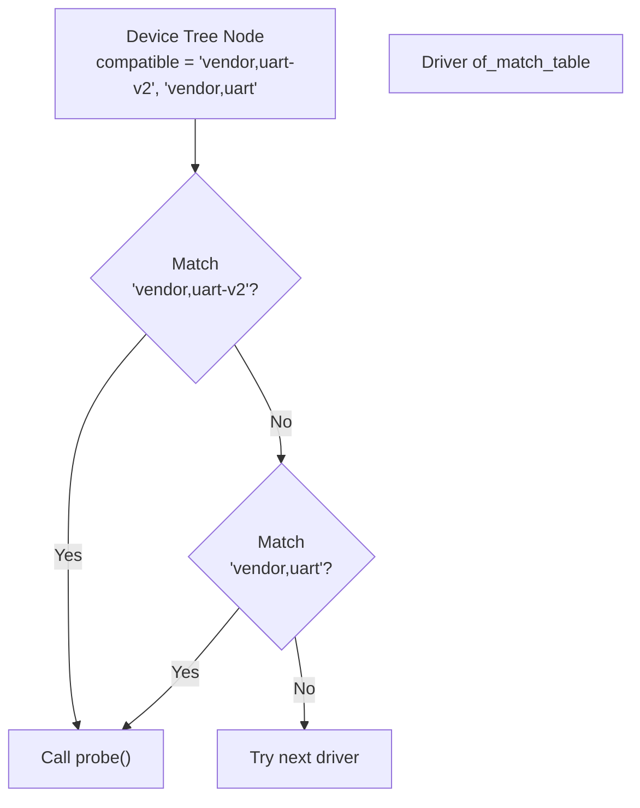

# Device Bindings

Device bindings define how Device Tree nodes describe a specific device type. Drivers use bindings to match and parse device properties.

## The compatible Property

The `compatible` property is the primary matching mechanism:

```dts
uart@10000000 {
    /* List from most specific to least specific */
    compatible = "vendor,uart-v2", "vendor,uart", "ns16550a";
};
```

### Matching Process



## Driver Matching Table

```c
#include <linux/of.h>
#include <linux/of_device.h>

/* Match table */
static const struct of_device_id my_of_match[] = {
    { .compatible = "vendor,uart-v2", .data = &uart_v2_data },
    { .compatible = "vendor,uart", .data = &uart_v1_data },
    { .compatible = "ns16550a", .data = &ns16550_data },
    { }  /* Sentinel */
};
MODULE_DEVICE_TABLE(of, my_of_match);

static struct platform_driver my_driver = {
    .probe = my_probe,
    .remove = my_remove,
    .driver = {
        .name = "my_uart",
        .of_match_table = my_of_match,
    },
};
```

## Getting Match Data

Retrieve data associated with the matched entry:

```c
/* Data structures for different variants */
struct uart_variant {
    int fifo_size;
    bool has_dma;
    int (*init)(struct device *dev);
};

static const struct uart_variant uart_v1_data = {
    .fifo_size = 16,
    .has_dma = false,
};

static const struct uart_variant uart_v2_data = {
    .fifo_size = 64,
    .has_dma = true,
};

static int my_probe(struct platform_device *pdev)
{
    const struct uart_variant *variant;

    /* Get match data */
    variant = of_device_get_match_data(&pdev->dev);
    if (!variant) {
        dev_err(&pdev->dev, "No match data\n");
        return -ENODEV;
    }

    dev_info(&pdev->dev, "FIFO size: %d, DMA: %s\n",
             variant->fifo_size,
             variant->has_dma ? "yes" : "no");

    return 0;
}
```

## Combining DT and ID Table

Support both Device Tree and non-DT platforms:

```c
/* Device Tree matching */
static const struct of_device_id my_of_match[] = {
    { .compatible = "vendor,device" },
    { }
};
MODULE_DEVICE_TABLE(of, my_of_match);

/* Platform ID matching (non-DT) */
static const struct platform_device_id my_id_table[] = {
    { "my-device", 0 },
    { }
};
MODULE_DEVICE_TABLE(platform, my_id_table);

static struct platform_driver my_driver = {
    .probe = my_probe,
    .remove = my_remove,
    .id_table = my_id_table,
    .driver = {
        .name = "my_device",
        .of_match_table = my_of_match,
    },
};
```

## Checking Device Tree Source

```c
static int my_probe(struct platform_device *pdev)
{
    /* Check if device came from Device Tree */
    if (pdev->dev.of_node) {
        dev_info(&pdev->dev, "Probed from Device Tree\n");
    } else {
        dev_info(&pdev->dev, "Probed from platform data\n");
    }

    return 0;
}
```

## Common Binding Patterns

### Required vs Optional Properties

```c
static int my_probe(struct platform_device *pdev)
{
    struct device *dev = &pdev->dev;
    struct device_node *np = dev->of_node;
    u32 required_val;
    u32 optional_val;
    int ret;

    /* Required property - return error if missing */
    ret = of_property_read_u32(np, "vendor,required-prop", &required_val);
    if (ret) {
        dev_err(dev, "Missing required property\n");
        return ret;
    }

    /* Optional property - use default if missing */
    ret = of_property_read_u32(np, "vendor,optional-prop", &optional_val);
    if (ret)
        optional_val = 100;  /* Default value */

    return 0;
}
```

### Boolean Properties

```dts
device@10000000 {
    vendor,feature-enabled;  /* Property present = true */
};
```

```c
static int my_probe(struct platform_device *pdev)
{
    struct device_node *np = pdev->dev.of_node;
    bool feature_enabled;

    feature_enabled = of_property_read_bool(np, "vendor,feature-enabled");

    if (feature_enabled)
        dev_info(&pdev->dev, "Feature is enabled\n");

    return 0;
}
```

### Child Nodes

```dts
device@10000000 {
    compatible = "vendor,parent-device";

    channel@0 {
        reg = <0>;
        vendor,mode = "fast";
    };

    channel@1 {
        reg = <1>;
        vendor,mode = "slow";
    };
};
```

```c
static int my_probe(struct platform_device *pdev)
{
    struct device_node *np = pdev->dev.of_node;
    struct device_node *child;

    /* Iterate over child nodes */
    for_each_child_of_node(np, child) {
        u32 reg;
        const char *mode;

        of_property_read_u32(child, "reg", &reg);
        of_property_read_string(child, "vendor,mode", &mode);

        dev_info(&pdev->dev, "Channel %d: mode=%s\n", reg, mode);
    }

    return 0;
}
```

## Standard Bindings

### GPIO Binding

```dts
device@10000000 {
    reset-gpios = <&gpio0 5 GPIO_ACTIVE_LOW>;
    enable-gpios = <&gpio0 6 GPIO_ACTIVE_HIGH>;
};
```

```c
#include <linux/gpio/consumer.h>

static int my_probe(struct platform_device *pdev)
{
    struct gpio_desc *reset_gpio;
    struct gpio_desc *enable_gpio;

    reset_gpio = devm_gpiod_get(&pdev->dev, "reset", GPIOD_OUT_HIGH);
    if (IS_ERR(reset_gpio))
        return PTR_ERR(reset_gpio);

    enable_gpio = devm_gpiod_get_optional(&pdev->dev, "enable", GPIOD_OUT_LOW);

    return 0;
}
```

### Clock Binding

```dts
device@10000000 {
    clocks = <&clk_provider 0>, <&clk_provider 1>;
    clock-names = "core", "bus";
};
```

```c
#include <linux/clk.h>

static int my_probe(struct platform_device *pdev)
{
    struct clk *core_clk, *bus_clk;

    core_clk = devm_clk_get(&pdev->dev, "core");
    if (IS_ERR(core_clk))
        return PTR_ERR(core_clk);

    bus_clk = devm_clk_get(&pdev->dev, "bus");
    if (IS_ERR(bus_clk))
        return PTR_ERR(bus_clk);

    return 0;
}
```

### Interrupt Binding

```dts
device@10000000 {
    interrupts = <0 15 4>, <0 16 4>;
    interrupt-names = "rx", "tx";
};
```

```c
static int my_probe(struct platform_device *pdev)
{
    int rx_irq, tx_irq;

    rx_irq = platform_get_irq_byname(pdev, "rx");
    if (rx_irq < 0)
        return rx_irq;

    tx_irq = platform_get_irq_byname(pdev, "tx");
    if (tx_irq < 0)
        return tx_irq;

    return 0;
}
```

## Vendor Prefix

All custom properties should use a vendor prefix:

```dts
/* Good: Vendor-prefixed */
device@10000000 {
    mycompany,buffer-size = <4096>;
    mycompany,feature-enable;
};

/* Bad: No prefix (reserved for standard properties) */
device@10000000 {
    buffer-size = <4096>;
};
```

## Module Device Table

Export device IDs for module autoloading:

```c
static const struct of_device_id my_of_match[] = {
    { .compatible = "vendor,device" },
    { }
};
MODULE_DEVICE_TABLE(of, my_of_match);
```

This generates aliases in the module:

```bash
$ modinfo my_driver.ko | grep alias
alias:          of:N*T*Cvendor,device
```

## Complete Example

```c
#include <linux/module.h>
#include <linux/platform_device.h>
#include <linux/of.h>
#include <linux/of_device.h>
#include <linux/clk.h>
#include <linux/gpio/consumer.h>

struct my_variant {
    int version;
    int max_speed;
};

static const struct my_variant variant_v1 = {
    .version = 1,
    .max_speed = 100000,
};

static const struct my_variant variant_v2 = {
    .version = 2,
    .max_speed = 400000,
};

static const struct of_device_id my_of_match[] = {
    { .compatible = "vendor,device-v1", .data = &variant_v1 },
    { .compatible = "vendor,device-v2", .data = &variant_v2 },
    { }
};
MODULE_DEVICE_TABLE(of, my_of_match);

static int my_probe(struct platform_device *pdev)
{
    struct device *dev = &pdev->dev;
    const struct my_variant *variant;
    u32 buffer_size;
    bool turbo_mode;

    /* Get variant data */
    variant = of_device_get_match_data(dev);
    if (!variant)
        return -ENODEV;

    /* Read custom properties */
    if (device_property_read_u32(dev, "vendor,buffer-size", &buffer_size))
        buffer_size = 1024;  /* Default */

    turbo_mode = device_property_read_bool(dev, "vendor,turbo-mode");

    dev_info(dev, "Version %d, max speed %d, buffer %u, turbo %s\n",
             variant->version, variant->max_speed, buffer_size,
             turbo_mode ? "on" : "off");

    return 0;
}

static int my_remove(struct platform_device *pdev)
{
    return 0;
}

static struct platform_driver my_driver = {
    .probe = my_probe,
    .remove = my_remove,
    .driver = {
        .name = "my_device",
        .of_match_table = my_of_match,
    },
};
module_platform_driver(my_driver);

MODULE_LICENSE("GPL");
```

## Summary

- `compatible` property matches DT nodes to drivers
- Use `of_device_id` table with `MODULE_DEVICE_TABLE(of, ...)`
- `of_device_get_match_data()` retrieves variant-specific data
- Support both DT and platform ID for portability
- Use vendor prefix for custom properties
- Standard bindings exist for GPIO, clocks, interrupts, etc.

## Next

Learn about [property access functions]() for reading Device Tree values.
