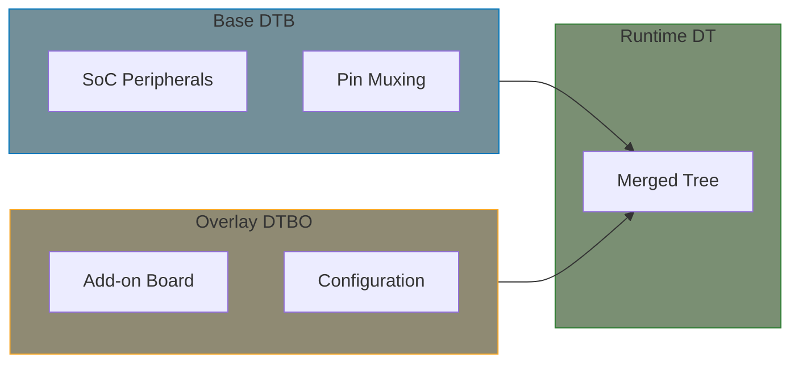

# Device Tree Overlays

Device Tree overlays allow modifying the Device Tree at runtime, enabling dynamic hardware configuration for add-on boards, capes, and HATs.

## What Are Overlays?



## Overlay Syntax

### Basic Overlay Structure

```dts
/dts-v1/;
/plugin/;  /* Mark as overlay */

/ {
    compatible = "vendor,board";  /* Optional: Restrict to specific boards */

    fragment@0 {
        target-path = "/";  /* Or target = <&label>; */

        __overlay__ {
            /* Nodes to add/modify */
            new_device: device@10000000 {
                compatible = "vendor,new-device";
                reg = <0x10000000 0x1000>;
                status = "okay";
            };
        };
    };
};
```

### Target Types

```dts
/* Target by label (preferred) */
fragment@0 {
    target = <&i2c1>;
    __overlay__ {
        /* Modifications to i2c1 */
    };
};

/* Target by path */
fragment@1 {
    target-path = "/soc/serial@20000000";
    __overlay__ {
        status = "okay";
    };
};
```

## Common Overlay Patterns

### Enable a Disabled Device

```dts
/dts-v1/;
/plugin/;

/* Enable UART2 that was disabled in base DT */
&uart2 {
    status = "okay";
};
```

Modern shorthand (kernel 4.17+):

```dts
/dts-v1/;
/plugin/;

&uart2 {
    status = "okay";
};
```

### Add I2C Device

```dts
/dts-v1/;
/plugin/;

&i2c1 {
    #address-cells = <1>;
    #size-cells = <0>;

    temp_sensor: tmp102@48 {
        compatible = "ti,tmp102";
        reg = <0x48>;
    };
};
```

### Add SPI Device

```dts
/dts-v1/;
/plugin/;

&spi0 {
    #address-cells = <1>;
    #size-cells = <0>;

    flash@0 {
        compatible = "jedec,spi-nor";
        reg = <0>;
        spi-max-frequency = <10000000>;
    };
};
```

### Configure GPIO

```dts
/dts-v1/;
/plugin/;

/* Configure GPIO for LED */
/ {
    fragment@0 {
        target-path = "/";
        __overlay__ {
            leds {
                compatible = "gpio-leds";

                user_led {
                    label = "user-led";
                    gpios = <&gpio0 5 GPIO_ACTIVE_HIGH>;
                    default-state = "off";
                };
            };
        };
    };
};
```

## Parameters in Overlays

### Symbol Reference

```dts
/dts-v1/;
/plugin/;

/* Reference symbols from base DT */
&{/soc} {
    my_device: device@30000000 {
        compatible = "vendor,device";
        reg = <0x30000000 0x1000>;
        interrupts = <&gic 0 45 4>;  /* Reference gic from base */
        clocks = <&clk_main>;        /* Reference clock from base */
    };
};
```

### Runtime Parameters (Platform Specific)

Some platforms support parameterized overlays:

```dts
/* Raspberry Pi style parameters */
/dts-v1/;
/plugin/;

/ {
    compatible = "brcm,bcm2835";

    __overrides__ {
        i2c_baudrate = <&frag0>,"clock-frequency:0";
        addr = <&sensor>,"reg:0";
    };

    fragment@0: frag0 {
        target = <&i2c1>;
        __overlay__ {
            clock-frequency = <100000>;  /* Default */
            #address-cells = <1>;
            #size-cells = <0>;

            sensor: sensor@48 {
                compatible = "vendor,sensor";
                reg = <0x48>;  /* Default */
            };
        };
    };
};
```

## Compiling Overlays

```bash
# Compile overlay to .dtbo
dtc -I dts -O dtb -o overlay.dtbo overlay.dts

# With symbols (for cascading overlays)
dtc -I dts -O dtb -@ -o overlay.dtbo overlay.dts

# Preprocess with cpp (for #include, #define)
cpp -nostdinc -I include -undef -x assembler-with-cpp overlay.dts | \
    dtc -I dts -O dtb -@ -o overlay.dtbo
```

## Loading Overlays

### ConfigFS Interface

```bash
# Check if overlay support is available
ls /sys/kernel/config/device-tree/overlays/

# Create overlay directory
mkdir /sys/kernel/config/device-tree/overlays/my-overlay

# Load overlay
cat my-overlay.dtbo > /sys/kernel/config/device-tree/overlays/my-overlay/dtbo

# Check status
cat /sys/kernel/config/device-tree/overlays/my-overlay/status
# Should show "applied"

# Remove overlay
rmdir /sys/kernel/config/device-tree/overlays/my-overlay
```

### Bootloader Loading

```bash
# U-Boot example
fdt addr ${fdt_addr}
load mmc 0:1 ${overlay_addr} /overlays/my-overlay.dtbo
fdt apply ${overlay_addr}
```

### Platform-Specific Methods

```bash
# Raspberry Pi: /boot/config.txt
dtoverlay=my-overlay

# BeagleBone: /boot/uEnv.txt
dtbo=/lib/firmware/my-overlay.dtbo
```

## Overlay in Driver

Drivers can check if their device came from an overlay:

```c
static int my_probe(struct platform_device *pdev)
{
    struct device_node *np = pdev->dev.of_node;

    /* Check if node is from overlay */
    if (of_node_check_flag(np, OF_OVERLAY)) {
        dev_info(&pdev->dev, "Device added via overlay\n");
    }

    return 0;
}
```

## Hot-Plug Considerations

When using overlays for hot-pluggable hardware:

```c
/* Driver should handle dynamic addition/removal */
static int my_probe(struct platform_device *pdev)
{
    /* Normal probe - works for overlay-added devices */
    return 0;
}

static int my_remove(struct platform_device *pdev)
{
    /* Clean removal - called when overlay is removed */
    return 0;
}
```

## Overlay Ordering

Overlays are applied in order. Later overlays can modify earlier ones:


## Debugging Overlays

```bash
# View current device tree
ls /sys/firmware/devicetree/base/

# View overlay status
cat /sys/kernel/config/device-tree/overlays/*/status

# Decompile running tree
dtc -I fs /sys/firmware/devicetree/base/ > current.dts

# Check dmesg for overlay messages
dmesg | grep -i overlay
```

## Complete Example: Add-on Board

```dts
/*
 * my-addon-board.dts
 * Overlay for custom add-on board with:
 * - I2C temperature sensor
 * - SPI display
 * - GPIO button and LED
 */
/dts-v1/;
/plugin/;

/ {
    compatible = "vendor,main-board";

    /* I2C sensor on I2C1 */
    fragment@0 {
        target = <&i2c1>;
        __overlay__ {
            #address-cells = <1>;
            #size-cells = <0>;
            status = "okay";

            temp_sensor: tmp102@48 {
                compatible = "ti,tmp102";
                reg = <0x48>;
            };
        };
    };

    /* SPI display on SPI0 */
    fragment@1 {
        target = <&spi0>;
        __overlay__ {
            #address-cells = <1>;
            #size-cells = <0>;
            status = "okay";

            display@0 {
                compatible = "sitronix,st7789v";
                reg = <0>;
                spi-max-frequency = <32000000>;
                dc-gpios = <&gpio0 24 GPIO_ACTIVE_HIGH>;
                reset-gpios = <&gpio0 25 GPIO_ACTIVE_LOW>;
                width = <240>;
                height = <320>;
            };
        };
    };

    /* GPIO devices */
    fragment@2 {
        target-path = "/";
        __overlay__ {
            gpio-keys {
                compatible = "gpio-keys";

                button {
                    label = "user-button";
                    linux,code = <KEY_ENTER>;
                    gpios = <&gpio0 17 GPIO_ACTIVE_LOW>;
                };
            };

            leds {
                compatible = "gpio-leds";

                status-led {
                    label = "status";
                    gpios = <&gpio0 18 GPIO_ACTIVE_HIGH>;
                    linux,default-trigger = "heartbeat";
                };
            };
        };
    };
};
```

## Kernel Configuration

Enable overlay support:

```
CONFIG_OF_OVERLAY=y
CONFIG_OF_CONFIGFS=y
```

## Summary

- Overlays modify the Device Tree at runtime
- Use `/plugin/` directive and `fragment@N` structure
- Target nodes by label (`target = <&label>`) or path
- Load via ConfigFS, bootloader, or platform-specific methods
- Useful for add-on boards, capes, HATs
- Compile with `dtc -@` for symbol support
- Drivers automatically handle overlay-added devices

## Next

Learn about [binding documentation]() for upstream kernel submissions.
