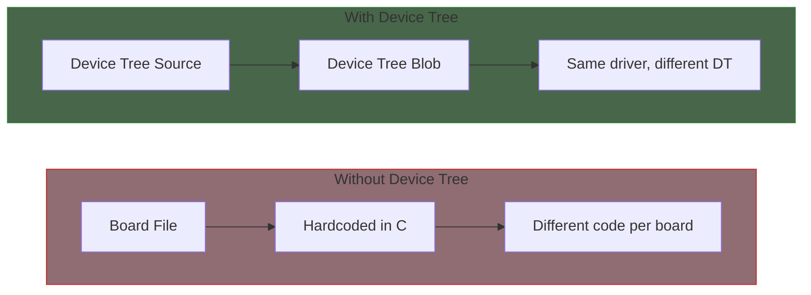
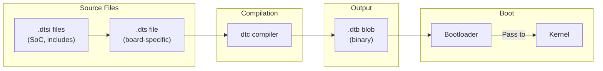
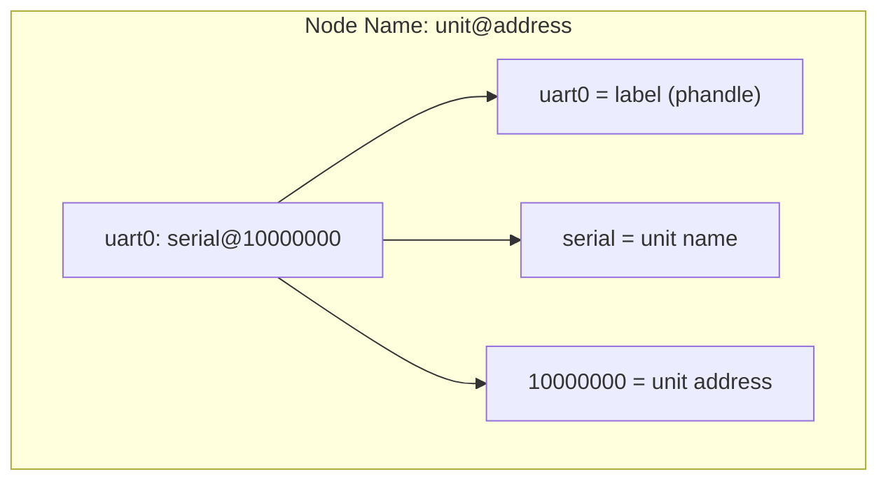
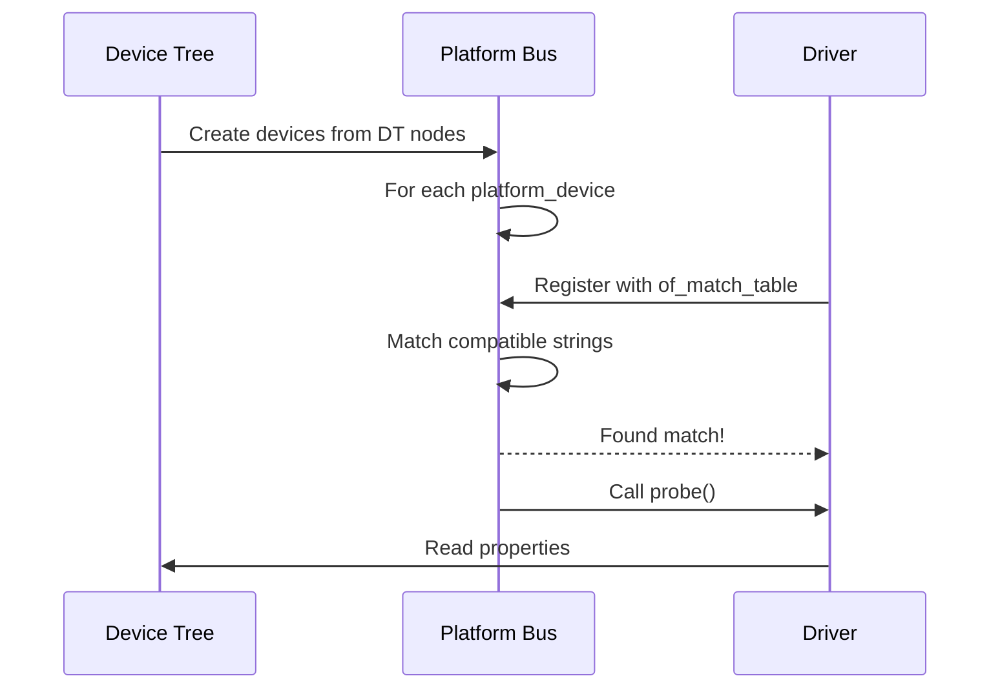

# Part 8: Platform Bus and Device Tree

Device Tree is the standard mechanism for describing hardware in embedded Linux systems. Understanding Device Tree is essential for writing portable, maintainable drivers.

## Why Device Tree?



## Chapter Contents

| Chapter | Topic | Key Concepts |
|---------|-------|--------------|
| [8.1]() | Device Tree Basics | DTS syntax, nodes, properties |
| [8.2]() | Device Bindings | compatible, of_match_table |
| [8.3]() | Property Access | of_property_read_*, device_property_* |
| [8.4]() | GPIO in Device Tree | GPIO specifiers, gpiod_get |
| [8.5]() | Clocks and Regulators | Clock and regulator references |
| [8.6]() | Device Tree Overlays | Runtime DT modification |
| [8.7]() | Binding Documentation | YAML bindings, dt-schema |

## Device Tree Overview



## Basic DTS Structure

```dts
/dts-v1/;

/ {
    compatible = "vendor,board";
    model = "Vendor Board Name";

    /* CPU cluster */
    cpus {
        #address-cells = <1>;
        #size-cells = <0>;

        cpu@0 {
            compatible = "arm,cortex-a53";
            device_type = "cpu";
            reg = <0>;
        };
    };

    /* Memory */
    memory@80000000 {
        device_type = "memory";
        reg = <0x80000000 0x40000000>;
    };

    /* SoC peripherals */
    soc {
        compatible = "simple-bus";
        #address-cells = <1>;
        #size-cells = <1>;
        ranges;

        uart0: serial@10000000 {
            compatible = "vendor,uart";
            reg = <0x10000000 0x1000>;
            interrupts = <0 10 4>;
            clocks = <&clk_uart>;
            status = "okay";
        };

        gpio0: gpio@10001000 {
            compatible = "vendor,gpio";
            reg = <0x10001000 0x1000>;
            gpio-controller;
            #gpio-cells = <2>;
        };
    };
};
```

## Key Concepts

### Node Addressing



### Properties

| Property | Purpose | Example |
|----------|---------|---------|
| `compatible` | Identifies device/driver | `"vendor,device"` |
| `reg` | Memory/IO addresses | `<0x10000 0x1000>` |
| `interrupts` | Interrupt specifiers | `<0 15 4>` |
| `clocks` | Clock references | `<&clk 0>` |
| `status` | Enable/disable | `"okay"` or `"disabled"` |

### Driver Matching



## Property Types

```c
/* String */
compatible = "vendor,device";

/* String list */
compatible = "vendor,device-v2", "vendor,device";

/* 32-bit integer */
reg-shift = <2>;

/* Integer array */
reg = <0x10000000 0x1000>;

/* phandle reference */
clocks = <&clk_main>;

/* phandle with arguments */
clocks = <&clk_provider 5>;

/* Boolean (presence = true) */
big-endian;
```

## Examples

This part includes working examples:

- **dt-platform-driver**: Platform driver with Device Tree binding

## Prerequisites

Before starting this part, ensure you understand:

- Platform drivers (Part 6)
- Probe and remove lifecycle (Part 6)
- Interrupt handling basics (Part 7)

## Further Reading

- [Device Tree Specification](https://devicetree.org/) - Official DT specification
- [Devicetree Usage](https://docs.kernel.org/devicetree/usage-model.html) - Kernel DT documentation
- [Binding Index](https://docs.kernel.org/devicetree/bindings/index.html) - Device binding reference

## Next

Start with [Device Tree Basics]() to learn DTS syntax and structure.
