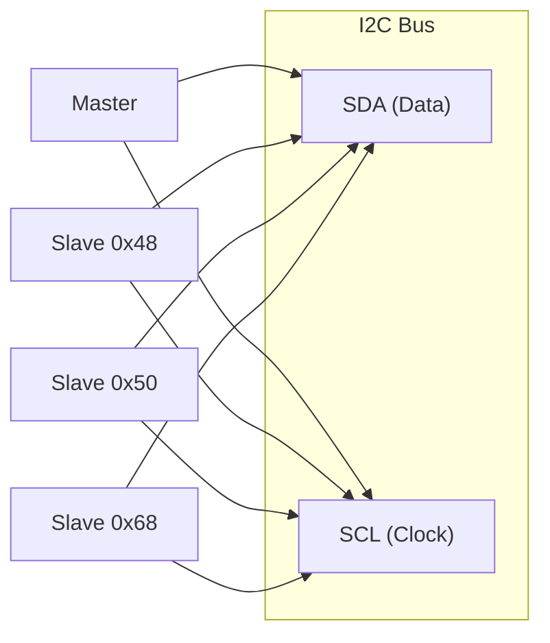
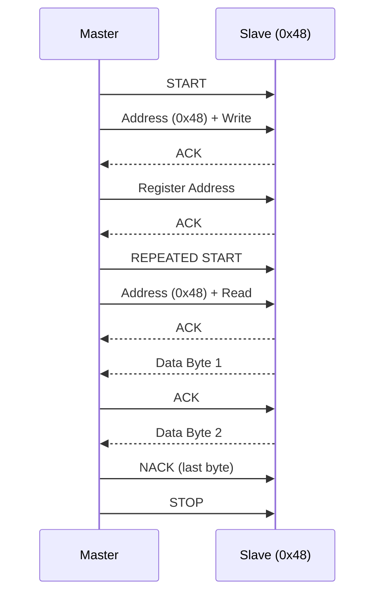
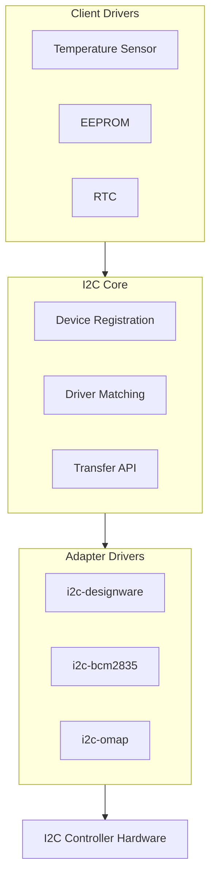

# I2C Subsystem

I2C (Inter-Integrated Circuit) is a two-wire serial bus commonly used for connecting low-speed peripherals like sensors, EEPROMs, and RTCs.

## I2C Basics

### Physical Layer



- **SDA**: Bidirectional data line
- **SCL**: Clock line (driven by master)
- **Open-drain**: Both lines pulled high by resistors

### Communication Protocol



## Linux I2C Architecture

### Components



### Key Structures

```c
/* I2C adapter (controller) */
struct i2c_adapter {
    struct module *owner;
    const struct i2c_algorithm *algo;  /* Transfer functions */
    void *algo_data;
    int nr;                            /* Bus number */
    char name[48];
    struct device dev;
};

/* I2C algorithm */
struct i2c_algorithm {
    int (*master_xfer)(struct i2c_adapter *adap,
                       struct i2c_msg *msgs, int num);
    u32 (*functionality)(struct i2c_adapter *adap);
};

/* I2C client (device instance) */
struct i2c_client {
    unsigned short flags;
    unsigned short addr;               /* 7-bit address */
    char name[I2C_NAME_SIZE];
    struct i2c_adapter *adapter;
    struct device dev;
    int init_irq;
    int irq;
};
```

## I2C Transfers

### Basic Message

```c
struct i2c_msg {
    __u16 addr;    /* Slave address */
    __u16 flags;   /* I2C_M_RD, I2C_M_TEN, etc. */
    __u16 len;     /* Message length */
    __u8 *buf;     /* Data buffer */
};
```

### Common Transfer Patterns

```c
#include <linux/i2c.h>

/* Write single byte */
int i2c_write_byte(struct i2c_client *client, u8 reg, u8 value)
{
    u8 buf[2] = { reg, value };

    return i2c_master_send(client, buf, 2);
}

/* Read single byte */
int i2c_read_byte(struct i2c_client *client, u8 reg, u8 *value)
{
    struct i2c_msg msgs[2];
    int ret;

    /* Write register address */
    msgs[0].addr = client->addr;
    msgs[0].flags = 0;  /* Write */
    msgs[0].len = 1;
    msgs[0].buf = &reg;

    /* Read data */
    msgs[1].addr = client->addr;
    msgs[1].flags = I2C_M_RD;  /* Read */
    msgs[1].len = 1;
    msgs[1].buf = value;

    ret = i2c_transfer(client->adapter, msgs, 2);
    return ret == 2 ? 0 : -EIO;
}

/* Read multiple bytes */
int i2c_read_block(struct i2c_client *client, u8 reg,
                   u8 *data, int len)
{
    struct i2c_msg msgs[2];
    int ret;

    msgs[0].addr = client->addr;
    msgs[0].flags = 0;
    msgs[0].len = 1;
    msgs[0].buf = &reg;

    msgs[1].addr = client->addr;
    msgs[1].flags = I2C_M_RD;
    msgs[1].len = len;
    msgs[1].buf = data;

    ret = i2c_transfer(client->adapter, msgs, 2);
    return ret == 2 ? 0 : -EIO;
}
```

### Convenience Functions

```c
/* Simple read/write */
int i2c_master_send(const struct i2c_client *client,
                    const char *buf, int count);
int i2c_master_recv(const struct i2c_client *client,
                    char *buf, int count);

/* SMBus functions (common protocols) */
s32 i2c_smbus_read_byte_data(const struct i2c_client *client, u8 command);
s32 i2c_smbus_write_byte_data(const struct i2c_client *client,
                               u8 command, u8 value);
s32 i2c_smbus_read_word_data(const struct i2c_client *client, u8 command);
s32 i2c_smbus_write_word_data(const struct i2c_client *client,
                               u8 command, u16 value);
s32 i2c_smbus_read_block_data(const struct i2c_client *client,
                               u8 command, u8 *values);
```

## Device Tree Binding

```dts
/* I2C controller */
i2c1: i2c@20000000 {
    compatible = "vendor,i2c-controller";
    reg = <0x20000000 0x1000>;
    #address-cells = <1>;
    #size-cells = <0>;
    clock-frequency = <400000>;  /* 400 kHz */

    /* I2C devices */
    temp_sensor: tmp102@48 {
        compatible = "ti,tmp102";
        reg = <0x48>;
    };

    eeprom: at24@50 {
        compatible = "atmel,24c32";
        reg = <0x50>;
        pagesize = <32>;
    };

    rtc: ds1307@68 {
        compatible = "dallas,ds1307";
        reg = <0x68>;
    };
};
```

## I2C Bus Speeds

| Mode | Speed | Use Case |
|------|-------|----------|
| Standard | 100 kHz | General use |
| Fast | 400 kHz | Most sensors |
| Fast Plus | 1 MHz | Higher performance |
| High Speed | 3.4 MHz | Special devices |

## Viewing I2C Devices

```bash
# List I2C buses
ls /dev/i2c-*
i2cdetect -l

# Scan for devices
i2cdetect -y 1

# Read register
i2cget -y 1 0x48 0x00

# Write register
i2cset -y 1 0x48 0x01 0x60

# View device info
ls /sys/bus/i2c/devices/
cat /sys/bus/i2c/devices/1-0048/name
```

## Error Handling

```c
int ret;

ret = i2c_transfer(client->adapter, msgs, 2);
if (ret < 0) {
    /* I2C transfer error */
    dev_err(&client->dev, "I2C transfer failed: %d\n", ret);
    return ret;
}

if (ret != 2) {
    /* Didn't transfer all messages */
    dev_err(&client->dev, "I2C short transfer\n");
    return -EIO;
}
```

### Common Errors

| Error | Meaning |
|-------|---------|
| -ENODEV | Device not responding (NACK) |
| -ETIMEDOUT | Bus timeout |
| -EBUSY | Bus arbitration lost |
| -EIO | General I/O error |

## Summary

- I2C uses two wires (SDA, SCL) for communication
- Devices addressed by 7-bit address
- Adapters drive the bus, clients are devices
- Use `i2c_transfer()` for custom protocols
- Use `i2c_smbus_*()` for standard operations
- Device Tree binds I2C devices to addresses

## Next

Learn how to write an [I2C client driver]().
