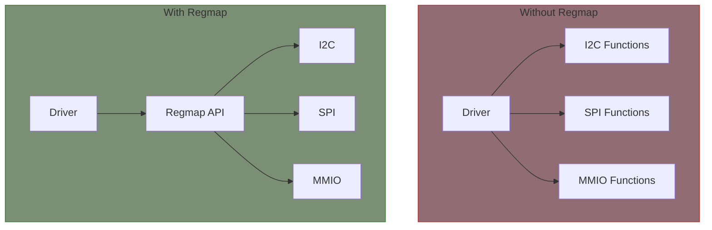

# I2C with Regmap

Regmap provides a unified API for register access, abstracting the underlying bus (I2C, SPI, MMIO). It also provides caching, range checking, and other features.

## Why Regmap?



## Basic Setup

```c
#include <linux/regmap.h>

/* Register map configuration */
static const struct regmap_config my_regmap_config = {
    .reg_bits = 8,           /* Register address size */
    .val_bits = 8,           /* Register value size */
    .max_register = 0xFF,    /* Highest register address */
};

static int my_probe(struct i2c_client *client)
{
    struct regmap *regmap;

    /* Create regmap for I2C */
    regmap = devm_regmap_init_i2c(client, &my_regmap_config);
    if (IS_ERR(regmap))
        return PTR_ERR(regmap);

    /* Now use regmap API */
    regmap_write(regmap, REG_CONFIG, 0x60);
    regmap_read(regmap, REG_STATUS, &value);

    return 0;
}
```

## Configuration Options

```c
static const struct regmap_config my_regmap_config = {
    /* Basic configuration */
    .reg_bits = 8,              /* Bits in register address */
    .val_bits = 16,             /* Bits in register value */
    .max_register = 0x7F,       /* Max register for range check */

    /* Endianness */
    .val_format_endian = REGMAP_ENDIAN_BIG,

    /* Caching */
    .cache_type = REGCACHE_RBTREE,  /* or REGCACHE_FLAT, REGCACHE_NONE */

    /* Register defaults for cache init */
    .reg_defaults = my_reg_defaults,
    .num_reg_defaults = ARRAY_SIZE(my_reg_defaults),

    /* Volatile registers (always read from hardware) */
    .volatile_reg = my_volatile_reg,

    /* Readable/writeable checks */
    .readable_reg = my_readable_reg,
    .writeable_reg = my_writeable_reg,

    /* Read/write stride */
    .reg_stride = 1,

    /* Use hardware spinlock */
    .use_hwlock = false,
};
```

## Register Access

### Basic Read/Write

```c
unsigned int val;

/* Single register read */
ret = regmap_read(regmap, REG_STATUS, &val);
if (ret)
    return ret;

/* Single register write */
ret = regmap_write(regmap, REG_CONFIG, 0x60);
if (ret)
    return ret;

/* Read-modify-write */
ret = regmap_update_bits(regmap, REG_CONFIG,
                         MASK_ENABLE | MASK_MODE,  /* Mask */
                         MASK_ENABLE);             /* Value */
```

### Bulk Operations

```c
u8 regs[4];

/* Bulk read */
ret = regmap_bulk_read(regmap, REG_DATA, regs, 4);

/* Bulk write */
ret = regmap_bulk_write(regmap, REG_DATA, regs, 4);

/* Write multiple registers with different values */
static const struct reg_sequence init_regs[] = {
    { REG_CONFIG, 0x60 },
    { REG_THRESH, 0x80 },
    { REG_ENABLE, 0x01 },
};
ret = regmap_multi_reg_write(regmap, init_regs, ARRAY_SIZE(init_regs));
```

### Bit Operations

```c
/* Set specific bits */
ret = regmap_set_bits(regmap, REG_CONFIG, BIT(3) | BIT(5));

/* Clear specific bits */
ret = regmap_clear_bits(regmap, REG_CONFIG, BIT(3) | BIT(5));

/* Test bit */
ret = regmap_test_bits(regmap, REG_STATUS, BIT(7));
if (ret > 0)
    /* Bit is set */

/* Update bits with mask */
ret = regmap_update_bits(regmap, REG_CONFIG, 0x0F, new_value & 0x0F);
```

## Cache Configuration

### Cache Types

```c
/* No caching - always access hardware */
.cache_type = REGCACHE_NONE,

/* Flat array - good for small, dense register maps */
.cache_type = REGCACHE_FLAT,

/* Red-black tree - good for sparse register maps */
.cache_type = REGCACHE_RBTREE,

/* Maple tree - newer, more efficient for most cases */
.cache_type = REGCACHE_MAPLE,
```

### Register Defaults

```c
static const struct reg_default my_reg_defaults[] = {
    { REG_CONFIG, 0x00 },
    { REG_THRESH_LOW, 0x4B },
    { REG_THRESH_HIGH, 0x50 },
};

static const struct regmap_config my_regmap_config = {
    /* ... */
    .reg_defaults = my_reg_defaults,
    .num_reg_defaults = ARRAY_SIZE(my_reg_defaults),
    .cache_type = REGCACHE_RBTREE,
};
```

### Volatile Registers

Volatile registers bypass the cache:

```c
static bool my_volatile_reg(struct device *dev, unsigned int reg)
{
    switch (reg) {
    case REG_STATUS:     /* Status changes without writes */
    case REG_DATA:       /* Data register */
    case REG_IRQ_STATUS: /* Interrupt status */
        return true;
    default:
        return false;
    }
}

static const struct regmap_config my_regmap_config = {
    /* ... */
    .volatile_reg = my_volatile_reg,
};
```

### Cache Sync

```c
/* Sync cache to hardware (e.g., after resume) */
ret = regmap_cache_sync(regmap);

/* Mark cache as dirty (e.g., before suspend) */
regmap_cache_mark_dirty(regmap);

/* Bypass cache temporarily */
regcache_cache_bypass(regmap, true);
regmap_read(regmap, REG_STATUS, &val);  /* Direct hardware access */
regcache_cache_bypass(regmap, false);
```

## Complete Example

```c
#include <linux/module.h>
#include <linux/i2c.h>
#include <linux/regmap.h>
#include <linux/iio/iio.h>

#define REG_CONFIG      0x00
#define REG_STATUS      0x01
#define REG_DATA_L      0x02
#define REG_DATA_H      0x03
#define REG_THRESH_L    0x04
#define REG_THRESH_H    0x05

struct my_adc {
    struct device *dev;
    struct regmap *regmap;
};

static const struct reg_default my_adc_defaults[] = {
    { REG_CONFIG, 0x00 },
    { REG_THRESH_L, 0x00 },
    { REG_THRESH_H, 0xFF },
};

static bool my_adc_volatile(struct device *dev, unsigned int reg)
{
    return reg == REG_STATUS || reg == REG_DATA_L || reg == REG_DATA_H;
}

static bool my_adc_readable(struct device *dev, unsigned int reg)
{
    return reg <= REG_THRESH_H;
}

static bool my_adc_writeable(struct device *dev, unsigned int reg)
{
    return reg == REG_CONFIG || reg == REG_THRESH_L || reg == REG_THRESH_H;
}

static const struct regmap_config my_adc_regmap_config = {
    .reg_bits = 8,
    .val_bits = 8,
    .max_register = REG_THRESH_H,
    .cache_type = REGCACHE_RBTREE,
    .reg_defaults = my_adc_defaults,
    .num_reg_defaults = ARRAY_SIZE(my_adc_defaults),
    .volatile_reg = my_adc_volatile,
    .readable_reg = my_adc_readable,
    .writeable_reg = my_adc_writeable,
};

static int my_adc_read_raw(struct iio_dev *indio_dev,
                           struct iio_chan_spec const *chan,
                           int *val, int *val2, long mask)
{
    struct my_adc *adc = iio_priv(indio_dev);
    unsigned int data_l, data_h;
    int ret;

    if (mask != IIO_CHAN_INFO_RAW)
        return -EINVAL;

    /* Read 16-bit data from two registers */
    ret = regmap_read(adc->regmap, REG_DATA_L, &data_l);
    if (ret)
        return ret;

    ret = regmap_read(adc->regmap, REG_DATA_H, &data_h);
    if (ret)
        return ret;

    *val = (data_h << 8) | data_l;
    return IIO_VAL_INT;
}

static const struct iio_info my_adc_info = {
    .read_raw = my_adc_read_raw,
};

static const struct iio_chan_spec my_adc_channels[] = {
    {
        .type = IIO_VOLTAGE,
        .info_mask_separate = BIT(IIO_CHAN_INFO_RAW),
    },
};

static int my_adc_probe(struct i2c_client *client)
{
    struct my_adc *adc;
    struct iio_dev *indio_dev;
    int ret;

    indio_dev = devm_iio_device_alloc(&client->dev, sizeof(*adc));
    if (!indio_dev)
        return -ENOMEM;

    adc = iio_priv(indio_dev);
    adc->dev = &client->dev;

    /* Initialize regmap */
    adc->regmap = devm_regmap_init_i2c(client, &my_adc_regmap_config);
    if (IS_ERR(adc->regmap))
        return dev_err_probe(&client->dev, PTR_ERR(adc->regmap),
                             "Failed to init regmap\n");

    /* Configure device using regmap */
    ret = regmap_write(adc->regmap, REG_CONFIG, 0x80);  /* Enable */
    if (ret)
        return ret;

    /* Setup IIO device */
    indio_dev->name = "my-adc";
    indio_dev->info = &my_adc_info;
    indio_dev->channels = my_adc_channels;
    indio_dev->num_channels = ARRAY_SIZE(my_adc_channels);

    return devm_iio_device_register(&client->dev, indio_dev);
}

static const struct of_device_id my_adc_of_match[] = {
    { .compatible = "vendor,my-adc" },
    { }
};
MODULE_DEVICE_TABLE(of, my_adc_of_match);

static struct i2c_driver my_adc_driver = {
    .driver = {
        .name = "my-adc",
        .of_match_table = my_adc_of_match,
    },
    .probe = my_adc_probe,
};
module_i2c_driver(my_adc_driver);

MODULE_LICENSE("GPL");
```

## Regmap for Different Buses

```c
/* I2C */
regmap = devm_regmap_init_i2c(client, &config);

/* SPI */
regmap = devm_regmap_init_spi(spi, &config);

/* Memory-mapped I/O */
regmap = devm_regmap_init_mmio(&pdev->dev, base, &config);

/* SPMI (System Power Management Interface) */
regmap = devm_regmap_init_spmi_base(sdev, &config);
```

## Summary

- Regmap abstracts bus-specific register access
- Provides caching, range checking, and locking
- Use `devm_regmap_init_i2c()` for I2C devices
- Configure volatility for status/data registers
- Use `regmap_update_bits()` for read-modify-write
- Cache sync helps with power management

## Next

Learn about the [SPI subsystem]().
