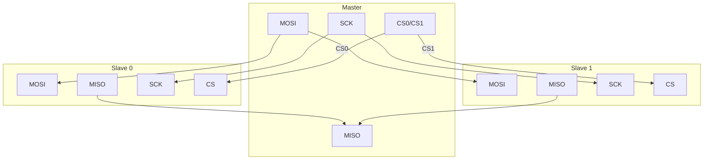
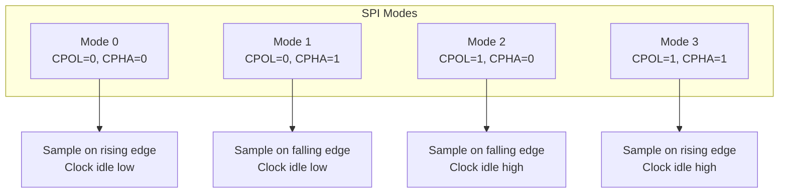
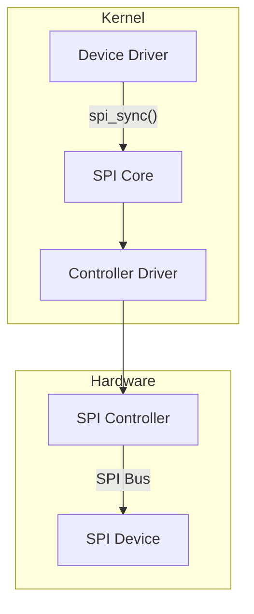

# SPI Subsystem

SPI (Serial Peripheral Interface) is a synchronous serial bus commonly used for high-speed peripherals like flash memory, displays, and sensors.

## SPI Basics

### Physical Layer



- **MOSI**: Master Out Slave In (data from master)
- **MISO**: Master In Slave Out (data to master)
- **SCK/SCLK**: Serial Clock
- **CS/SS**: Chip Select (active low, one per slave)

### SPI Modes



| Mode | CPOL | CPHA | Clock Idle | Sample Edge |
|------|------|------|------------|-------------|
| 0 | 0 | 0 | Low | Rising |
| 1 | 0 | 1 | Low | Falling |
| 2 | 1 | 0 | High | Falling |
| 3 | 1 | 1 | High | Rising |

## Linux SPI Architecture



### Key Structures

```c
/* SPI device */
struct spi_device {
    struct device dev;
    struct spi_controller *controller;
    u32 max_speed_hz;      /* Max clock speed */
    u8 chip_select;        /* CS line index */
    u8 bits_per_word;      /* Word size (usually 8) */
    bool cs_gpiod;         /* CS via GPIO */
    u32 mode;              /* SPI mode flags */
};

/* SPI transfer */
struct spi_transfer {
    const void *tx_buf;    /* TX buffer */
    void *rx_buf;          /* RX buffer */
    unsigned int len;      /* Length in bytes */
    u32 speed_hz;          /* Override speed */
    u16 delay_usecs;       /* Delay after transfer */
    u8 bits_per_word;      /* Override word size */
    bool cs_change;        /* Toggle CS after */
};

/* SPI message (collection of transfers) */
struct spi_message {
    struct list_head transfers;
    struct spi_device *spi;
    void (*complete)(void *context);
    void *context;
    int status;
};
```

## SPI Transfers

### Simple Transfer

```c
#include <linux/spi/spi.h>

/* Write then read */
int spi_write_then_read(struct spi_device *spi,
                        const void *txbuf, unsigned n_tx,
                        void *rxbuf, unsigned n_rx);

/* Example: Read register */
static int read_reg(struct spi_device *spi, u8 reg, u8 *val)
{
    u8 cmd = reg | 0x80;  /* Read command (device-specific) */

    return spi_write_then_read(spi, &cmd, 1, val, 1);
}

/* Example: Write register */
static int write_reg(struct spi_device *spi, u8 reg, u8 val)
{
    u8 buf[2] = { reg, val };

    return spi_write(spi, buf, 2);
}
```

### Full-duplex Transfer

```c
static int spi_full_duplex(struct spi_device *spi, u8 *tx, u8 *rx, int len)
{
    struct spi_transfer t = {
        .tx_buf = tx,
        .rx_buf = rx,
        .len = len,
    };
    struct spi_message m;

    spi_message_init(&m);
    spi_message_add_tail(&t, &m);

    return spi_sync(spi, &m);
}
```

### Multiple Transfers

```c
static int read_data(struct spi_device *spi, u8 reg, u8 *data, int len)
{
    u8 cmd = reg | 0x80;
    struct spi_transfer t[] = {
        {
            .tx_buf = &cmd,
            .len = 1,
        },
        {
            .rx_buf = data,
            .len = len,
        },
    };
    struct spi_message m;

    spi_message_init(&m);
    spi_message_add_tail(&t[0], &m);
    spi_message_add_tail(&t[1], &m);

    return spi_sync(spi, &m);
}
```

### Using spi_sync_transfer()

```c
/* Simplified API for transfer array */
static int read_regs(struct spi_device *spi, u8 reg, u8 *data, int len)
{
    u8 cmd = reg | 0x80;
    struct spi_transfer t[] = {
        { .tx_buf = &cmd, .len = 1 },
        { .rx_buf = data, .len = len },
    };

    return spi_sync_transfer(spi, t, ARRAY_SIZE(t));
}
```

## Device Tree Binding

```dts
&spi0 {
    status = "okay";

    /* SPI device */
    sensor@0 {
        compatible = "vendor,my-sensor";
        reg = <0>;                    /* CS0 */
        spi-max-frequency = <10000000>; /* 10 MHz */
        spi-cpol;                     /* Mode 2 or 3 */
        spi-cpha;                     /* Mode 1 or 3 */
        /* interrupt */
        interrupt-parent = <&gpio>;
        interrupts = <10 IRQ_TYPE_EDGE_FALLING>;
    };

    flash@1 {
        compatible = "jedec,spi-nor";
        reg = <1>;                    /* CS1 */
        spi-max-frequency = <50000000>;
        /* Uses default mode 0 */
    };
};
```

### SPI Mode Properties

| Property | Meaning |
|----------|---------|
| `spi-cpol` | Clock polarity high (CPOL=1) |
| `spi-cpha` | Clock phase 1 (CPHA=1) |
| `spi-cs-high` | Chip select active high |
| `spi-3wire` | Three-wire mode (bidirectional) |
| `spi-lsb-first` | LSB first transfer |

## SPI Mode Flags

```c
/* In driver code */
spi->mode |= SPI_MODE_0;      /* CPOL=0, CPHA=0 */
spi->mode |= SPI_MODE_1;      /* CPOL=0, CPHA=1 */
spi->mode |= SPI_MODE_2;      /* CPOL=1, CPHA=0 */
spi->mode |= SPI_MODE_3;      /* CPOL=1, CPHA=1 */

spi->mode |= SPI_CS_HIGH;     /* CS active high */
spi->mode |= SPI_LSB_FIRST;   /* LSB first */
spi->mode |= SPI_3WIRE;       /* Bidirectional mode */
spi->mode |= SPI_NO_CS;       /* No CS control */
```

## Async Transfers

For non-blocking transfers:

```c
static void transfer_complete(void *context)
{
    struct my_device *dev = context;
    complete(&dev->done);
}

static int async_transfer(struct my_device *dev)
{
    struct spi_message m;
    struct spi_transfer t = {
        .tx_buf = dev->tx_buf,
        .rx_buf = dev->rx_buf,
        .len = 256,
    };

    spi_message_init(&m);
    spi_message_add_tail(&t, &m);

    m.complete = transfer_complete;
    m.context = dev;

    reinit_completion(&dev->done);

    return spi_async(dev->spi, &m);
}

/* Later: wait for completion */
wait_for_completion(&dev->done);
```

## DMA Transfers

For large transfers, use DMA-capable buffers:

```c
struct my_device {
    struct spi_device *spi;
    u8 *tx_buf;
    u8 *rx_buf;
    dma_addr_t tx_dma;
    dma_addr_t rx_dma;
};

static int alloc_dma_buffers(struct my_device *dev)
{
    dev->tx_buf = dma_alloc_coherent(&dev->spi->dev, BUF_SIZE,
                                      &dev->tx_dma, GFP_KERNEL);
    if (!dev->tx_buf)
        return -ENOMEM;

    dev->rx_buf = dma_alloc_coherent(&dev->spi->dev, BUF_SIZE,
                                      &dev->rx_dma, GFP_KERNEL);
    if (!dev->rx_buf) {
        dma_free_coherent(&dev->spi->dev, BUF_SIZE,
                          dev->tx_buf, dev->tx_dma);
        return -ENOMEM;
    }

    return 0;
}
```

## Viewing SPI Devices

```bash
# List SPI devices
ls /sys/bus/spi/devices/

# Device info
cat /sys/bus/spi/devices/spi0.0/modalias
cat /sys/bus/spi/devices/spi0.0/driver/name

# Using spidev (if enabled)
ls /dev/spidev*
```

## Summary

- SPI is a 4-wire (or 3-wire) synchronous serial bus
- Devices selected via chip select (CS) lines
- Four modes based on clock polarity and phase
- Use `spi_sync()` for synchronous transfers
- Use `spi_async()` for non-blocking transfers
- Configure mode via DT or in driver code

## Next

Learn how to write an [SPI device driver]().
