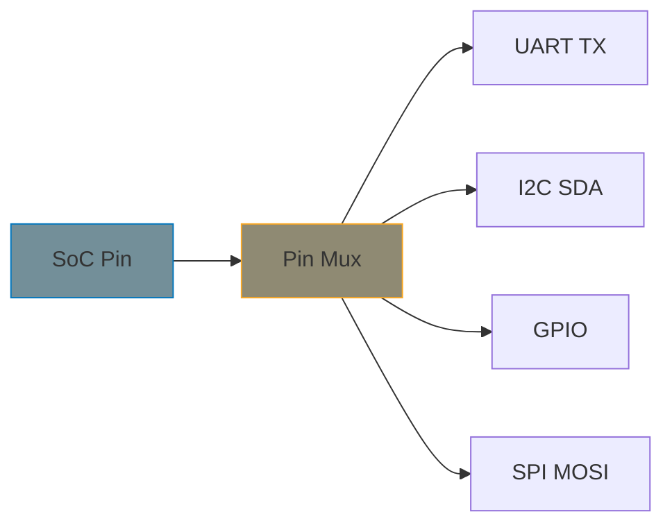

# Pin Control Subsystem

Modern SoCs have hundreds of pins, each configurable for different functions — UART, I2C, SPI, GPIO, or other peripherals. The pin control (pinctrl) subsystem manages this multiplexing and configuration, ensuring pins are set up correctly before a driver uses them.

## Why Pinctrl Matters



Without pinctrl, you'd have to write register-level code to configure pin muxing in every driver. The pinctrl subsystem centralizes this so drivers just declare what they need in the device tree.

## Consumer Perspective (Driver Authors)

Most driver authors don't write pinctrl providers — they *consume* pin configurations declared in the device tree. The driver framework handles pin setup automatically during probe.

### Device Tree Declaration

```dts
&uart2 {
    pinctrl-names = "default", "sleep";
    pinctrl-0 = <&uart2_default>;   /* Used during probe */
    pinctrl-1 = <&uart2_sleep>;     /* Used during suspend */
    status = "okay";
};

/* Pin configuration nodes (defined by SoC pinctrl provider) */
&pinctrl {
    uart2_default: uart2-default {
        pins = "gpio4", "gpio5";
        function = "uart2";
        bias-pull-up;
    };

    uart2_sleep: uart2-sleep {
        pins = "gpio4", "gpio5";
        function = "gpio";
        bias-pull-down;
    };
};
```

### Automatic Pin Setup

When a driver calls `devm_pinctrl_get()` or when the bus infrastructure probes a device, the `"default"` pin state is applied automatically. No driver code needed for the common case.

### Runtime State Switching

For power management, switch between pin states at runtime:

```c
#include <linux/pinctrl/consumer.h>

struct my_device {
    struct pinctrl *pinctrl;
    struct pinctrl_state *pins_default;
    struct pinctrl_state *pins_sleep;
};

static int my_probe(struct platform_device *pdev)
{
    struct my_device *dev;

    dev = devm_kzalloc(&pdev->dev, sizeof(*dev), GFP_KERNEL);
    if (!dev)
        return -ENOMEM;

    /* Get pinctrl handle */
    dev->pinctrl = devm_pinctrl_get(&pdev->dev);
    if (IS_ERR(dev->pinctrl))
        return PTR_ERR(dev->pinctrl);

    /* Look up named states */
    dev->pins_default = pinctrl_lookup_state(dev->pinctrl,
                                              PINCTRL_STATE_DEFAULT);
    if (IS_ERR(dev->pins_default))
        return PTR_ERR(dev->pins_default);

    dev->pins_sleep = pinctrl_lookup_state(dev->pinctrl,
                                            PINCTRL_STATE_SLEEP);
    /* Sleep state is optional */
    if (IS_ERR(dev->pins_sleep))
        dev->pins_sleep = NULL;

    platform_set_drvdata(pdev, dev);
    return 0;
}

static int my_suspend(struct device *dev)
{
    struct my_device *mydev = dev_get_drvdata(dev);

    if (mydev->pins_sleep)
        pinctrl_select_state(mydev->pinctrl, mydev->pins_sleep);

    return 0;
}

static int my_resume(struct device *dev)
{
    struct my_device *mydev = dev_get_drvdata(dev);

    pinctrl_select_state(mydev->pinctrl, mydev->pins_default);
    return 0;
}
```

### Standard State Names

| State Name | Constant | Purpose |
|-----------|----------|---------|
| `"default"` | `PINCTRL_STATE_DEFAULT` | Normal operation (applied at probe) |
| `"sleep"` | `PINCTRL_STATE_SLEEP` | Low-power mode |
| `"idle"` | `PINCTRL_STATE_IDLE` | Runtime idle |
| `"init"` | `PINCTRL_STATE_INIT` | Before probe (rare) |

## Pin Configuration Properties

These device tree properties control electrical characteristics:

| Property | Description |
|----------|-------------|
| `bias-pull-up` | Enable internal pull-up resistor |
| `bias-pull-down` | Enable internal pull-down resistor |
| `bias-disable` | Disable pull-up/down |
| `drive-strength = <N>` | Drive strength in mA |
| `input-enable` | Configure as input |
| `output-high` / `output-low` | Configure as output |
| `slew-rate = <N>` | Output slew rate |

## Provider Perspective (SoC Vendors)

Pinctrl providers are typically written by SoC vendors. The key structure is `struct pinctrl_desc`:

```c
#include <linux/pinctrl/pinctrl.h>
#include <linux/pinctrl/pinmux.h>
#include <linux/pinctrl/pinconf.h>
#include <linux/pinctrl/pinconf-generic.h>

/* Define pins */
static const struct pinctrl_pin_desc my_pins[] = {
    PINCTRL_PIN(0, "gpio0"),
    PINCTRL_PIN(1, "gpio1"),
    PINCTRL_PIN(2, "gpio2"),
    PINCTRL_PIN(3, "gpio3"),
};

/* Pin groups (sets of pins used together) */
static const unsigned int uart0_pins[] = { 0, 1 };
static const unsigned int i2c0_pins[]  = { 2, 3 };

/* Functions (what the pin groups can be muxed to) */
static const char * const uart0_groups[] = { "uart0_grp" };
static const char * const i2c0_groups[]  = { "i2c0_grp" };

/* pinctrl_ops: pin enumeration */
static const struct pinctrl_ops my_pctlops = {
    .get_groups_count = my_get_groups_count,
    .get_group_name   = my_get_group_name,
    .get_group_pins   = my_get_group_pins,
    .dt_node_to_map   = pinconf_generic_dt_node_to_map_all,
    .dt_free_map      = pinconf_generic_dt_free_map,
};

/* pinmux_ops: function multiplexing */
static const struct pinmux_ops my_pmxops = {
    .get_functions_count = my_get_functions_count,
    .get_function_name   = my_get_function_name,
    .get_function_groups = my_get_function_groups,
    .set_mux             = my_set_mux,  /* Actually configure the mux */
};

/* pinconf_ops: electrical configuration */
static const struct pinconf_ops my_confops = {
    .is_generic        = true,
    .pin_config_get    = my_pin_config_get,
    .pin_config_set    = my_pin_config_set,
};

/* Register the pinctrl device */
static int my_pinctrl_probe(struct platform_device *pdev)
{
    struct pinctrl_desc *desc;
    struct pinctrl_dev *pctldev;

    desc = devm_kzalloc(&pdev->dev, sizeof(*desc), GFP_KERNEL);
    if (!desc)
        return -ENOMEM;

    desc->name    = "my-pinctrl";
    desc->pins    = my_pins;
    desc->npins   = ARRAY_SIZE(my_pins);
    desc->pctlops = &my_pctlops;
    desc->pmxops  = &my_pmxops;
    desc->confops = &my_confops;
    desc->owner   = THIS_MODULE;

    pctldev = devm_pinctrl_register(&pdev->dev, desc, NULL);
    if (IS_ERR(pctldev))
        return PTR_ERR(pctldev);

    return 0;
}
```

## Pinctrl and GPIO Relationship

The GPIO and pinctrl subsystems interact through `gpio-ranges`, which maps GPIO numbers to pinctrl pins:

```dts
gpio: gpio@10000 {
    gpio-controller;
    #gpio-cells = <2>;
    gpio-ranges = <&pinctrl 0 0 32>;  /* GPIO 0-31 = pin 0-31 */
};
```

When a GPIO is requested, the pinctrl subsystem automatically muxes the pin to GPIO function. See [GPIO Provider]() for how `gpio_chip` integrates with pinctrl via `set_config`.

## Debugging Pinctrl

```bash
# View all registered pinctrl devices
ls /sys/kernel/debug/pinctrl/

# View pin assignments
cat /sys/kernel/debug/pinctrl/*/pinmux-pins

# View pin groups
cat /sys/kernel/debug/pinctrl/*/pingroups

# View pin configuration
cat /sys/kernel/debug/pinctrl/*/pinconf-pins
```

## Best Practices

- **Let the framework handle default state** — don't manually select `"default"` in probe
- **Always provide a sleep state** for power-sensitive designs
- **Use generic pin config properties** (`bias-pull-up`, `drive-strength`) for portability
- **Test pin states** with debugfs during development
- **Consumer drivers rarely need pinctrl code** — device tree + automatic state management handles most cases

## Summary

- Pinctrl manages pin multiplexing and electrical configuration
- Most drivers are consumers — declare pin states in device tree, the framework applies them
- The `"default"` state is applied automatically at probe
- Use `pinctrl_select_state()` for runtime switching (e.g., sleep states)
- Providers implement `pinctrl_ops`, `pinmux_ops`, and `pinconf_ops`
- GPIO and pinctrl integrate through `gpio-ranges`

## Next

Continue to [Part 10: PWM, Watchdog, HWMON, LED Drivers]() for specialized device subsystems.
