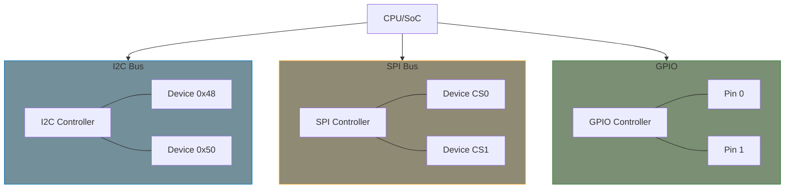
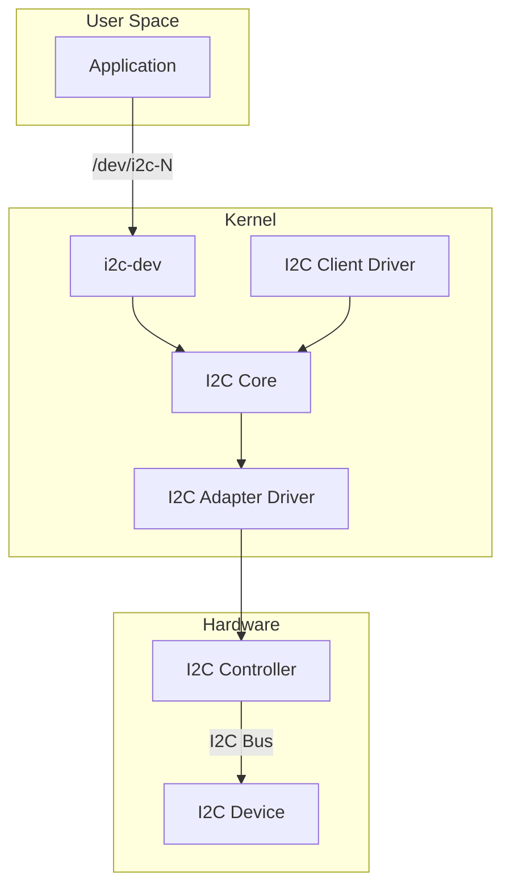
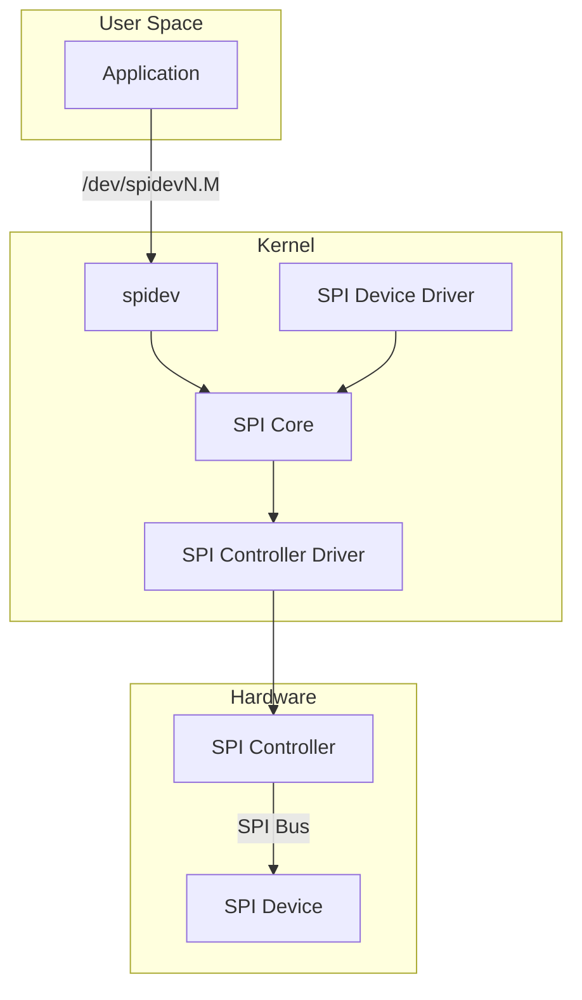

# Part 9: I2C, SPI, and GPIO Drivers

I2C and SPI are the most common buses for connecting sensors, displays, and peripherals in embedded systems. This part covers writing drivers for devices on these buses.

## Bus Overview



## Chapter Contents

| Chapter | Topic | Key Concepts |
|---------|-------|--------------|
| [9.1]() | I2C Subsystem | Bus architecture, adapters, clients |
| [9.2]() | I2C Client Driver | i2c_driver, probe/remove |
| [9.3]() | I2C with Regmap | regmap abstraction for I2C |
| [9.4]() | SPI Subsystem | Bus architecture, transfers |
| [9.5]() | SPI Driver | spi_driver, SPI messaging |
| [9.6]() | GPIO Consumer API | gpiod_get, set/get values |
| [9.7]() | GPIO Provider | gpio_chip implementation |
| [9.8]() | Pin Control | Pin muxing, pin configuration |

## I2C vs SPI Comparison

| Feature | I2C | SPI |
|---------|-----|-----|
| Wires | 2 (SDA, SCL) | 4+ (MOSI, MISO, CLK, CS) |
| Addressing | 7-bit address | Chip select lines |
| Speed | Up to 3.4 MHz | Up to 100+ MHz |
| Topology | Multi-master, multi-slave | Single master, multi-slave |
| Complexity | Higher protocol | Simple |
| Use case | Sensors, EEPROMs | Flash, displays, high-speed |

## I2C Architecture



## SPI Architecture



## Key Data Structures

### I2C

```c
/* I2C client (device) */
struct i2c_client {
    unsigned short addr;        /* 7-bit I2C address */
    char name[I2C_NAME_SIZE];   /* Device name */
    struct i2c_adapter *adapter; /* Parent adapter */
    struct device dev;          /* Device structure */
};

/* I2C driver */
struct i2c_driver {
    int (*probe)(struct i2c_client *client);
    void (*remove)(struct i2c_client *client);
    struct device_driver driver;
    const struct i2c_device_id *id_table;
};
```

### SPI

```c
/* SPI device */
struct spi_device {
    struct device dev;
    struct spi_controller *controller;
    u32 max_speed_hz;
    u8 chip_select;
    u8 bits_per_word;
    u32 mode;  /* SPI_MODE_0..3, SPI_CS_HIGH, etc. */
};

/* SPI driver */
struct spi_driver {
    int (*probe)(struct spi_device *spi);
    void (*remove)(struct spi_device *spi);
    struct device_driver driver;
    const struct spi_device_id *id_table;
};
```

## Examples

This part includes working examples:

- **i2c-sensor**: I2C temperature sensor driver
- **spi-device**: SPI device driver with regmap
- **gpio-driver**: GPIO controller (gpio_chip)

## Prerequisites

Before starting this part, ensure you understand:

- Platform drivers (Part 6)
- [Managed resources (devm_*)]() - used extensively in these drivers
- Device Tree (Part 8)
- Interrupt handling (Part 7)

## Further Reading

- [I2C Documentation](https://docs.kernel.org/i2c/index.html) - I2C subsystem guide
- [SPI Documentation](https://docs.kernel.org/spi/index.html) - SPI subsystem guide
- [GPIO Documentation](https://docs.kernel.org/driver-api/gpio/index.html) - GPIO API guide

## Next

Start with [I2C Subsystem]() to understand I2C bus architecture.
